# 시퀀스 다이어그램
- UML 다이어그램의 한 종류로 시스템이나 객체들이 메세지를 주고받으며 상호 작용하는 과정을 표현하는 행위 다이어그램이다.
- 현재 구축되어 있는 시스템이 어떻게 동작하고 있는지 표현하거나 신규 개발해야 할 시스템이 어떠한 시8ㅕㅑㅓ나리오로 흘러갈 지 쉽게 표현할 수 있어 자주 사용된다.

## 특징
- 각 동작에 참여하는 시스템이나 객체들의 수행기간을 확인할 수 있음
- 메세지의 명확한 순서를 확인할 수 있음
- 전반적인 시스템 흐름을 시각화 시킬 수 있음
- 실시간 명세의 표현에 적합함
- 복잡한 시나리오의 표현에 적합함

## 시퀀스 다이어그램 툴
- GitMind
- Lucidchart
- Visual Paradigm

## 시퀀스 다이어그램 구성요소
|구성요소|표현방법|내용|
|------|------|----|
|액터|<image src="image/액터.png">|시스템으로부터 서비스를 요청하는 외부 요소로, 사람이나 와부 시스템을 뜻함|
|객체|<image src="image/객체.png">|메세지를 주고받는 객체|
|생명선|<image src="image/생명선.png">|객체가 메모리에 존재하는 기간으로, 객체 아래쪽에 점선을 그어 표현함|
|메세지|<image src="image/메세지.png">|객체가 상호 작용을 위해 주고받는 메세지|
|객체 소멸|<image src="image/객체 소멸.png">|해당 객체가 더이상 메모리에 존재하지 않음을 표현한 것
|프레임|<image src="image/프레임.png">|다이어그램 전체 또는 일부를 묶어 표현한 것

## 생명선(Lifeline)
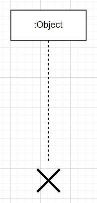

- 생명선은 액터나 객체가 얼마나 오래 존재하는지를 나타내는 선이다.
- 액터나 객체가 위에 존재하고 그 아래로 점선으로 존재한다.
- 점선이 이어져있는 곳 까지가 메모리에 살아있다는 뜻이다
- 메모리에서 객체가 소멸되면 생명선 아래에 X표로 객체 소멸 표시를 해준다.

## 실행상자
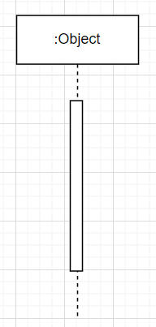

- 실행상자는 액터나 객체와 같은 인스턴스가 다른 인스턴스와 상호작용을 할 때 작성하며 작성법은 라이프라인의 중앙에 위와 같이 직사각형의 맘대로 표기한다.

## 메세지
|유형|표현방법|내용|
|---|-----|----|
|동기 메세지|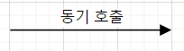|동기적으로 메세지를 전송함|
|비동기 메세지|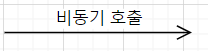|비동기적으로 메세지를 전송함|
|동기 반환 메세지|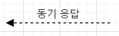|동기적으로 메세지 호출을 반환함|
|비동기 반환 메세지|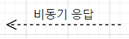|비동기적으로 메세지 호출을 반환함|
- 메세지는 인스턴스 간 주고 받은 데이터를 나타낸다.
- 호출은 실선, 응답은 점선으로 표기하며 동기 메세지는 화살표를 채우고 비동기식 메세지는 화살표를 비워둔다.

### 동기 호출
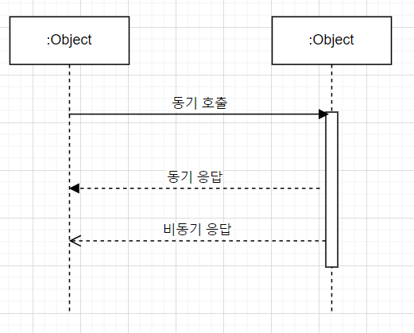
- 동기 호출은 요청을 보낸 뒤 응답이 올때까지 기다린다.
- 동기 호출 메세지는 꽉찬 화살표에 실선으로 표기하며 동기 응답은 꽉찬 화살표에 점선, 비동기 응답은 빈 화살표에 점선으로 표시한다.

### 비동기 호출

- 비동기 호출은 빈 화살표에 실선으로 표기하며 요청을 보낸 뒤 응답을 기다리지 않는다.

### 자체 메시지
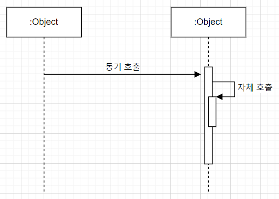

- 자체적으로 동작을 처리할때는 자체 메시지를 사용한다.
- 자체 메시지는 본인의 생명선으로 회귀하는 화살표를 그린다.

### 반환 메시지
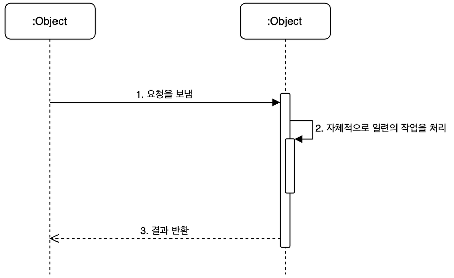
- 동기 메시지에서 표현했던 것과 같이 요청에 대한 결과를 반환한다.
- 점선과 선으로 이루어진 화살표로 표현한다.

## 흐름 제어
- 로직에는 if,for,while과 같은 흐름을 제어하는 표현식이 있다.
- 시퀀스 다이어그램은 시간 순으로 인스턴스간 상호작용을 표현하기 때문에 흐름을 제어하는 표현들이 필요할 수 있다.

### Guard
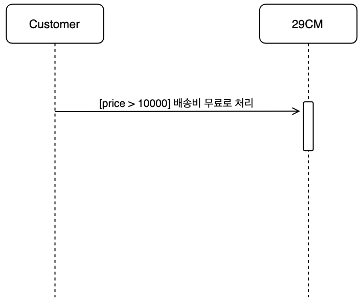
- 단일 메시지에 대해 조건을 명시할 수 있는 방법이다.
- 사용법은 메시지의 앞 쪽에 []대괄호로 감싼 후 조건을 명시한다.
- 예를 들어 가격이 10,000원 이상이라고 하면 [price > 10000]이라고 명시한다.

### Sequence Fragment
- Sequence Fragment는 범위로 조건을 명시할 수 있다. 특정 부분에 대해서 메시지를 반복하거나 조건을 명시할 때 사용된다.

### alternative

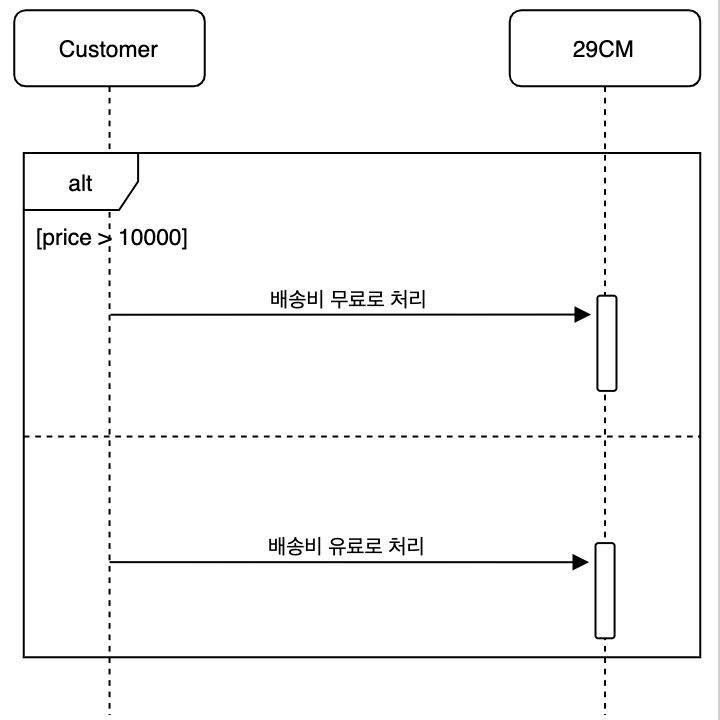

- alternative는 alt로 줄여서 사용한다.
- alt는 조건문인 if/else문을 Guard를 사용해 표현할 수 있다.
- 위는 가격이 10000원 이상이면 배송비를 무료로 처리하고 그렇지 않으면 배송비를 유료로 하는 것을 표현한 예시이다.

### Option
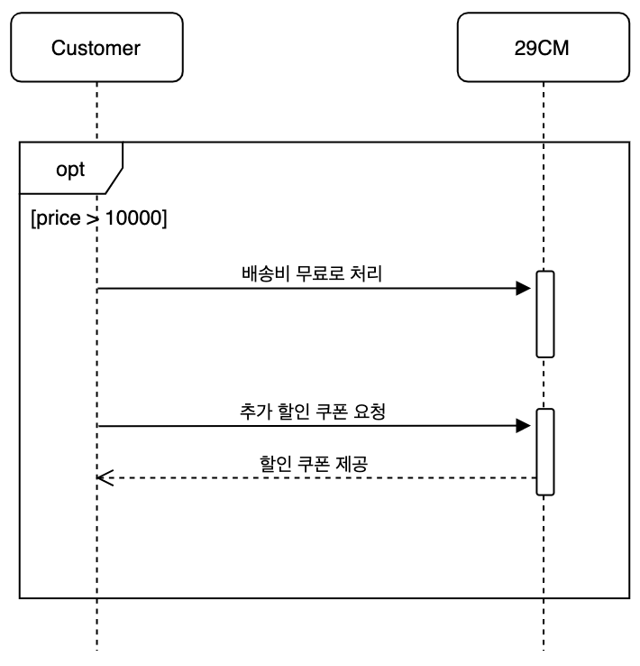

- option은 opt로 줄여서 사용한다.
- opt는 조건문인 if문을 Guard를 사용해 표현할 수 있다.
- 즉, 조건에 따라 선택 사항이 단 한 개일 경우에 사용된다.
- 위는 가격이 10000원 이상이면 배송비를 무료로 처리하고 고객이 추가 할인 쿠폰을 요청한 다음 쿠폰을 제공하는 예시이다.
- 만약 가격이 10000원 미만이면 해당 로직을 타지 않는다.

### loop
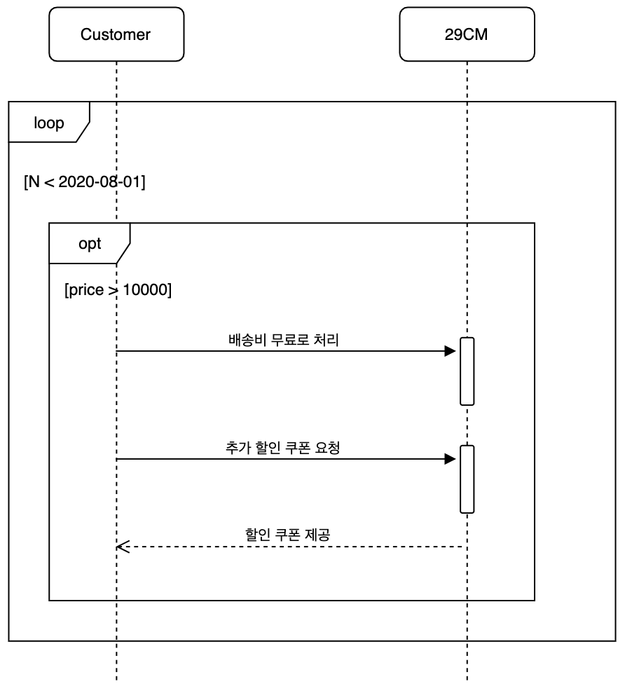

- loop은 단어 의미 그대로 for,while과 같은 반복문을 표현한다.
- 위는 입력된 시간이 2008-08-01보다 작을 때 반복문을 실행하고 그 하위 조건으로 처리를 하는 예시이다.

### parallel
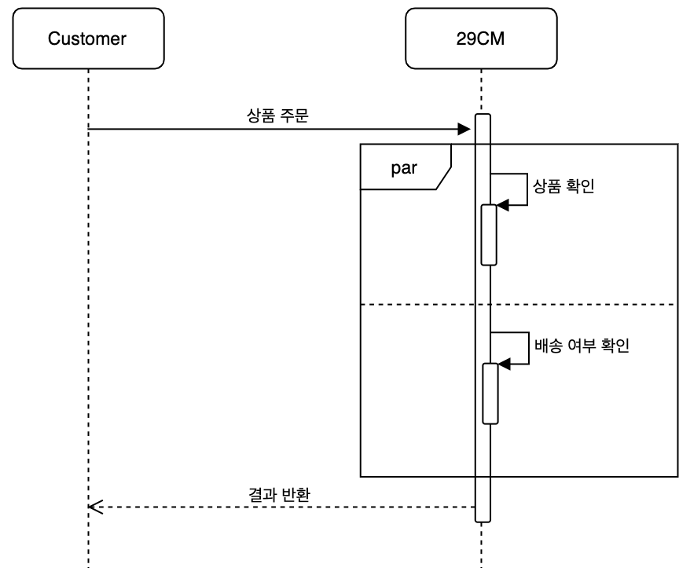

- parallel은 단어 그대로 병렬 처리를 의미하며 par로 줄여서 사용한다.
- 위는 상품 주문이 들어왔을 때, 상품 확인과 배송 여부 확인을 병렬로 진행하는 것을 표현한 예시이다.