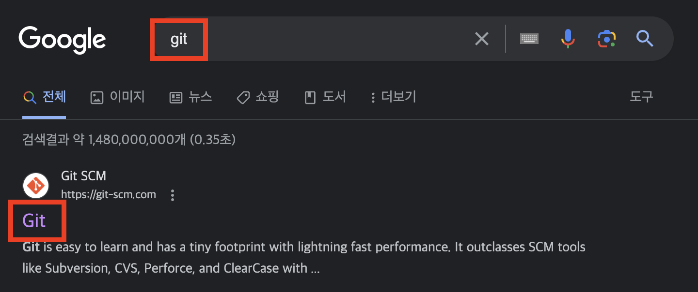

# GIT
- 분산 버전관리 시스템(Distributed Version Control Systems)이다.
- 컴퓨터 파일의 변경 사항을 추적하고 여러명의 사용자들 간에 파일에 대한 작업을 조율하는데 사용한다.
- 주로 여러명의 개발자가 하나의 소프트웨어 개발 프로젝트에 참여할 때, 소스 코드를 관리하는데 주로 사용된다.

## 버전관리는 왜 필요한가?
- 예를들어 팀프로젝트로 본인이 맡은 파트의 ppt를 만들어서 합치는 과정이라고 생각해보자.
- 팀원이 많아질수록 각 파트별로 만든 파일을 본 버전에 합치는 과정은 매우 복잡해질것이다.

## git의 장점
- 인터넷이 연결이 되지 않은 곳에서도 개발을 진행할 수 있으며, 분산 버전관리이기 때문에 중앙저장소가 삭제되어도 원상복구가 가능하다.
- 각자의 개발자가 Branch에서 개발한 뒤, 본 프로그램에 합치는 merge방식을 통한 병렬 개발 가능

## git 기본 용어
- 동작과 이력을 효율적으로 처리하기 위해서 저장공간을 논리적으로 분리
- 작업공간(working directory / working tree)
- 임시작업공간(stage)
- 질적으로 저장되고 기록되는 공간(repository)

### Repository
- 저장소
- 히스토리, 태그, 소스의 가지치기 혹은 branch에 따라 버전을 저장
- 작업자가 변경한 모든 히스토리를 확인 가능

### Working Tree
- 작업을 하는 공간
- 로컬 저장소에 접근하여 파일을 생성, 수정 그리고 저장하는 공간
- staging area에 맞닿아 있음
- 저장소를 어느 한 시점을 바라보는 작업자의 현재 시점.

### Staging Area
- 저장소에 커밋하기 전에 커밋을 준비하는 위치

### Commit
- 현재 변경된 작업 상태를 점검을 마치고 확정하고 저장소에 저장하는 작업

### Head
- 현재 작업중인 Branch를 가리킨다.

### Branch
- 가지 또는 분기점
- 작업을 할 때에 현재 상태를 복사하여 Branch에서 작업을 한 후에 완전하다 싶을 때 Merge를 하여 작업한다.
- 새로만든 브랜치는 지금 작업하고 있는 마지막 commit을 가리킨다.

### Merge
- 다른 Branch의 내용을 현재 Branch로 가져와 합치는 작업을 의미한다.

## git 기본 명령어
### 1. git help
- 도움말 기능(가장 많이 사용하는 21개의 git 명령어 출력)
- 사용법이 궁금한 명령어에 대해 'git help [궁금한 명령어]'를 타이핑시
- 해당 git 명령어의 설정과 사용에 대한 도움말 출력

### 2. git init
- git 저장소를 초기화
- 저장소나 디렉토리 안에서 이 명령어를 실행하기 전까지는 그냥 일반 폴더이다.
- 이 명령어를 입력한 후에야 추가적인 git 명령어 입력 가능

### 3. git status
- 저장소 상태 체크
- 어떤 파일이 저장소 안에 있는지, 커밋이 필요한 변경사항이 있는지, 현재 저장소의 어떤 Branch에서 작업하고 있는지 등의 상태 정보 출력

### 4. git branch
- 새로운 branch생성
- 여러 협업자와 작업할 시, 이 명령어로 새로운 브랜치를 만들고, 자신만의 변경사항과 파일 추가 및 커밋 타임라인을 생성, 완성 후 협업자의 branch 혹은 main과 merge

### 5. git add
- 'staging 영역'에 변경내용 추가.
- 다음 commit명령 전까지 변경분을 staging영역에 보관하여 변동 내역을 저장

|명령어|작용|
|----|---|
|git add [업로드 하고싶은 파일 혹은 디렉토리 경로] | 해당 파일 혹은 디렉토리 변경 내용 staging area 등록|
|git add .|현재 디렉토리 모든 변경내용 staging area등록(상위X)|
|git add -A| 작업 디렉토리 모든 변경 내용 staging area 등록|
|git add -P| 터미널에서 staging area로 넘길 파일 선택 가능|

### 6. git commit
- staging area에 있는 변경 내용 묶음 및 정의
- git의 가장 중요한 명령어
#### git commit -m [커밋 메세지]
- staging area에 있는 내용은 "커밋 메세지"를 반영한 수정본 파일 묶음

### 7. git log
- 커밋 내역 확인

### 8. git push
- 로컬 컴퓨터에서 서버로 변경사항을 "push"

### 9. git pull
- 서버 저장소로부터 최신 버전을 "pull"
- 서버 저장소의 데이터를 가져와, 현재 branch에 merge

### 10. git clone
- 서버 저장소의 데이터를 로컬 컴퓨터로 복사.
- 서버 저장소의 데이터를 그대로 가져옴. 작업중이던 내역이 있을시 덮어쓰기 됨

### 11. git checkout
- 작업하기 원하는 branch로 이동

### 12. git merge
- 개별 branch에서 마친 작업을 master branch로 병합

## git 설치하기

### 1. 크롬에서 git 입력 후 페이지 들어가서 설치하기

### 2. 로컬 저장소 만들기
- 로컬저장소로 사용하기 위한 폴더 생성하기
- 우클릭 하여 gitbash열기
- git init으로 로컬저장소로 확정
  - 보기 -> 숨김파일 표시, 확장자 표시

#### 로컬폴더내의 변경사항을 stage에 등록
- 현재 디렉토리의 일부만 stage에 올리기
  - git add 파일명
- 현재 디렉토리의 모든 변경내용을 stage에 올리기
  - git add .
- 작업 디렉토리 내의 모든 변경내용을 모두 stage영역에 올리기
  - git add -A

#### 현재 상태 확인하기
- git status

#### stage에서 내리기
- git rm --cached 파일명

#### commit 하기
- stage 상태의 파일들을 영구적으로 저장
  - git commit;
- 커밋을 하면서 메세지를 같이 할 수있는 옵션
  - git commit -m '커밋 메세지'

### 3. branch만들기
#### 브랜치 생성하기
- git branch 브랜치명

#### 브랜치 이동하기
- git checkout 브랜치명

※ commit이 완료되지 않으면 다른 브랜치로 이동 불가 
- 바로 이전 브랜치로 돌아가기 : git checkout - 
- branch생성과 동시에 해당 branch로 이동하기 : git checkout -b 브랜치명

## 3. 로컬에 있는 두 branch를 merge하기
1. Branch A에서부터 Branch B를 생성한다고 가정
2. Branch B에서 작업 완료 후 Branch A에 Branch B의 내용 Merge하기

### Merge 방법
#### 1. branch A로 이동하기
- git checkout branchA

#### 2. branch B를 branch A에 Merge한다.
- git merge branchB

## 깃허브(Github)란 무엇인가?
- git을 사용하는 프로젝트를 지원하는 웹 호스팅 서비스

