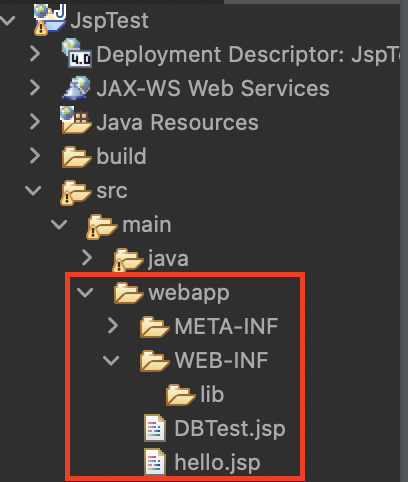
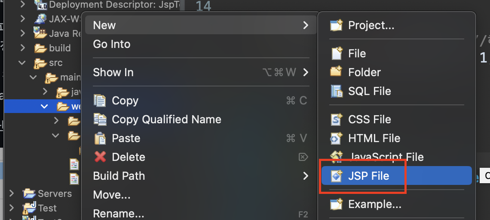
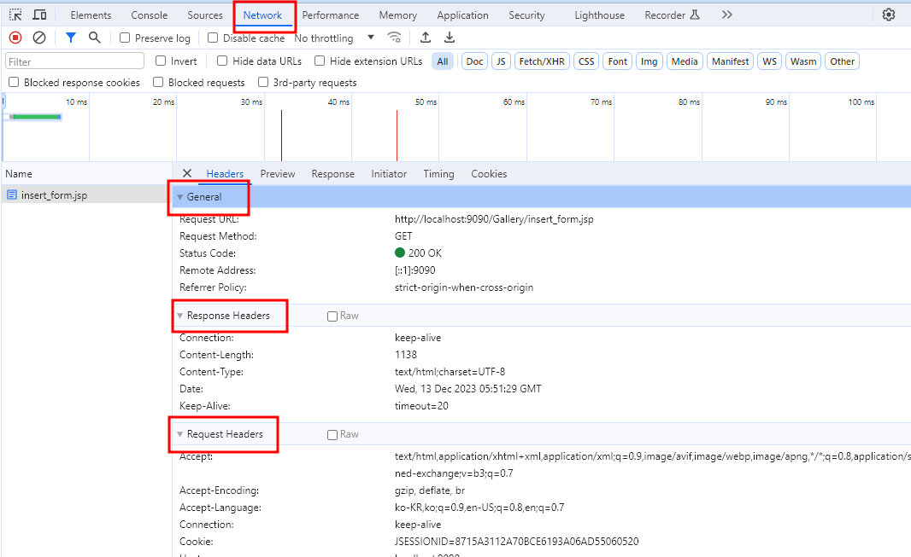
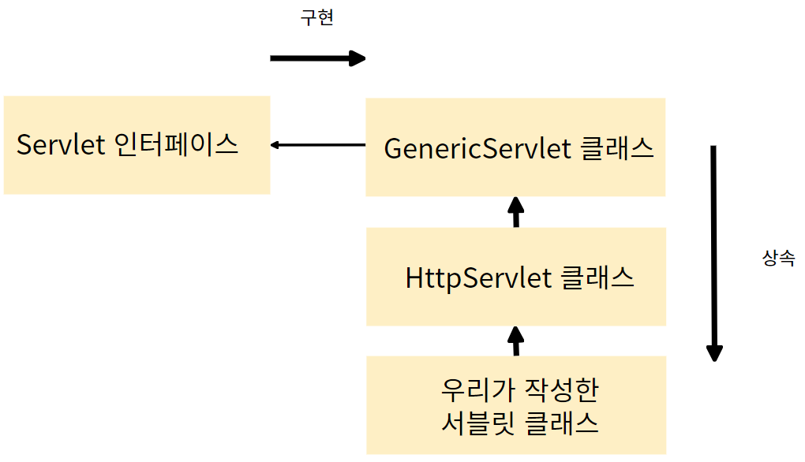
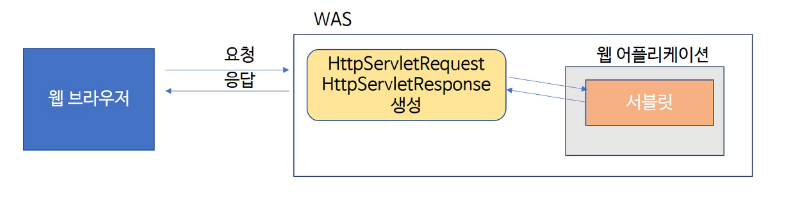

# 실습 환경 구축하기

1. WEB1500 폴더 아래 JSP 폴더 생성후 안에 util과 work폴더 만들기


2. util 폴더에 eclipse와 tomcat 넣기
  - 이클립스 압축폴더는 지우지말고 갖고 있을 것 이후 과정에서 계속 새로 풀어서 사용할 것이기 때문에


## 톰캣
1. apache.org 사이트로 접속한다.


2. 스크롤을 많이 내리면 T 부분에 톰캣이 있다.


3. 왼쪽에 다운로드 받는 탭이 있고 원하는 버전을 선택한 뒤 운영체제에 맞는 파일을 다운로드 받는다.


## 톰캣의 구조


#### 톰캣 디렉토리 설명

|디렉토리 이름|설명|
|----|---------|
|bin|톰캣을 실행하고, 종료시키는 스크립트 (.bat , .sh 등) 파일이 들어있다.|
|conf|서버 전체 설정파일 폴더 ( server.xml 등 )|
|lib|톰캣구동하는데 필요한 라이브러리(jar)가 들어있다|
|logs|예외 발생 사항 등의 로그 저장|
|temp|임시 저장용 폴더|
|webapps|웹 어플리케이션 폴더|
|work|jsp 파일을 서블릿형태로 변환한 java 파일과 class 파일이 저장|

#### 톰캣 주요 파일들

|파일 이름|설명|
|----|---------|
|context.xml|세션,쿠키 저장 경로 등을 지정하는 설정 파일이다. |
|server.xml|Tomcat의 주 설정 파일로 접근/접속에 관한 설정이 주를 이룬다.|
|web.xml|Tomcat의 환경설정 파일이며 서블릿, 필터, 인코딩 등을 설정할 수 있다.<br>가장 먼저 읽는 파일 DefaultServlet 지정 및 Servlet-mapping|


4. conf폴더의 server.xml을 켜 서버와 관련된 설정을 해주자(메모장으로 열어주자)


5. 주석처리가 되어있지 않는 Connector 부분의 포트번호를 9090으로 바꿔주자
    - 데이터베이스가 8080포트를 차지하게 될 것이므로 최고한 8080,8081은 피해주자.
  


## 이클립스 설정하기

1. 인코딩 타입 설정하기
Window > Preferences


General > Workspace > Text file encoding
한글이 깨지지 않게 설정을 해주자.


General > Web Brower


2. 서버 설정하기

Server > Runtime Environments


톰캣 버전 선택하고 Next 누르기 (수업할 때는 8.5버전을 사용하지만 상황에 따라서 유동적으로 설치한 버전 선택해서 하기)


Browse 눌러서 톰캣이 설치된 경로 잡아주기


bin 폴더가 눈으로 보이는 곳에서 폴더 선택하기(bin 폴더까지 절대로 들어가지 말것!!)


Finish 누르기

3. Web의 인코딩 타입 변경하기

Web > CSS Files


Web > HTML Files


Web > JSP Files


### 프로젝트 생성하기

File > New > Dynamic Web Project
 


톰캣, 모듈버전(3.1로 잡혀있는지) 확인 후 finish


## JSP 프로젝트 폴더 구조



- **webapp** : HTML(.html), JSP, Javascript(.js), CSS(.css) 및 이미지와 같은 파일들이 위치한다. 해당 위치에 놓이는 파일들은 웹 애플리케이션이 배치 될 떄 그대로 옮겨진다.

- **WEB-INF** : 웹 애플리케이션의 설정 파일들이 해당 디렉토리 아래에 포함된다. WEB-INF 내에 있는 파일들은 클라이언트에서 요청할 수 없다. 따라서 html, js와 같은 정적 자원은 바로 읽을 수 없다.

- **WEB-INF/lib** : 애플리케이션 실행에 필요한 라이브러리 즉, jar 파일들을 모아두는 디렉토리이다. jar은 자바 아카이브 파일이란 의미로 java + ARchive의 합성어로 jar로 사용된다.


- webapp에서 HTML파일이 아닌 JSP파일을 만든다.



<hr>

# 웹 기초

## request와 response의 이해
- 서버는 클라이언트가 있기 때문에 동작을 한다. 서버로 요청(request)를 보내고, 서버에서는 요청의 내용을 읽고 처리한 뒤 클라이언트에 응답(response)을 보냅니다.
- 따라서 서버에는 요청을 받는 부분과 응답을 보내는 부분이 있어야 한다. request와 response은 이벤트 방식이라고 생각할 수 있다.

## HTTP
- HTTP는 HTML문서와 같은 리소스를 가져올 수 있도록 해주는 프로토콜(protocol)이다.
- HTTP는 웹에서 이루어지는 모든 데이터 교환의 기초이며, 클라이언트-서버 프로토콜이기도 하다.
- 클라이언트와 서버들은 개별적인 베세지 교환에 의해 통신한다. 보통 브라우저인 클라이언트에 의해 전송되는 메세지를 요청(request)라고 부르며, 서버에서 응답으로 전송되는 메세지를 응답(response)라고 부른다.

## 헤더(Header)
- HTTP헤더는 클라이언트와 서버가 요청 또는 응답으로 부가적인 정보를 전송할 수 있도록 해준다.
- HTTP헤더는 대소문자를 구분하지 않는 이름과 콜론':' 다음에 오는 값으로 이루어져있다. 값 앞에 붙은 빈 문자열은 무시된다.

### 일반 헤더(General header)
- request와 response모두에 적용되지만 body에서 최종적으로 전송되는 데이터와는 관련이 없는 헤더

### 요청 헤더(Request header)
- 패치될 resource나 클라이언트 자체에 대한 자세한 정보를 포함하는 헤더

### 응답 헤더(Response header)
- 위치 또는 서버 자체에 대한 정보(이름,버전 등)와 같이 응답에 대한 부가적인 정보를 갖는 헤더

### 엔티티 헤더(Entity header)
- 컨텐츠 길이나 MIME 타입과 같이 엔티티 바디에 대한 정보를 포함하는 헤더


- request와 response는 모두 header와 body를 가지고 있다.
- header는 request또는 response에 대한 정보를 가지고 있는곳
- body는 server와 client간에 주고받을 실제 데이터를 담아두는 공간이다.
- 개발자 도구의 Network탭에서 요청 중 하나를 클릭해보면 더 상세하게 request와 response을 살펴볼수 있다.



- General은 공통 헤더이고, Request Headers는 요청 헤더, Response Headers는 응답헤더이다.
- Request Payload가 요청의 본문이다. 응답의 본문은 Preview나 Response탭에서 확인할 수 있다.

### HTTP 상태 코드
브라우저는 서버에 보내주는 상태 코드를 보고 request가 성공했는지 실패했는지를 판단한다.
- 2XX : 성공을 알리는 상태코드이다. 대표적으로 200(성공), 201(작성됨)이 많이 사용된다.
- 3XX : 리다이렉션(다른 페이지로 이동)을 알리는 상태코드이다. 어떤 주소를 입력했는데 다른 주소의 페이지로 넘어갈 때 이 코드가 사용된다. 대표적으로 301(영구이동),302(임시이동)이 있다. 304(수정되지 않음)는 요청의 응답으로 캐시를 사용했다는 뜻이다.
- 4XX : 요청 오류를 나타낸다. 요청 자체에 오류가 있을 때 표시된다. 대표적으로 400(잘못된 요청), 401(권한 없음), 403(금지됨), 404(찾을 수 없음)가 있다.
- 5XX : 서버오류를 나타낸다. 요청은 제대로 왔지만 서버에 오류가 생겼을 때 발생한다. 이 오류가 뜨지 않게 주의해서 프로그래밍 해야 한다. 500(내부 서버 오류), 501(불량 게이트웨이), 503(서비스를 사용할 수 없음)이 자주 사용된다.

## HTTP 요청 메서드
클라이언트가 서버에 데이터를 전송하여 응답을 얻고자 할 때 사용하는 방식
- GET : 서버 자원을 가져오고자 할 때 사용한다. 요청의 본문에 데이터를 넣지 않는다. 데이터를 서버로 보내야 한다면 쿼리스트링을 사용한다.
- POST : 서버에 자원을 새로 등록하고자 할 때 사용한다. 요청의 본문에 새로 등록할 데이터를 넣어 보낸다.
- PUT : 서버의 자원을 요청에 들어 있는 자원으로 치환하고자 할 때 사용한다. 요청의 본문에 치환할 데이터를 넣어 보낸다.
- PATCH : 서버 자원을 삭제하고자 할 때 사용한다. 요청의 본문에 데이터를 넣지 안흔ㄴ다.
- OPTIONS : 요청을 하기 전에 통신 옵션을 설명하기 위해 사용한다.

# 서블릿(Servlet)
- Servlet이란 자바를 기반으로 하는 웹 어플리케이션 프로그래밍 기술이다.
- Servlet기술을 발전시킨것이 후에 배우게될 스프링이다.
- 스프링은 실제로 Servlet을 이용하여 동작하기도 한다.
- 자바 클래스 형태로 웹 애플리케이션을 작성하는데 그래서 .java가 확장자이다.
- Java를 기반으로 HTML을 첨가해서 사용할 수 있다.

## Servlet의 역사
- 자바(JAVA) 언어를 개발한 Sun에서 웹 개발을 위해 만들었다.

- 그렇게 작성된 클래스를 서블릿 클래스라고 한다.
- 서블릿(Servlet)은 JAVA 코드를 작성하고 나서 실행하면 클래스파일(.class)을 만들게 된다.
- 서블릿의 단점은 JAVA코드가 한줄만 변경되어도 다시 처음부터 실행해야 한다.

[출처] Servlet/JSP :: Servlet(서블릿)이란? JSP란? |작성자 Showshine


출처 : Servlet Architecture (출처 : https://www.geeksforgeeks.org/servlet-architecture/ )

## Servlet의 개요
- 서블릿 기술에서 웹 어플리케이션을 구현하기 위해 작성해야 하는 코드는 'Servlet class'입니다.
- 이 클래스는 클래스 상태 그대로 실행되는 것이 아니라 '서블릿'으로 만들어진 다음에 실행이된다.
- 즉 서블릿은 서블릿 클래스로부터 만들어진 객체이다.
- 하지만 모든 서블릿 객체가 서블릿이라고 할 수는 없다. 
- 웹 컨테이너(톰캣)는 서블릿 클래스를 가지고 서블릿 객체를 만든 다음에 그 객체를 초기화 하여 웹 서비스를 할 수 있는 상태로 만드는데 이런 작업을 거친 서블릿 객체만 서블릿이라고 할 수 있다.

## Servlet 클래스 실습
### 서블릿 클래스를 작성할 때 지켜야할 규칙
- Servlet class는 javax.servlet.http.HttpServlet 클래스를 상속하도록 만들어야 한다.
- doGet() 또는 doPost() 메서드 안에 웹 브라우저로부터 요청이 왔을 때 해야 할 일을 기술해야 합니다.
- HTML문서는 doGet, doPost() 의 두번째 파라미터를 이용해서 출력해야 한다.

#### javax.servlet.HttpServlet클래스
- javax.servlet.Servlet interface를 implements 한 클래스이다.
- 이 클래스는 Servlet 인터페이스를 직접 구현하는 것이 아니라, 상위 클래스인 GenericServlet클래스를 통해 간접적으로 구현한다.



- 상속/구현 관계를 알아야 하는 이유는 Servlet클래스를 작성하면서 이런 클래스의 API 규격서를 찾아봐야 할 경우가 종종 있기 때문입니다.
- 이 클래스의 인터페이스는 JDK의 표준 라이브러리가 아니라 J2EE(Java Platform Enterprise Edition)라는 확장 라이브러리에 속한다.

### 서블릿 클래스 작성하기
- 서블릿 클래스는 javax.servlet.http.HttpServlet클래스를 상속받도록 만들어야 한다.
- 서블릿 클래스는 public으로 만들어야 한다.
- 웹 컨테이너(톰캣)가 서블릿 객체를 만들 때 이 접근 권한이 필요하기 때문이다.

```java
public class TestServlet extends HttpServlet{

}
```
- 서블릿 안에 doGet() 또는 doPost() 를 선언해야 한다. 이 두 메서드는 javax.servlet.HttpServletRequest와 javax.servlet.http.HttpServletResponse 타입의 매개변수를 받아야 한다.

```java
public class TestServlet extends HttpServlet{
	public void doGet(HttpServletRequest request, HttpServletResponse response) throws Exception{
		....
	}
}
```
- 특정 HTTP요청(GET,POST)을 처리하는 메서드 (doGet(),doPost() 등)를 알아서 호출하는 service() 메서드를 사용해도 된다.

### HttpServlet 클래스의 메서드
|함수|설명|
|---|----|
|<b>void init()</b>|서블릿이 처음에 요청을 처리하기 전에 호출되며, 서블릿 초기화 작업을 수행한다.|
|void doGet(ServletRequest req, ServletResponse res)|클라이언트로 부터 GET 요청을 받았을 때 호출|
|void doPost(ServletRequest req, ServletResponse res)|클라이언트로 부터 POST 요청을 받았을 때 호출|
|void doPut(ServletRequest req, ServletResponse res)|클라이언트로부터 PUT요청을 받았을 때 호출|
|void doDelete(ServletRequest req, ServletResponse res)|클라이언트로부터 DELETE요청을 받았을 때 호출|
|void doHead(ServletRequest req, ServletResponse res)|클라이언트로부터 HEAD요청을 받았을 때 호출|
|void doOptions(ServletRequest req, ServletResponse res)|클라이언트로부터 OPTIONS 요청을 받았을 때 호출|
|void Trace(ServletRequest req, ServletResponse res)|클라이언트로부터 TRACE 요청을 받았을 때 호출|
|<b>void service(ServletRequest req, ServletResponse res)</b>|이 메서드는 각 요청에 대해 호출되며, 실제 서블릿이 요청하는 로직을 구현한다|
|<b>void destroy()</b>|이 메서드는 서블릿이 종료될 때 호출되며, 서블릿이 사용한 자원을 정리하고 마무리 작업을 수행한다.|
|getServletInfo()|이 메서드는 서블릿에 대한 정보를 반환한다.<br>일반적으로 서블릿의 버전, 작성자 등에 대한 정보를 제공하는 데 사용된다.|

### request,response 객체를 받는 원리



- 클라이언트에서 요청이 들어오면 톰캣이 HttpServletRequest, HttpServletResponse 객체를 생성한다.
- service() 메서드의 매개변수로 사용한다.


### HelloServlet 클래스 생성하기
```java
package com.korea.test3;

import java.io.IOException;

import javax.servlet.ServletException;
import javax.servlet.ServletRequest;
import javax.servlet.ServletResponse;
import javax.servlet.http.HttpServlet;

//@webServlet : mapping을 해주면 해당 주소가 브라우저에서 입력될 때 톰캣이 찾아서 실행해준다.
@webServlet("/hello")

//HttpServlet : 서블릿을 만들기 위해 반드시 상속해야할 필수 클래스
public class HelloServlet extends HttpServlet{
	
	@Override
	public void init() throws ServletException {
		//서블릿이 초기화 될 때 호출되는 메서드
		//1. 서블릿의 초기화 하는 역할
		System.out.println("[HelloServlet] init() is called");
	}
	
	@Override
	public void service(ServletRequest req, ServletResponse res) throws ServletException, IOException {
		// 1. 입력
		// 2. 처리
		// 3. 출력
		System.out.println("[HelloServlet] service() is called");
	}

	@Override
	public void destroy() {
		//3. 뒷정리 - 서블릿이 메모리에서 제거될 때 서블릿 컨테이너에 의해서 자동 호
		System.out.println("[HelloServlet] destory() is called");
	
	}
}
```


- 서블릿은 기본적으로 singleton pattern을 따른다.
- 최초에 요청이 들어왔을 때 서블릿객체가 없으면 클래스를 로딩하고 객체를 생성한다.
- init()메서들 통해 초기화를 한다.
- service()메서드가 실행되고 응답을 한다.
- 하지만 서블릿 객체가 이미 있다면 그 객체를 재활용한다.
- 한개의 객체를 만들어놓고 재활용을 한다.

### service() 메서드에 코드 추가하기

```java
@Override
	public void service(ServletRequest req, ServletResponse res) throws ServletException, IOException {
		// 1. 입력
		// 2. 처리
		// 3. 출력
		System.out.println("[HelloServlet] service() is called");

		int total = 0;
		for(int i = 1; i < 101; i++)
			total += i;
		
		response.setContentType("text/html; charset=utf-8");
		PrintWriter out = response.getWriter();
		out.println("<html>");
		out.println("<body>");
		out.printf("1부터 100까지 합은 = %d", total);
		out.println("</body>");
		out.println("</html>");
	}
```
- 클라이언트로부터 Servlet으로 요청이 들어오면 request를 파악한 후 response를 전달한다.
- Servlet으로 들어온 요청 텍스트(HTML)형태로 응답을 보내려면 출력 스트림을 얻어내야 한다.
- response의 getWriter()메서드를 호출하였다.
- getWriter()는 java.io의 PrinterWriter클래스 타입을 반환한다.

- ### PrintWriter
  - int,float,double,String 또는 Object와 같은 모든 형태의 데이터를 콘솔이나 Java파일에 텍스트 형식으로 쓰는데 사용되는 클래스
- getWriter() 메서드를 통해 응답으로 내보낼 출력 스트림을 얻어낸 후 print("HTML 태그")형태로 작성하여 스트림에 텍스트를 기록한다.
