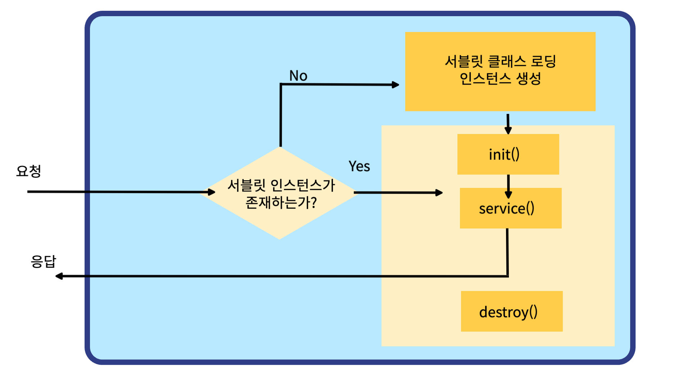

# 파일 업로드
- 파일업로드를 위한 라이브러리가 필요합니다.

servlets.com


WEB-INF -> lib 폴더에 넣어주자


내가 원하는 사진을 골라서 업로드를 할 수 있도록 해주는 페이지

#### uploadInput.jsp 만들기

```jsp
<%@ page language="java" contentType="text/html; charset=UTF-8"
    pageEncoding="UTF-8"%>
<!DOCTYPE html>
<html>
	<head>
		<meta charset="UTF-8">
		<title>Insert title here</title>
    <script type="text/javascript">
			function send(f){
				var title = f.title.value.trim();
				var photo = f.photo.value.trim();
				
				//유효성체크
				if(title == ''){
					alert("제목을 입력하세요");
					return;
				}
				
				if(photo == ''){
					alert("파일을 업로드 하세요");
					return;
				}
				//jsp에서 일반 java파일을 호출하는것은 불가능하다. 대신 Servlet이라고 하는것을 호출 할 수 있다.
				f.action = "upload.do";//upload.do의 url매핑을 가진 서블릿 호충
				f.submit();
			}
		</script>
	</head>
	<body>
	<!-- 파일 업로드시 주의사항
		1) form태그의 전송방식은 반드시 POST
		2) enctype="multipart/form-data" : 필수!!
		enctype (form태그의 파일 데이터를 전송할 때 사용하는 인코딩 기법 -->
		<form method="POST" enctype="multipart/form-data">
		제목 : <input name="title"><br>
		첨부 : <input type="file" name="photo"><br>
		 <!-- 웹에서 사용자의 로컬 파일을 입력받기 위해서 input 태그의 type 속성을 file로 지정하는 방법을 사용한다. -->
		<input type="button" value="업로드" onclick="send(this.form)">
		</form>
	</body>
</html>
```

```
<input type="file">의 기본모양
```


기존의 데이터 전송방식


필요없는 JSP가 늘어나기 때문에 JAVA클래스와 비슷한 Servlet을 만들자.

## Servlet
- 서블릿은 서블릿 클래스로부터 만들어진 객체를 의미한다.
- 하지만 모든 서블릿 객체를 서블릿이라고는 하지 않는다. 웹 서버가 서블릿 클래스를 가지고 서블릿 객체를 만들고<br>그 객체를 초기화해서 웹 서비스를 할 수 있는 상태로 만드는 작업을 거친것을 서블릿이라고 할 수 있다.

## Servlet의 역사
- 자바(JAVA) 언어를 개발한 Sun에서 웹 개발을 위해 만들었다.
- 그래서 JAVA언어로 되어있고, .java가 확장자이다.
- 서블릿(Servlet)은 JAVA 코드를 작성하고 나서 실행하면 클래스파일(.class)을 만들게 된다.
- 서블릿의 단점은 JAVA코드가 한줄만 변경되어도 다시 처음부터 실행해야 한다.

[출처] Servlet/JSP :: Servlet(서블릿)이란? JSP란? |작성자 Showshine

### Servlet을 만들면 반드시 해야 하는 작업
- 서블릿의 주요 클래스와 메서드
    - HttpServlet : 서블릿을 만들기 위해 반드시 상속해야할 필수 클래스
    - HttpServletRequest : 클라이언트가 데이터를 입력하거나 클라이언트의 정보에 대한 요청 값을 가지고 있는 클래스
    - HttpServletResponse : 클라이언트가 요청한 정보를 처리하고 다시 응답하기 위한 정보를 담고 있는 클래스
    - HttpSession : 클라이언트가 세션의 정보를 저장하고 세션 기능을 유지하기 위해 제공되는 

httpServlet에서 제공되는 주요 메서드
|메서드|설명|
|-----|-----|
|void init()|서블릿의 객체가 생성 될 때 호출되는 메서드|
|void destroy()|서블릿의 객체가 메모리에서 사라질 때 호출되는 메서드|
|void service(request,respons)|서블릿의 요청이 있을 때 호출되는 메서드|
|void doget()|html의 form의 메서드가 get일때 호출되는 메서드|
|void doPost()|html에서 form의 메서드가 post일때 호출되는 메서드|

### HelloServlet 클래스 생성하기
```java
package com.korea.test3;

import java.io.IOException;

import javax.servlet.ServletException;
import javax.servlet.ServletRequest;
import javax.servlet.ServletResponse;
import javax.servlet.http.HttpServlet;

@web("/hello")
public class HelloServlet extends HttpServlet{
	
	@Override
	public void init() throws ServletException {
		//서블릿이 초기화 될 때 호출되는 메서드
		//1. 서블릿의 초기화 하는 역할
		System.out.println("[HelloServlet] init() is called");
	}
	
	@Override
	public void service(ServletRequest req, ServletResponse res) throws ServletException, IOException {
		// 1. 입력
		// 2. 처리
		// 3. 출력
		System.out.println("[HelloServlet] service() is called");
	}

	@Override
	public void destroy() {
		//3. 뒷정리 - 서블릿이 메모리에서 제거될 때 서블릿 컨테이너에 의해서 자동 호
		System.out.println("[HelloServlet] destory() is called");
	
	}

	
	
}
```




httpServletRequest에서 제공되는 주요 메서드
|메서드|설명|
|-----|-----|
|String getParameter(name)|name에 할당된 값을 반환하며 지정된 파라미터 값이 없으면 null 값을 반환|
|String[] getParameterValues(name)|name의 모든 값을 String 배열로 반환|
|Enumeration getParameterNames()|요청에 사용된 모든 파라미터 이름을 java.util.Enumeration 타입으로 반환|
|void setCharacterEncoding(env)|post방식으로 요청된 문자열의 character encoding을 설정|

httpServletResponse에서 제공되는 주요 메서드
|메서드|설명|
|-----|-----|
|void setHeader(name, value)|응답에 포함될 Header를 설정합니다.|
|void setContentType(type)|출력되는 페이지의 contentType을 설정|
|String getCharacterEncoding()|응답 페이지의 문자 인코딩 Type을 반환|
|void sendRedirect()|지정된 URL로 요청을 재전송|

httpSession에서 제공되는 주요 메서드
|메서드|설명|
|-----|-----|
|String getId()|해당 세션의 세션 ID를 반환|
|long getCreationTime()|세션의 생성된 시간을 반환|
|long getLastAccessedTime()|클라이언트 요청이 마지막으로 시도된 시간을 반환|
|void setMaxInactiveInterval(time)|세션을 유지할 시간을 초단위로 설정|
|int getMaxinactiveInterval()|setMaxInactiveInterval(time)로 지정된 값을 반환. (기본값 30분)|
|boolean isNew()|클라이언트 세션 ID를 할당하지 않은 경우 true 값을 반환|
|void invalidate()|해당 세션을 종료|


#### FileUploadAction 서블릿 생성


항상 파일을 구분할 때 OOVO, OODAO, OOAction 이렇게 구분하는 편


실제 파일 이름으로 접근하는것이 아닌 url mapping을 따로 설정할 수 있다. 


upload.do로 바꾸고 next를 누르자


여러가지 추상메서드가 있는데 일반적인 java클래스에서 main에 해당하는 service 클래스만 상속받자.


```java
package action;

import java.io.File;
import java.io.IOException;

import javax.servlet.RequestDispatcher;
import javax.servlet.ServletException;
import javax.servlet.annotation.WebServlet;
import javax.servlet.http.HttpServlet;
import javax.servlet.http.HttpServletRequest;
import javax.servlet.http.HttpServletResponse;

import com.oreilly.servlet.MultipartRequest;
import com.oreilly.servlet.multipart.DefaultFileRenamePolicy;

/**
 * Servlet implementation class FileUploadAction
 */
//@WebServlet("/upload.do") : url매핑 - jsp등에서 현재 서블릿을 요청할 수 있는 식별자를 지정하는 영역
@WebServlet("/upload.do")//.do는 임의로 지은것
public class FileUploadAction extends HttpServlet {
	private static final long serialVersionUID = 1L;

	/**
	 * @see HttpServlet#service(HttpServletRequest request, HttpServletResponse response)
	 */
	protected void service(HttpServletRequest request, //요청처리객체
							HttpServletResponse response) //응답처리객체
									throws ServletException, IOException {
		// 매핑이 호출되면 가장먼저 실행되는 메서드
		System.out.println("서블릿접속됨");
		
		//post로 보냈다면 깨지지 않게 하기위해 인코딩을 해주자.
		request.setCharacterEncoding("utf-8");
		
		//파일업로드( multipart/form-data)
		String path = "c:/upload";
		int max_size = 1024*1024*100; //100mb
		
		//파일을 포함한 파라미터를 수신하기 위한 객체
		MultipartRequest mr = new MultipartRequest(request, //request정보를 위임
							   path, //업로드 경로
							   max_size,//최대 업로드 용량
							   "utf-8", //수신시 인코딩 타입
							   new DefaultFileRenamePolicy()// 중복된 파일명을 알아서 변경 같은 이름의 다른 사진을 올리게 되면 갱신되버린다.
							   );
		
		
		String filename = "no_file";
		
		//업로드가 완료된 파일의 정보를 얻어오자
		File f = mr.getFile("photo");
		
		if(f != null) {
			filename = f.getName();//방금 업로드된 파일의 이름을 가져올 수 있다.
		}
		
		//파일 이외의 일반 파라미터
		String title = mr.getParameter("title");
		
		//파일명과 제목을 request영역에 저장
		request.setAttribute("title", title);
		request.setAttribute("filename", filename);
		
		//바인딩해놓은 정보를 어떤 페이지에서 가져다가 사용할 것인지를 지정(포워딩)
		아무 jsp가서 ${title}로 쓸 수 없다. 꼭 포워딩 된곳에서만 사용할 수 있다.		
		RequestDispatcher disp = request.getRequestDispatcher("result.jsp");
		disp.forward(request,response);
	}

}
```

#### result.jsp 생성하기

```
<%@ page language="java" contentType="text/html; charset=UTF-8"
    pageEncoding="UTF-8"%>
<!DOCTYPE html>
<html>
<head>
<meta charset="UTF-8">
<title>Insert title here</title>
<script>
	
</script>
</head>
<body>
	제목: ${ title }<br>
	
</body>
</html>
```
사진이 깨져서 나온다.


하지만 jsp는 프로젝트의 외부경로까지 접근을 할 수가 없다.

프로젝트 내부에서 upload폴더를 하나 만들자.


#### result.jsp 코드 수정하기

```
<%@ page language="java" contentType="text/html; charset=UTF-8"
    pageEncoding="UTF-8"%>
<!DOCTYPE html>
<html>
<head>
<meta charset="UTF-8">
<title>Insert title here</title>
<script>
	
</script>
</head>
<body>
	제목: ${ title }<br>
	
</body>
</html>
```

하지만 사진은 여전히 c드라이브에 있고 불러올수 없다

그렇기 때문에 애초에 프로젝트의 upload폴더에 사진을 넣어야 한다.

- 상대경로 : 프로젝트 내의 눈에 보이는 폴더가 있는 경로(보통 웹을 디자인 하기 위한 이미지를 넣는다.)
- 절대경로 : 컴퓨터 내의 특정 경로에 상대경로와 연결이 되어 있는 폴더

상대경로에 넣은 데이터는 절대경로에 들어가지만, 절대경로에 직접 넣으면 상대경로에서는 보이지 않는다.

#### FileUploadAction 코드 수정하기
- 프로젝트의 upload 폴더와 연결되어 있는 절대경로를 찾아내보자!


```java
package action;

import java.io.File;
import java.io.IOException;

import javax.servlet.RequestDispatcher;
import javax.servlet.ServletContext;
import javax.servlet.ServletException;
import javax.servlet.annotation.WebServlet;
import javax.servlet.http.HttpServlet;
import javax.servlet.http.HttpServletRequest;
import javax.servlet.http.HttpServletResponse;

import com.oreilly.servlet.MultipartRequest;
import com.oreilly.servlet.multipart.DefaultFileRenamePolicy;

/**
 * Servlet implementation class FileUploadAction
 */
@WebServlet("/upload.do")
public class FileUploadAction extends HttpServlet {
	private static final long serialVersionUID = 1L;

	/**
	 * @see HttpServlet#service(HttpServletRequest request, HttpServletResponse response)
	 */
	protected void service(HttpServletRequest request, HttpServletResponse response) throws ServletException, IOException {
		// TODO Auto-generated method stub
		
		String web_path = "/upload/";
		//현재 프로젝트에 대한 정보를 관리하는 클래스
		ServletContext application = request.getServletContext();
		
		//web상의 상대경로 -> 절대경로로 변환
		//더이상 c드라이브로 접근하지 말고 절대경로로 접근해봐
		String path = application.getRealPath(web_path);
		System.out.println(path);
		
		//최대 업로드 용량은 버퍼영역을 사용하여 업로드 시에만 공간을 확보하기 때문에
		//크게 잡아도 메모리 낭비는 없다.
		int max_size = 1024 * 1024 * 100; //최대 업로드 용량이 100mb
		
		//file타입을 포함한 파라미터를 받기위한 객체
		MultipartRequest mr = new MultipartRequest(request,
							   path,	//업로드 경로
		 					   max_size,	//최대 용량
							   "utf-8",	//수신 인코딩 타입
							   new DefaultFileRenamePolicy()); //파일명 중복시 넘버링 처리
		
		//업로드된 파일정보 얻어오기
		String filename = "";
		File f= mr.getFile("photo"); //c:/upload/파일명.jpg
		
		if( f != null) { //정상적으로 파일이 업로드 되었다면
			filename = f.getName(); //업로드 된 파일명
			System.out.println(filename);
		}
		
		//파일클래스 이외의 일반적인 파라미터 수신
		String title = mr.getParameter("title");
		
		//파일정보 바인딩
		request.setAttribute("title", title);
		request.setAttribute("filename", filename);
		RequestDispatcher disp = request.getRequestDispatcher("result.jsp");
		disp.forward(request,response);
	}

}

```


콘솔의 절대경로를 복사해서 파일 탐색기로 가보면 사진이 저장되어 있는걸 확인할 수 있다.

프로젝트를 다시 실행해보면 사진이 잘 나오는걸 확인할 수 있다.

### 개발방법론
- MODEL1 : 하나의 jsp에서 자바코드,CSS,html까지 모든 작업을 다 수행하는 형태
- MODEL2 : 기능에 따라 클래스와 jsp를 분리시켜 사용하는 방법
	- 모델2는 MVC패턴이라고 부른다.
	- M : Model(VO)
	- V : View(jsp)
	- C : Controller(Servlet)


