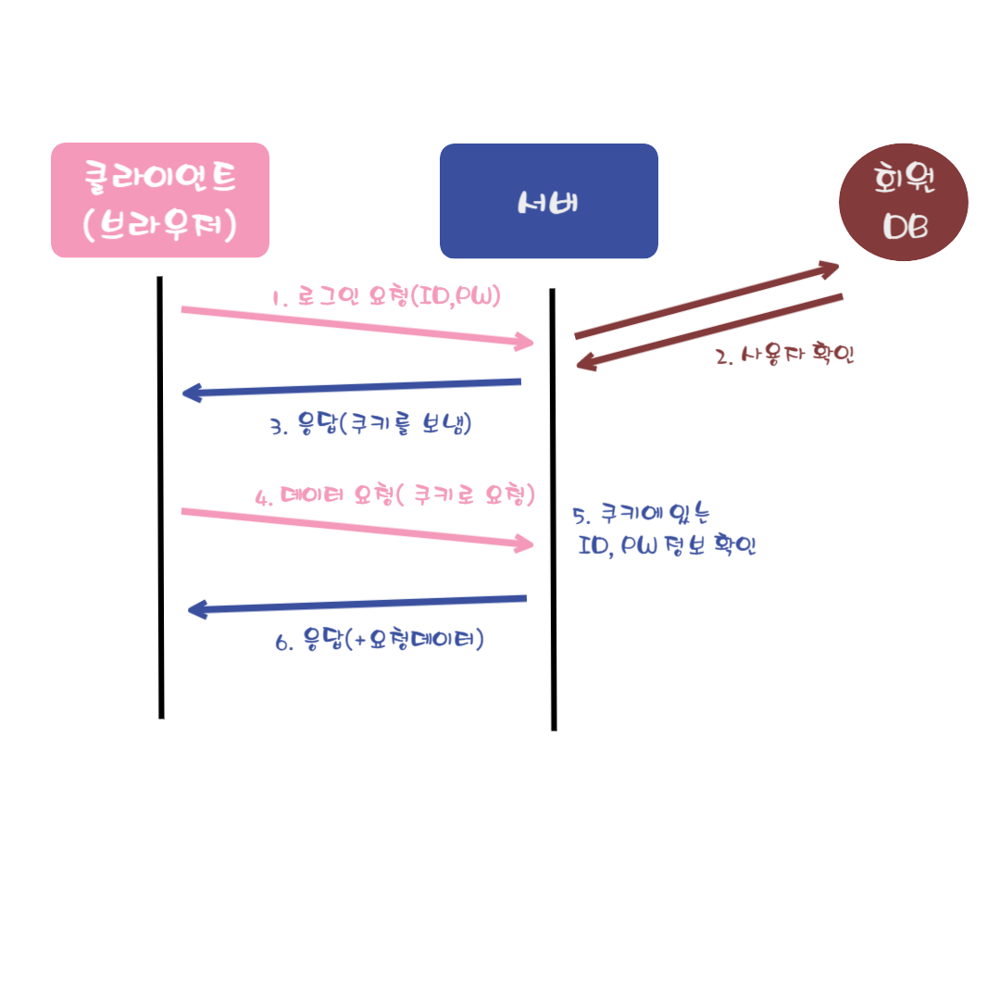
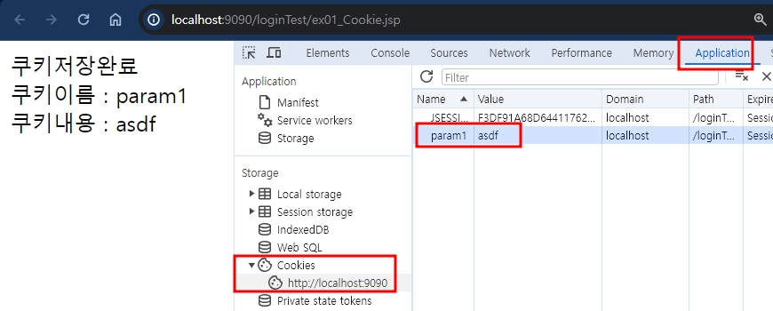
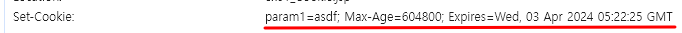

# 웹 어플리케이션 인증의 특수성
- 일반적으로 server - client 구조로 되어있다.
- Http를 이용하여 통신한다. -> 비연결성(Connectionless), 무상태(Stateless)의 특징을 지닌다.

### 비연결성(Connectionless)
- 서버와 클라이언트가 연결되어 있지 않다.
- 서버와 클라이언트가 계속 연결되어 있다면, 서버의 비용이 기하급수적으로 늘어난다.
- 리소스의 절약을 위해 서버는 하나의 요청에 하나의 응답을 보내고 연결을 끊는다.

### 무상태(Stateless)
- 서버가 클라이언트의 이전 상태를 저장하지 않는다. -> 클라이언트가 직전에 무슨 요청을 보냈었는지 알지 못한다.
- 기존 상태를 저장하는 것은 서버의 비용과 부담을 증가시키기 때문에, 기존의 상태가 없다고 가정하는 프로토콜을 구현한다.

# 웹 어플리케이션의 인증 방식
- 비연결성과 무상태의 특성을 생각해보면, 사용자가 로그인을 통해 인증을 거쳐도, 이후 요청에 대해서는 인증된 상태를 유지할 수 없다.
- 서버가 사용자가 로그인 했다는 정보를 저장하지 않기 때문에 , 최초 로그인 이후 매 요청마다 반복적으로 ID,PW를 입력하여 페이지의 접근 허가를 받아야 한다.
- 하지만 우리가 실제로 인터넷을 사용할 때 로그인을 한번 만하고 자유롭게 이동할 수 있었다.
- Http에서는 쿠키(Cookie)와 세션(Session) 방식으로 인증/인가가 이루어집니다.

# 쿠키
- 클라이언트에 저장될 목적으로 생성한 작은 정보를 담은 파일(서버에서 사용자의 브라우저로 전송한다.)
- 브라우저는 서버에서 받은 쿠키를 저장해두었다가, 동일한 서버로 재요청할 때 쿠키를 함께 전송한다.
- 사용자가 로그인을 하면, 서버는 ID, PW 정보를 쿠키에 담아 브라우저로 다시 보낸다.
- 이후 브라우저에서는 요청할 때마다 로그인 정보가 담긴 쿠키를 함께 서버로 보낸다.
- 브라우저에서 매번 요청할 때마다 서버 입장에서는 로그인 정보가 담긴 쿠키를 받게 되는것이다.


## 쿠키의 장점
- 기존 로그인 정보를 사용하기 때문에 인증을 위한 추가적인 데이터 저장이 필요없다.

## 쿠키의 단점
- 사용자의 주요 정보를 매번 요청에 담기 때문에 보안상에 문제가 있을 수 있다.
- 클라이언트에서 쿠키 정보를 쉽게 변경, 삭제할 수 있고, 가로채기 당할 수도 있다.
- 쿠키 사이즈가 커질수록 네트워크 부하가 심해진다.

## 쿠키의 활용
- 쿠키는 서버와의 상호작용 뿐만 아니라, 웹사이트 환경 설정이나 검색 기록을 유지하여 이용자가 웹사이트를 다시 방문할 때 사용 경험을 제공해 주기도 한다.
1. 세션 관리(Session Management) : 서버간 일시적인 연결 유지에 이용(로그인)
2. 개인화(Personalization) : 웹사이트에 대한 사용자 선호, 테마 등의 세팅(다크모드, 언어 설정, 메뉴 순서 최적화)
3. 트래킹(Tracking) : 사용자 행동을 기록하고 분석하는 용도(분석 데이터 수집, 광고에 기여)

## 쿠키의 구성요소
- Name(이름) : 각각의 쿠키를 구별하는 데 사용되는 이름
- Value(값) : 쿠키의 이름과 관련된 값
- Expires(유효시간) : 쿠키의 유지시간
- Domain(도메인) : 쿠키가 저장된 도메인
- Path(경로) : 쿠키를 전송할 요청 경로

## 쿠키의 동작과정

- **쿠키 생성단계** : 쿠키를 사용하려면 먼저 쿠키를 생성해야 합니다. 쿠키는 주로 웹 서버 측에서 생성합니다. 생성된 쿠키는 응답 데이터와 함께 저장되어 웹 브라우저에 전송됩니다.
- **쿠키 저장단계** : 웹브라우저는 응답 데이터에 포함된 쿠키를 쿠키 저장소에 보관합니다. 쿠키는 종류에 따라 메모리나 파일로 저장됩니다.
- **쿠키 전송단계** : 웹브라우저는 한 번 저장된 쿠키를 요청이 있을 때마다 웹 서버에 전송합니다. 웹 서버는 웹 브라우저가 전송한 쿠키를 사용하여 필요한 작업을 수행할 수 있습니다.

> 일단 웹 브라우저에 쿠키가 저장되면 웹 브라우저는 쿠키가 삭제되기 전까지 웹 서버에 쿠키를 전송합니다



#### Cookie 클래스의 메서드 종류

|메서드|반환 유형|설명|
|-----|----|----------|
|getComment()|String|쿠키에 대한 설명을 반환합니다.|
|getDomain()|String|쿠키에 대한 유효한 도메인 정보를 반환합니다.|
|getMaxAge()|int|쿠키의 사용 가능 기간에 대한 정보를 반환합니다.|
|getName()|String|쿠키의 이름을 반환합니다.|
|getPath()|String|쿠키의 유효한 디렉토리 정보를 반환합니다.|
|getSecure()|boolean|쿠키의 보안 설정을 반환합니다.|
|getValue()|String|쿠키에 설정된 값을 반환합니다.|
|getVersion()|int|쿠키의 버전을 반환합니다.|
|setComment(String)|void|쿠키에 대한 설명을 설정합니다.|
|setDomain(String)|void|쿠키에 유효한 도메인을 설정합니다.|
|setMaxAge(int)|void|쿠키의 유효기간을 설정합니다.|
|setPath(String)|void|쿠키가 적용되는 경로를 지정합니다.|
|setSecure(boolean)|void|쿠키의 보안을 설정합니다.|
|setValue(String)|void|쿠키의 값을 설정합니다.|
|setVersion(int)|void|쿠키의 버전을 설정합니다.|

```java
Cookie Cookie(String name, String value)
```

## Ex_날짜_login 프로젝트 생성하기

### SetCookieAction 서블릿 생성하기
```java
package action;

import javax.servlet.RequestDispatcher;
import javax.servlet.ServletException;
import javax.servlet.annotation.WebServlet;
import javax.servlet.http.Cookie;
import javax.servlet.http.HttpServlet;
import javax.servlet.http.HttpServletRequest;
import javax.servlet.http.HttpServletResponse;

/**
 * Servlet implementation class SetCookieAction
 */

//사용자가 주소에 cookie를 치고 요청을 한다.
@WebServlet("/cookie")
public class SetCookieAction extends HttpServlet {
	private static final long serialVersionUID = 1L;

	/**
	 * @see HttpServlet#service(HttpServletRequest request, HttpServletResponse response)
	 */
	protected void service(HttpServletRequest request, HttpServletResponse response) throws ServletException, IOException {
		
		//쿠키를 클래스를 통해 쿠키를 생성하고 정보를 담아준다.
		Cookie cookie = new Cookie("param1", "asdf");

		//응답에 생성한 쿠키를 담아준다.
		response.addCookie(cookie);
		
		response.sendRedirect("ex01_Cookie.jsp");
	}
}

```

### ex01_Cookie.jsp 생성하기
```jsp
<%@ page language="java" contentType="text/html; charset=UTF-8"
    pageEncoding="UTF-8"%>
       
<!DOCTYPE html>
<html>
<head>
<meta charset="UTF-8">
<title>Insert title here</title>
</head>
<body>
	쿠키저장완료<br>
	쿠키이름 : ${cookie.param1.name}<br>
	쿠키내용 : ${cookie.param1.value}<br>
</body>
</html>
```
- SetCookieAction 서블릿에서 실행하면 다음과 같은 결과를 볼 수 있다.


- Application탭에서 저장된 쿠키들을 확인할 수 있다.



### 쿠키 저장방식
- 쿠키는 key=value 형태로 저장되는 문자열로서 여러개의 데이터를 콤마(,)로 열거하여 저장해 구분한다.
- 쿠키는 유효 기간이나 도메인 등을 설정한 파라미터들을 세미콜론(;)을 통해 열거한다.




### 쿠키 객체 얻기 
- 클라이언트에 저장된 모든 쿠키 객체를 가져오려면 request 내장 객체의 getCookies() 메서드를 사용합니다.
- 쿠키 객체가 여러 개 일때는 배열 형태로 가져옵니다.

```java
Cookie[] requst.getCookies()
```

#### getCookies() 메서드 사용 예
```java
Cookie[] cookies = request.getCookies();
```

### 쿠키 객체의 정보 얻기
```java
String getName() //쿠키 이름
String getValue() //쿠키 값 
```

## 쿠키 기한 정하기 
- 만료 날짜를 생략하면 브라우저 종료시 까지만 유지된다.(세션 쿠키)
- 만료 날짜를 입력하면 해당 날짜까지 유지된다.(영속쿠키)
```java
package action;
@WebServlet("/cookie")
public class SetCookieAction extends HttpServlet {
	private static final long serialVersionUID = 1L;

	/**
	 * @see HttpServlet#service(HttpServletRequest request, HttpServletResponse response)
	 */
	protected void service(HttpServletRequest request, HttpServletResponse response) throws ServletException, IOException {
		
		Cookie cookie = new Cookie("param1", "asdf");
		cookie.setMaxAge(60*60*24*7);//일주일

		response.addCookie(cookie);
		
		response.sendRedirect("ex01_Cookie.jsp");
	}
}
```


## 쿠키Path
- 쿠키에 경로를 설정하면, 해당 페이지 경로에서만 쿠키 사용 접근이 가능하다.
- 해당 경로의 하위 경로를 모두 포함한다.
- 그렇기 때문에 루트경로(/)로 설정하면 모든 경로에 쿠키가 유효하다.
- path를 설정하지 않으면 루트경로로 자동 입력 된다.
- 단, 쿠키의 범위를 좁게 잡을 수록 보안에는 좋다.

```java
package action;
@WebServlet("/cookie")
public class SetCookieAction extends HttpServlet {
	private static final long serialVersionUID = 1L;

	/**
	 * @see HttpServlet#service(HttpServletRequest request, HttpServletResponse response)
	 */
	protected void service(HttpServletRequest request, HttpServletResponse response) throws ServletException, IOException {
		
		Cookie cookie = new Cookie("param1", "asdf");
		cookie.setMaxAge(60*60*24*7);//일주일

		//만료 날짜를 생략하면 브라우저 종료시 까지만 유지된다.(세션 쿠키)
		//만료 날짜를 입력하면 해당 날짜까지 유지된다.(영속쿠키)

		cookie.setPath("/");

		response.addCookie(cookie);
		
		response.sendRedirect("ex01_Cookie.jsp");
	}
}
```

## 쿠키 삭제
- Cookie 클래스는 쿠키를 삭제하는 기능을 별도로 제공하지 않는다.
- 쿠키를 더 유지할 필요가 없으면 쿠키의 유효기간을 만료하면 됩니다.
- setMaxAge() 메서드에 유효 기간을 0으로 설정하여 쿠키를 삭제할 수 있습니다.

```java
void setMaxAge(int age)
```

#### setMaxAge() 메서드 사용 예
```java
Cookie cookie = new Cookie("memberId", "admin");
cookie.setMaxAge(0);
response.addCookie(cookie);
```

# 세션
- 서버에서 일정시간 동안 클라이언트의 상태를 유지하기 위해 사용한다.
- 서버에서 클라이언트별 세션 ID를 부여하고, 세션 정보를 서버에 저장한다.
  - 세션 ID : 사용자의 주요 정보가 아닌, 단지 사용자를 식별할 수 있는 값
- 서버에서 생성한 세션 ID는 클라이언트의 쿠키값(세션 쿠키)로 저장된다.
- 클라이언트에서 요청을 보낼 때 이 세션쿠키를 함께 보낸다.
- 서버에서는 클라이언트별 세션 쿠키 값이 저장되어 있으니, 요청으로 온 세션쿠키 값을 보고 어떤 클라이언트인지 식별할 수 있다.

## 세션의 장점
- 사용자의 로그인 정보를 주고 받지 않기 때문에 상대적으로 안전하다.
- 사용자마다 고유한 세션ID가 발급되기 때문에, 요청이 들어올 때마다 회원DB를 찾지 않아도 된다.
  - 쿠키값:JSESSIONID

## 세션의 단점
- 사용자를 식별할 수 있는 값인 세션 ID를 생성하고, 서버에 저장해야 하는 작업이 생긴다.
- 서버 세션 저장소를 사용하므로 요청이 많아지면 서버 부하가 심해진다.


#### session 내장객체 메서드 종류
- javax.servlet.http.HttpSession

|메서드|반환유형|설명|
|------|----|----------|
|getAttribute(String name)|Object|세션 속성 이름이 name인 속성 값을 Object형으로 반환합니다. 해당되는 속성 이름이 없을 때는 null을 반환합니다. 반환값이 Object 형이므로 반드시 형 변환을 하여 사용해야 합니다.|
|getAttributeNames()|Enumeration|세션 속성 이름을 Enumeration 객체 타입으로 반환|
|getCreationTime()|long|세션이 생성된 시간을 반환합니다. 1970년 1월 1일 0시 0초부터 현재 세션이 생성된 시간까지 경과한 시간을 1/1000초 값으로 반환|
|getId()|String|세션에 할당된 고유아이디를 String형으로 반환|
|getLastAccessedTime()|long|해당 세션에 클라이언트가 마지막으로 request를 보낸 시간을 반환합니다.|
|getMaxInactiveInterval(int interval)|int|해당 세션을 유지하기 위해 세션 유지 시간을 반환합니다. 기본 값은 1,800초(30분)입니다.|
|isNew()|boolean|해당 세션의 생성여부를 반환합니다. 처음 생성된 세션이면 true를 반환하고 이전에 생성된 세션이면 false를 반환합니다.|
|removeAttribute(String name)|void|세션 속성 이름이 name인 속성을 제거합니다.|
|setAttribute(String name, Object value)|void|세션 속성 이름이 name인 속성에 value를 할당합니다.|
|setMaxInactiveInterval(int interval)|void|해당 세션을 유지하기 위한 세션 유지 시간을 초 단위로 설정|
|invalidate()|void|현재 세션에 저장된 모든 세션 속성을 제거합니다.|

## 세션 생성
- 세션 속성값은 Object 객체 타입만 가능하기 때문에 int, double, char 등의 기본 타입은 사용할 수 없습니다.
- 만약 동일한 세션의 속성이름으로 세션을 설정하면 마지막에 설장한 것이 세션 속성 값이 됩니다.
```java
void setAttribute(String name, Object value)
```

## ex01_session.jsp 생성하기
```
<%@ page language="java" contentType="text/html; charset=UTF-8"
    pageEncoding="UTF-8"%>
    <%
    	session.setAttribute("param1", "asdf");
    	session.setAttribute("param2", "qwer");
    	session.setAttribute("param3", "zxcv");
    	
    	session.removeAttribute("param1");
    %>
<!DOCTYPE html>
<html>
<head>
<meta charset="UTF-8">
<title>Insert title here</title>
</head>
<body>

</body>
</html>
```

## ex02_session.jsp 생성하기
```
<%@page import="java.util.Enumeration"%>
<%@ page language="java" contentType="text/html; charset=UTF-8"
    pageEncoding="UTF-8"%>
    
    <%
    	Enumeration<String> names = session.getAttributeNames();
    
    
    	while(names.hasMoreElements()){
    		String key = names.nextElement();
    		String value = (String)session.getAttribute(key);
    		out.println(key + " = " + value + "<br>");
    	}
    %>
<!DOCTYPE html>
<html>
<head>
<meta charset="UTF-8">
<title>Insert title here</title>
</head>
<body>

</body>
</html>
```

## ex03_session.jsp 생성
```
<%@ page language="java" contentType="text/html; charset=UTF-8"
    pageEncoding="UTF-8"%>
    
    <%
    	session.setMaxInactiveInterval(60*60*2);
    	//세션의 기본 지속시간은 30분이다.(1800초)
    	int second = session.getMaxInactiveInterval();
    	out.println(second);
    %>
<!DOCTYPE html>
<html>
<head>
<meta charset="UTF-8">
<title>Insert title here</title>
</head>
<body>

</body>
</html>
```

# DB에서 아이디 비밀번호 가져와서 로그인하기

Ex_날짜_login 프로젝트 생성하기

## 테이블 생성하기
이미 있는 사람은 추가하지 않아도 된다.
```
--일련번호 관리객체
create sequence seq_member_idx;

--회원테이블
create table member(
	idx int primary key,               --일련번호
	name varchar2(100) not null,       --이름
	id varchar2(100) not null unique,  --아이디(중복방지 unique)
	pwd varchar2(100) not null,        --패스워드
	email varchar2(100) unique        --이메일
);

--샘플 데이터 추가
insert into member values( seq_member_idx.nextVal,
				 '홍길동', 
				 'one',
				 '1234',
				 'one@korea.com'
				 );

--커밋
commit;
```

## check_login.jsp 생성하기
-로그인이 되어있는 상태인지를 검증하기 위한 jsp
```html
<!DOCTYPE html>
<html>
<head>
<meta charset="UTF-8">
<title>Insert title here</title>
</head>
<body>
	나는 로그인을 확인하지!
</body>
</html>
```
## main_content.jsp 생성하기
- 로그인이 됐을때만 접근 가능한 페이지
```html
<%@ page language="java" contentType="text/html; charset=UTF-8"
    pageEncoding="UTF-8"%>
<!DOCTYPE html>
<html>
<head>
<meta charset="UTF-8">
<title>Insert title here</title>
</head>
<body>
url에 main_content.jsp를 그냥 쓰면 로그인을 안해도 접근이 가능하다.
check_login.jsp를 거쳐서 나오게 해보자
외부에 있는걸 붙힌다. 

로그인이 필요한 페이지에서는 아래의 코드를 가지고 있으면 된다.
	<jsp:include page="check_login.jsp"/>
	 <!-- main_content페이지에 접근하려고 해도 check_login에 먼저 접근해야 한다. -->
	메인페이지
</body>
</html>
```
## login_form.jsp 생성하기
- 아이디가 틀렸으면 아이디가 없다고, 비밀번호가 틀렸으면 비밀번호가 틀렸다고 유효성체크 나눠서 해주기
```JS
<%@ page language="java" contentType="text/html; charset=UTF-8"
    pageEncoding="UTF-8"%>
<!DOCTYPE html>
<html>
<head>
<meta charset="UTF-8">
<title>Insert title here</title>
ajax사용하기 위해 등록해주기
로그인시도할 때 아이디가 없으면 아이디가 없다고 경고, 비밀번호가 틀리면 비밀번호가 틀렸다고 경고를 따로 띄워주자.
'아이디나 비밀번호가 틀렸습니다' 라고 나오면 개발자가 귀찮아서 코드를 추가하지 않은것
	<script src="js/httpRequest.js"></script>
	<script>
		function send(f){
			var id = f.id.value.trim();
			var pwd = f.pwd.value.trim();
			
			//유효성체크
			if(id==''){
				alert("아이디를 입력해주세요");
				return;
			}
			
			if(pwd==''){
				alert("비밀번호를 입력하세요");
				return;
			}
			
			var url = "login.do";
			var param ="id="+encodeURIComponent(id)+"&pwd="+encodeURIComponent(pwd);
			
			sendRequest(url,param,myCheck,"POST");
		}
		
		//콜백메서드
		function myCheck(){
			if(xhr.readyState == 4 && xhr.status == 200){
				
			}
		}
	</script>
</head>
<body>
	<form>
		<table border="1" align="center">
			<caption>:::로그인:::</caption>
			<tr>
				<th>아이디</th>
				<td><input name="id"></td>
			</tr>
			<tr>
				<th>비밀번호</th>
				<td><input name="pwd" type="password"></td>
			</tr>
			<tr>
			
				<td colspan="2" align="center">
					<input  type="button" value="로그인" onclick="send(this.form)">
				</td>
			</tr>
			
		</table>
	</form>

</body>
</html>
```

## MemberVO 클래스 생성
```java
package vo;

public class MemberVO {
	private String name,id,pwd;

	public String getName() {
		return name;
	}

	public void setName(String name) {
		this.name = name;
	}

	public String getId() {
		return id;
	}

	public void setId(String id) {
		this.id = id;
	}

	public String getPwd() {
		return pwd;
	}

	public void setPwd(String pwd) {
		this.pwd = pwd;
	}	
}
```

## LoginAction 생성
```JAVA
package action;

import java.io.IOException;

import javax.servlet.ServletException;
import javax.servlet.annotation.WebServlet;
import javax.servlet.http.HttpServlet;
import javax.servlet.http.HttpServletRequest;
import javax.servlet.http.HttpServletResponse;

import dao.MemberDAO;
import vo.MemberVO;

/**
 * Servlet implementation class LoginAction
 */
@WebServlet("/login.do")
public class LoginAction extends HttpServlet {
	private static final long serialVersionUID = 1L;

	/**
	 * @see HttpServlet#service(HttpServletRequest request, HttpServletResponse response)
	 */
	protected void service(HttpServletRequest request, HttpServletResponse response) throws ServletException, IOException {
		// login.do?id=aaaa&pwd=1111
		
		String id = request.getParameter("id");
		String pwd = request.getParameter("pwd");
		
		MemberVO vo = MemberDAO.getInstance().selectOne(id); 
	}

}
```
## MemberDAO 클래스 생성
```java
package dao;

import java.sql.Connection;
import java.sql.PreparedStatement;
import java.sql.ResultSet;
import java.sql.SQLException;

import service.DBService;
import vo.MemberVO;

public class MemberDAO {
	// single-ton pattern: 
	// 객체1개만생성해서 지속적으로 서비스하자
	static MemberDAO single = null;

	public static MemberDAO getInstance() {
		//생성되지 않았으면 생성
		if (single == null)
			single = new MemberDAO();
		//생성된 객체정보를 반환
		return single;
	}
	
	//로그인 체크
실수를 많이 하는부분 id랑 pwd를 둘다 받았다고 가정해보자 쿼리문이
select * from member where id=? and pwd=? 이렇게 만드는 순간
id가 없어도 null이 들어오고 비밀번호가 틀려도 null이 들어온다.
아이디나 비밀번호가 잘못되었습니다 라고 나옴;;
	public MemberVO selectOne(String id) {

		MemberVO vo = null;

		Connection conn = null;
		PreparedStatement pstmt = null;
		ResultSet rs = null;
		String sql = "select * from member where id=?";

		try {
			//1.Connection얻어온다
			conn = DBService.getInstance().getConnection();
			//2.명령처리객체정보를 얻어오기
			pstmt = conn.prepareStatement(sql);

			//3.pstmt parameter 설정
			pstmt.setString(1, id);
			//4.결과행 처리객체 얻어오기
			rs = pstmt.executeQuery();

			if (rs.next()) {
				vo = new MemberVO();
				//현재레코드값=>Vo저장
				vo.setPwd(rs.getString("pwd"));
				vo.setName(rs.getString("name"));
			}

		} catch (Exception e) {
			// TODO: handle exception
			e.printStackTrace();
		} finally {

			try {
				if (rs != null)
					rs.close();
				if (pstmt != null)
					pstmt.close();
				if (conn != null)
					conn.close();
			} catch (SQLException e) {
				// TODO Auto-generated catch block
				e.printStackTrace();
			}
		}

		return vo;
	}
}
```
## LoginAction 에 코드 추가하기

```java
.....
MemberVO vo = MemberDAO.getInstance().selectOne(id); 

String param = " ";		
String resultStr=" ";

//vo가 null인경우 id자체가 DB에 존재하지 않는다는 의미
if(vo==null) {
	param = "no_id";
	resultStr = String.format("[{'param':'%s'}]", param);
	response.getWriter().print(resultStr);
	return;
} 

if(!vo.getPwd().equals(pwd)) {
	//비밀번호가 일치하지 않을 때
	param = "no_pwd";
	resultStr = String.format("[{'param':'%s'}]", param);
	response.getWriter().print(resultStr);
	return;
}

//아이디와 비빌번호 체크에 문제가 없다면 세션에 바인딩 한다.
//세션은 서버의 메모리(램)를 사용하기 때문에 세션을 많이 사용할수록 브라우저가 느려지기 때문에
//필요한 곳에서만 세션을 쓰도록 하자

//세션유지시간(기본값 30분)
		HttpSession session = request.getSession();
		//session.setMaxInactiveInterval(3600); //세션이 1시간 유지 초단위로 써줘야함;;
		session.setAttribute("vo", vo); 

//포워딩을 할 필요가 없고 어느 jsp에서든 el표기법으로 vo.name,vo.pwd를 사용할 수 있다.

로그인 성공한 경우
param="clear";
resultStr = String.format("[{'param':'%s'}]", param);
response.getWriter().print(resultStr);


여기서 할 일을 마쳤으니 콜백메서드로 돌아가자
```
## login_form.jsp 콜백메서드에 코드 작성하기
```js
function myCheck(){
	if(xhr.readyState == 4 && xhr.status == 200){
		var data = xhr.responseText;
		var json = eval(data);

		if(json[0].param == 'no_id'){
			alert("아이디가 존재하지 않습니다.");
		}else if(json[0].param == 'no_pwd'){
			alert("비밀번호가 맞지 않습니다.");
		}else {
			alert("로그인 성공");
			location.href="main_content.jsp";
	//로그인에 성공하면 메인 화면으로 이동할건데 로그인 하지 않아도 위의 주소를 치면 이동이 가능하다는 치명적인 단점이 있다.
	//이걸 잡아줘야 한다.
		}
	}
}
```

## check_login.jsp 수정하기
```js
<%@ taglib prefix="c" uri="http://java.sun.com/jsp/jstl/core" %>
<c:if test="${empty vo }"> <!-- vo가 비어있다는 것은 세션에 저장을 못했다는것! -->
	<script>
		alert("로그인 후 이용해주세요");
		location.href="login_form.jsp";
	</script>
</c:if>
```
## 로그아웃 기능 만들기
```js
<%@ page language="java" contentType="text/html; charset=UTF-8"
    pageEncoding="UTF-8"%>
<!DOCTYPE html>
<html>
<head>
<meta charset="UTF-8">
<title>Insert title here</title>
</head>
<body>
	<jsp:include page="check_login.jsp"/>
	 <!-- main_content페이지에 접근하려고 해도 check_login에 먼저 접근해야 한다. -->
	메인페이지<br>
	${vo.name}님 로그인을 환영합니다.
	<input type="button" onclick="logout.do">
</body>
</html>
```
## LogoutAction 생성하기
```java
package action;

import java.io.IOException;

import javax.servlet.ServletException;
import javax.servlet.annotation.WebServlet;
import javax.servlet.http.HttpServlet;
import javax.servlet.http.HttpServletRequest;
import javax.servlet.http.HttpServletResponse;
import javax.servlet.http.HttpSession;

/**
 * Servlet implementation class LogoutAction
 */
@WebServlet("/logout.do")
public class LogoutAction extends HttpServlet {
	private static final long serialVersionUID = 1L;

	protected void service(HttpServletRequest request, HttpServletResponse response) throws ServletException, IOException {
		HttpSession session = request.getSession(); 
		세션객체는 static이라서 주소를 다 공유한다. 어차피 객체를 여러개 만들어도 하나만 생성되어 있다.
		//session.removeAttribute("vo");
		//세션에 들어있는 모든 속성을 제거한다.
		session.invalidate();
		
		response.sendRedirect("login_form.jsp");
	}
}
```
## <jsp:include> 액션태그 응용하기
- 학원 홈페이지만 둘러봐도 상단과 하단은 계속 같은 내용을 보여주는것을 알 수 있다.
- 로그인 기능을 구현하면서 <jsp:include>를 사용했다.<br> 코드는 항상위에서 아래로 실행이 되면서 <jsp:include>의 page속성에 정의된 페이지가 먼저 실행되는 모습을 보았다.
- 이를 이용하여 페이지를 모듈화하여 상단과 하단의 코드를 jsp파일을 따로 만들어 한번만 작성하여 코드를 효과적으로 줄일 수 있다.


\<jsp:include\> 액션태그와 <%@ include %> 처리과정 차이


### layout.jsp 생성하기
```js
<%@ page language="java" contentType="text/html; charset=EUC-KR"
    pageEncoding="EUC-KR"%>
<html>
<head>
    <title>layout</title>
</head>
<body>
    
    <table width="400" border="1" cellpadding="0" cellspacing="0">
        <tr>
            <td>
                <jsp:include page="top.jsp" flush="false"/>
            </td>
        </tr>
        <tr>
            <td>
                <jsp:include page="content.jsp" flush="false"/>
            </td>
        </tr>
        <tr>
            <td>
                <jsp:include page="bottom.jsp" flush="false"/>
            </td>
        </tr>
    </table>
    
</body>
</html>
```

### top.jsp 생성하기
```js
<%@ page language="java" contentType="text/html; charset=UTF-8"
    pageEncoding="UTF-8"%>
<html>
<head>
    <title>top</title>
</head>
<body>
    상단메뉴 : 
    <a href="#">HOME</a> 
    <a href="#">INFO</a>
</body>
</html>
```

### bottom.jsp 생성하기
```JS
<%@ page language="java" contentType="text/html; charset=EUC-KR"
    pageEncoding="EUC-KR"%>
<html>
<head>
    <title>bottom</title>
</head>
<body>
    하단메뉴 : 
    <a href="#">도움말</a> 
    <a href="#">약관</a>
    <a href="#">사이트맵</a>
</body>
</html>
```

### content.jsp
```JS
<%@ page language="java" contentType="text/html; charset=EUC-KR"
    pageEncoding="EUC-KR"%>
<html>
<head>
    <title>content</title>
</head>
<body>
    <br><br>
    내용 페이지
    <br><br>
</body>
</html>
```


