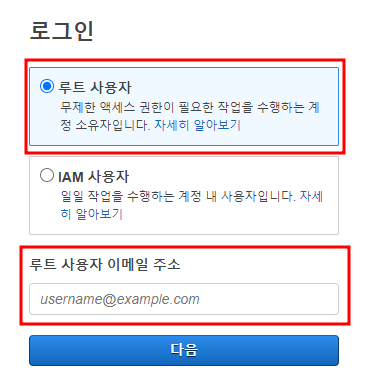
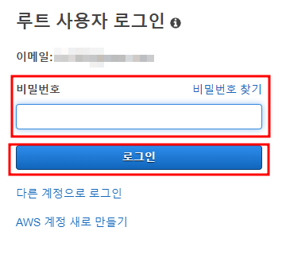
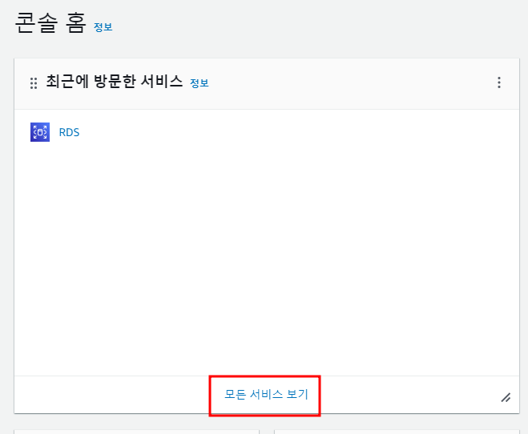
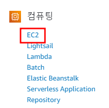
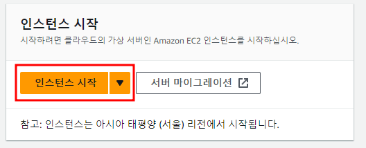
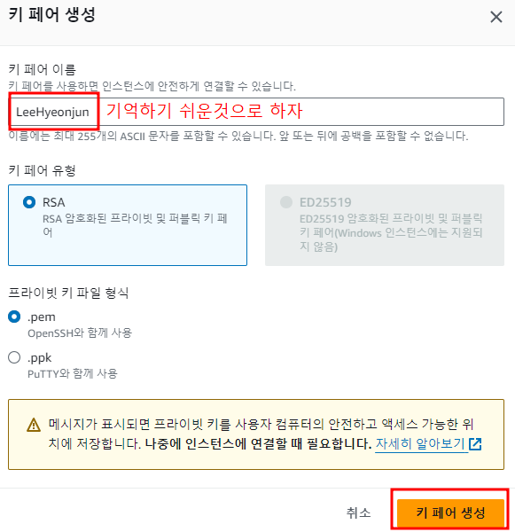
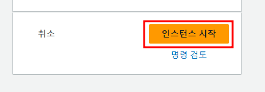
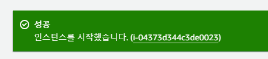
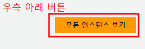

# AWS에 서버 구축하기

## AWS란?
- Amazon이 제공하는 cloud service
- 관리가 쉽과 빠르고 유연한 확장성이 장점
- 필요할때만 사용하고, 사용한 만큼만 비용 지불

### CLOUD환경
- 광대한 네트워크를 통하여 접근할 수 있는 가상화된 서버와 서버에서 작동하는 프로그램과 데이터베이스를 제공하는 IT환경

## AWS가입하기
- 최초 가입시 12개월 동안 프리티어 계정 사용가능

https://aws.amazon.com/ko/free

[주의] 무료 사용량을 초괗하면 과금될 수 있음

## Amazon EC2
- 크기 조정이 가능한 컴퓨팅 용량을 클라우드에서 제공하는 웹 서비스
- 여기에 가상 컴퓨터를 사용하여 인스턴스를 만들것이다.
- 이곳에 윈도우와 톰캣, 데이터베이스를 설치하여 사용해보자

### 그 외의 서비스
- Amazon S3
    - 확장성, 가용성, 내구성을 가진 데이터 저장공간(Simple Storage)을 제공
- Amazon RDS 
  - 관계형 DB관리 서비스
  - 관계형 DB(MySQL, Oracle등)를 모니터링 주기적인 백업

## [참고] 관련용어
- on-Premise : 서버를 직접 운영하는 방식
- Serverless : 서버 작업을 서버내부가 아닌 클라우드 서비스로 처리
- Region : 데이터센터가 물리적으로 존재하는 곳(최근에 서울리전이 생겼다)
- CDN(Content Delivery Network) : 정책 리소스를 빠르게 제공할 수 있게 전세계의 캐시서버에 복제해주는 서비스

## 로그인 하기
1. 아이디 입력하기

2. 비밀번호 입력하기

## EC2 구축하기

1. 모든 서비스로 이동하기

2. EC2로 이동하기

3. 리전바꾸기
- 서울이 아니라면 오른쪽 위 클릭하여 바꿔주기

4. 인스턴스 시작 누르기

5. OS 선택하기

6. 새 키 페어 생성하기

7. 인스턴스 시작
   

