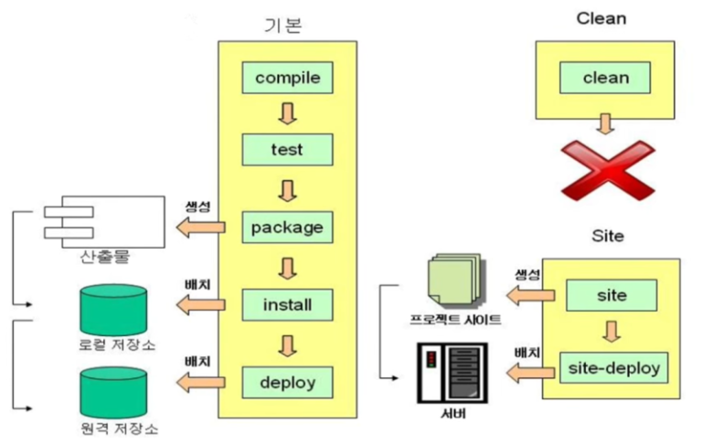

# 프레임워크란?
- Mybatis와 같이 뭔가를 만들기 위한 하나의 기본적인 틀을 의미한다.<br>이곳에 필요한 내용을 조립해서 쓰는 구조라고 생각하면 된다.

스프링 시스템 이전에 EJB(엔터프라이즈 자바빈즈)라는 프레임워크를 사용하고 있었는데, 이는 개발비용이 수억에서 수십억에 달한다.<br>
그러나 Spring을 통해 EJB의 90% 이상의 기능을 구현할 수 있으며, 오픈소스 기반이기 때문에 제작비용이 들지 않는다는 장점이 있다.<br>
이게 스프링을 많이 사용하는 이유다.<br>

전자정부표준프레임워크 = SpringFramework라고 생각해도 무방할 정도로 국내에 입찰되는 정부사업은 대부분 Spring을 사용한다고 보면 된다.<br>

Spring은 아래 그림과 같이 기본 틀을 제공하고 필요한 기능들을 추가해서 사용하는 구조라고 생각하면 된다.<br>
( 로그인, 게시판 등 만들어져 있는 기능을 끼워넣어서 사용하면 되는데, 물론 원하는 모양으로 디자인 하려면 커스터마이징이 필요하긴 하다.)<br>


# 스프링 프레임워크란?
스프링(Spring)은 매우 방대한 기능을 제공하고 있어서 스프링을 한마디로 정의하기는 힘들다. 흔히 스프링이라고 하면 스프링 프레임워크를 말하는데, 스프링 프레임워크의 주요 특징은 다음과 같다.
- <b>의존 주입(Dependency Inject : DI)</b> 지원
- <b>AOP(Aspect-Oriented Programming)</b> 지원
- <b>MVC 웹 프레임워크</b> 제공
- <b>JDBC, JPA 연동, 선언적 트랜잭션 처리 등 DB 연동</b> 지원<br><br>

이 외에도 스케줄링, 메시지 연동(JMS), 이메일 발송, 테스트 지원 등 자바 기반 어플리케이션을 개발하는데 필요한 다양한 기능을 제공한다.<br><br>

실제로 스프링 프레임워크를 이용해서 웹 어플리케이션을 개발할 때에는 스프링 프레임워크만 단독으로 사용하기 보다는 여러 스프링 관련 프로젝트를 함께 사용한다. 현재 스프링을 주도적으로 개발하고 있는 피보탈(Pivotal)은 스프링 프레임워크뿐만 아니라 어플리케이션 개발에 필요한 다양한 프로젝트를 진행하고 있다. 이들 프로젝트 중 자주 사용되는 것은 다음과 같다.
- <b>스프링 데이터</b> : 적은 양의 코드로 데이터 연동을 처리할 수 있도록 도와주는 프레임워크이다. JPA, 몽고DB, 레디스 등 다양한 저장소 기술을 지원한다.
- <b>스프링 시큐리티</b> : 인증/인가와 관련된 프레임워크로서 웹 접근 제어, 객체 접근 제어, DB - 오픈 ID - LDAP 등 다양한 인증 방식, 암호화 기능을 제공한다.
- <b>스프링 배치</b> : 로깅/추적, 작업 통계, 실패 처리 등 배치 처리에 필요한 기본 기능을 제공한다. <br><br>
이 외에도 스프링 인티그레이션, 스프링 하둡, 스프링 소셜 등 다양한 프로젝트가 존재한다. 각 프로젝트에 대한 내용은 [https://spring.io](https://spring.io) 사이트를 참고하기 바란다.
* * *

## 스프링 프레임워크의 특징
1. 경량 컨테이너(크기와 부하의 측면)로서 자바 객체를 직접 관리
	- 각각의 객체 생성, 소멸과 같은 라이프 사이클을 관리하며 스프링으로부터 필요한 객체를 얻어올 수 있다.
2. 제어 역행(IoC : Inversion of Control)
	- 애플리케이션의 느슨한 결합을 도모.(항상 결합은 약하게 유지하는것이 좋다.)
	- 컨트롤의 제어권이 사용자가 아니라 프레임워크에 있어 필요에 따라 스프링에서 사용자의 코드를 호출한다.

3. 의존성 주입(DI : Dependency Injection)
	- 각각의 계층이나 서비스들 간에 의존성이 존재할 경우 프레임워크가 서로 연결시켜준다.

4. 관점지향 프로그래밍(AOP : Aspect-Oriented Programming)
	- 트랜잭션이나 로깅, 보안과 같이 여러 모듈에서 공통적으로 사용하는 기능의 경우 해당 기능을 분리하여 관리할 수 있다.

5. 애플리케이션 객체의 생명 주기와 설정을 포함하고 관리한다는 점에서 컨테이너(Container)라고 할 수 있다.
	- iBatis, myBatis나 Hibernate등 완성도가 높은 데이터베이스처리 라이브러리와 연결할 수 있는 인터페이스를 제공한다.
	
* * *

# Maven
- Maven이란 자바용 프로젝트 관리 도구이이다.
- Maven은 Apache사에서 만든 빌드툴(build tool)이다
- pom.xml파일을 통해 정형화된 빌드 시스템으로 프로젝트 관리를 해준다.
- 필요한 라이브러리를 pom.xml에 정의해 놓으면 내가 사용할 라이브러리뿐만 아니라
- 해당 라이브러리가 작동하는 데에 필요한 다른 라이브러리들까지 관리하여 네트워크를 통해 자동 다운을 해준다.
- 프로젝트의 전체적인 라이프 사이클을 관리한다.

## 빌드
- 프로젝트를 위해 작성한 Java코드나 여러 자원들(.xml, .jar, .properties)를 JVM이나 톰캣 같은 WAS가 인식할 수 있는 구조로 패키징 하는 과정 및 결과물이다.
- 또 단순히 컴파일 해주는 작업 뿐만 아니라, 테스팅, 검사, 배포까지 일련의 작업들을 통틀어 빌드라고 한다.
- 빌드 순서는 compile -> test -> package순으로 진행된다.
- compile은 src/main/java 디렉토리 아래의 모든 소스 코드를 컴파일 하는 과정이다.
- test는 src/test/java, src/test/resources 테스트 자원 복사 및 테스트 소스를 컴파일 하는 과정이다.
- packaging단계는 컴파일과 테스트가 완료된 후에 jar, war같은 형태로 압축하는 작업이다.

## Maven의 특징
- 빌드 과정을 쉽게 만들기
- 정형화된 빌드 시스템 제공
- Maven은 Pom과 플러그인 세트를 사용하여 프로젝트를 빌드한다.
- 양질의 프로젝트 정보 제공
- 더 나은 개발

## 장점
- 편리한 의존성 라이브러리
- 정해진 빌드 방법을 사용하여 협업에서 유리하게 작용
- 다양한 플러그인을 통해 많은 작업이 자동화됨


## Maven LifeCycle




* * *

# 개발환경 구축하기
- JDK 설치 및 JAVA_HOME 환경 변수 설정 : [1.JAVA/day01(환경구축,주석,자료형,변수)](https://github.com/to7485/Web1500/tree/main/1.JAVA/day01(%ED%99%98%EA%B2%BD%EA%B5%AC%EC%B6%95%2C%EC%A3%BC%EC%84%9D%2C%EC%9E%90%EB%A3%8C%ED%98%95%2C%EB%B3%80%EC%88%98))

## STS 설치하기
- STS란? : 스프링개발만을 위한 이클립스


- STS4를 눌러서 들어가지만 STS4를 사용하지는 않을것.


- 아래로 스크롤을 해 STS3를 다운받을 수 있는 GITHUB로 이동한다.


- 운영체제에 맞는 STS를 다운받는다.


- 압축을 풀면 우리가 평소에 사용하던 이클립스처럼 실행할 수 있다.


- work폴더를 설정하여 실행을 한다.


- 톰캣 9버전을 다운로드 받자


- 왼쪽아래 VM어쩌구 되어있는거 클릭하고 delete를 눌러 삭제하자
- 그리고 다운받은 톰캣을 등록해주자.


- 톰캣 더블클릭하면 포트를 바꿀수 있다.


- 뭐가 모자란다는 경고가 뜰 수 있다.


***
# 환경설정하기
- 우리가 jsp를 하면서 했던 설정들을 다 해주자.


# 스프링 프로젝트 생성하기

## Ex_날짜_Spring
- File > new > Spring Legacy Project


- Spring MVC Project로 템플릿을 설정한다.


- 스프링 작업을 위한 메인 패키지가 미리 준비가 되어있어야 한다.
- 패키지는 3단계 이상 되어야 활성화가 된다.
- 단계는 .으로 구분한다.
- 패키지는 단순히 저장을 하는 용도만이 아니라 프로젝트끼리 구별하는 식별자로도 활용이된다.


# 프로젝트의 기본 경로
|경로|설명|
|---|---|
|src/main/java|서버단 JAVA파일|
|src/test/java|단위테스트를 위한 JAVA파일|
|src/main/resources|관련 설정파일|
|src/test/resources|src/main/test 관련 설정 파일|
|src/main/webapp/WEB-INF/views|jsp, html파일경로|
|pom.xml|라이브러리 의존성 관리|
|src/main/webapp/WEB-INF/spring/appServlet/servlet-context.xml| 웹과 관련된 스프링 설정파일|
|src/main/webapp/WEB-INF/spring/root-context.xml| 스프링 객체 관련 설정 파일|

- 프로젝트를 처음 만들게 되면 예제들이 기본적으로 만들어져있다.
- 실행할 때는 프로젝트에 우클릭을 하여 run as > run on server로 실행하자


- 프로젝트가 만들어지면 api나 라이브러리와 같은 정보들이 모두 pom.xml파일에 기록이 되어있다.


# pom.xml
- Project Object Model의 약자로 프로젝트의 다양한 정보를 처리하기 위한 객체 모델이다.
- pom.xml에는 프로젝트 관리 및 빌드에 필요한 환경 설정, 의존성 관리 등의 정보를 기술한다.

## pom.xml의 최소한의 구성
```xml
<project>
    <modelVersion>4.0.0</modelVersion>
    <groupId>org.example</groupId>
    <artifactId>maven-pom-project</artifactId>
    <version>1.0-SNAPSHOT</version>
</project>
```
- project,modelVersion, groupId, artifactId,version은 메이븐이 허용한 최소값이다.

## pom.xml의 기본속성 태그
```xml
<project></project>
```
- 프로젝트의 정보를 기술한다.

```xml
<modelVersion>4.0.0</modelVersion>
```
- 4.0.0이라고 적혀있는 것은 maven의 pom.xml의 모델 버전이다.
- Maven 1.x버전들은 3.0.0모델을 사용하였지만 Maven 2.x, Maven 3.x는 4.0.0버전을 사용한다.

```xml
<groupId>org.example</groupId>
```
- 프로젝트를 생성한 그룹명으로 제작사와 회사, 단체 등을 식별하기 위한것이다.

```xml
<artifactId>maven-pom-project</artifactId>
```
- 버전정보를 생략한 jar파일의 이름이다.

```xml
<version>4.0.0</version>
```
- 명시된 그룹의 artifact버전을 표기한다.
- 숫자와 점으로 이루어진(4.0.0)일반적인 버전 형태를 사용한다.

```xml
<packaging>jar</packaging>
```
- 프로젝트를 어떤 형태로 패키징할지 지정한다.(jar, war, zip등...)

```xml
<properties>
	<spring.maven.artifact.version>4.3.16.RELEASE</spring.maven.artifact.version>
</properties>
```
- pom.xml에서 사용하는 속성값들을 정의하고 pom내 어디서든 사용할 수 있다.

```xml
<dependencies>
	<dependency>
      <groupId>org.springframework</groupId>
      <artifactId>spring-context-support</artifactId>
      <version>${spring.maven.artifact.version}</version>
    </dependency>
    <dependency>
      <groupId>org.springframework</groupId>
      <artifactId>spring-core</artifactId>
      <version>${spring.maven.artifact.version}</version>
	</dependency>
</dependencies>
```
- \<dependencies\>는 pom.xml 태그중 최상위 속성을 가진 태그중 하나이며, 프로젝트와 의존관계에 있는 라이브러리를 모아서 관리하는 곳이다.
- 각각의 의존 라이브러리들의 정보는 \<dependency\>태그를 사용하여 작성한다.
- 참고로 \<dependencies\>태그는 라이브러리들을 모아서 관리하는 곳이기에 \<dependency\>태그를 사용하여 필요한 라이브러리를 기술하면 된다.

```xml
<dependency>
      <groupId>junit</groupId>
      <artifactId>junit</artifactId>
      <version>4.12</version>
      <scope>test</scope>
</dependency>
```
- \<dependency\>태그는 라이브러리의 정보를 기술한다.
- groupId,artifactId,version은 위에 pom.xml의 기본태그에서 설명한 바와 같다.
- <scope>태그는 이 라이브러리가 이용되는 범위를 지정하는 것이다.

## Build 수행을 위한 pom.xml태그와 설정
- 빌드 구성은 pom.xml에서 \<plugin\>설정에 의해 실행된다.
- \<plugin\> : 빌드에서 사용할 플러그
### maven에서 플러그인이란?
- Maven은 여러 플러그인으로 구성되어 있으며, 각각의 플러그인은 하나 이상의 명령을 포함하고 있다.


## pom.xml 수정하기
```xml
<?xml version="1.0" encoding="UTF-8"?>
<project xmlns="http://maven.apache.org/POM/4.0.0" xmlns:xsi="http://www.w3.org/2001/XMLSchema-instance"
	xsi:schemaLocation="http://maven.apache.org/POM/4.0.0 https://maven.apache.org/maven-v4_0_0.xsd">
	<modelVersion>4.0.0</modelVersion>
	<groupId>com.korea</groupId>
	<artifactId>kkk</artifactId>
	<name>PomTest</name>
	<packaging>war</packaging>
	<version>1.0.0-BUILD-SNAPSHOT</version>
	<properties>
//////////////////////////////////////////////////////////////////////////////////////////////////////
		<java-version>11</java-version>
		<org.springframework-version>5.1.20.RELEASE</org.springframework-version>
		<org.aspectj-version>1.9.0</org.aspectj-version>
		<org.slf4j-version>1.7.25</org.slf4j-version>
//////////////////////////////////////////////////////////////////////////////////////////////////////
	</properties>
	<dependencies>
	
		<!-- Spring -->
		<dependency>
			<groupId>org.springframework</groupId>
			<artifactId>spring-context</artifactId>
			<version>${org.springframework-version}</version>
			<exclusions>
				<!-- Exclude Commons Logging in favor of SLF4j -->
				<exclusion>
					<groupId>commons-logging</groupId>
					<artifactId>commons-logging</artifactId>
				 </exclusion>
			</exclusions>
		</dependency>
		<dependency>
			<groupId>org.springframework</groupId>
			<artifactId>spring-webmvc</artifactId>
			<version>${org.springframework-version}</version>
		</dependency>
				
		<!-- AspectJ -->
		<dependency>
			<groupId>org.aspectj</groupId>
			<artifactId>aspectjrt</artifactId>
			<version>${org.aspectj-version}</version>
		</dependency>	
		
		<!-- Logging -->
		<dependency>
			<groupId>org.slf4j</groupId>
			<artifactId>slf4j-api</artifactId>
			<version>${org.slf4j-version}</version>
		</dependency>
		<dependency>
			<groupId>org.slf4j</groupId>
			<artifactId>jcl-over-slf4j</artifactId>
			<version>${org.slf4j-version}</version>
			<scope>runtime</scope>
		</dependency>
		<dependency>
			<groupId>org.slf4j</groupId>
			<artifactId>slf4j-log4j12</artifactId>
			<version>${org.slf4j-version}</version>
			<scope>runtime</scope>
		</dependency>
		<dependency>
			<groupId>log4j</groupId>
			<artifactId>log4j</artifactId>
			<version>1.2.15</version>
			<exclusions>
				<exclusion>
					<groupId>javax.mail</groupId>
					<artifactId>mail</artifactId>
				</exclusion>
				<exclusion>
					<groupId>javax.jms</groupId>
					<artifactId>jms</artifactId>
				</exclusion>
				<exclusion>
					<groupId>com.sun.jdmk</groupId>
					<artifactId>jmxtools</artifactId>
				</exclusion>
				<exclusion>
					<groupId>com.sun.jmx</groupId>
					<artifactId>jmxri</artifactId>
				</exclusion>
			</exclusions>
			<scope>runtime</scope>
		</dependency>

		<!-- @Inject -->
		<dependency>
			<groupId>javax.inject</groupId>
			<artifactId>javax.inject</artifactId>
			<version>1</version>
		</dependency>
//////////////////////////////////////////////////////////////////////////////////////////////////////				
		<!-- Servlet -->
		<dependency>
			<groupId>javax.servlet</groupId>
			<artifactId>javax.servlet-api</artifactId>
			<version>4.0.1</version>
			<scope>provided</scope>
		</dependency>
		<dependency>
			<groupId>javax.servlet.jsp</groupId>
			<artifactId>jsp-api</artifactId>
			<version>2.1</version>
			<scope>provided</scope>
		</dependency>
		<dependency>
			<groupId>javax.servlet</groupId>
			<artifactId>jstl</artifactId>
			<version>1.2</version>
		</dependency>
//////////////////////////////////////////////////////////////////////////////////////////////////////	
		<!-- Test -->
		<dependency>
			<groupId>junit</groupId>
			<artifactId>junit</artifactId>
			<version>4.12</version>
			<scope>test</scope>
		</dependency>        
	</dependencies>
    <build>
        <plugins>
            <plugin>
                <artifactId>maven-eclipse-plugin</artifactId>
                <version>2.9</version>
                <configuration>
                    <additionalProjectnatures>
                        <projectnature>org.springframework.ide.eclipse.core.springnature</projectnature>
                    </additionalProjectnatures>
                    <additionalBuildcommands>
                        <buildcommand>org.springframework.ide.eclipse.core.springbuilder</buildcommand>
                    </additionalBuildcommands>
                    <downloadSources>true</downloadSources>
                    <downloadJavadocs>true</downloadJavadocs>
                </configuration>
            </plugin>
            <plugin>
                <groupId>org.apache.maven.plugins</groupId>
                <artifactId>maven-compiler-plugin</artifactId>
                <version>3.8.0</version>
                <configuration>
                    <source>11</source>
                    <target>11</target>
                    <compilerArgument>-Xlint:all</compilerArgument>
                    <showWarnings>true</showWarnings>
                    <showDeprecation>true</showDeprecation>
                </configuration>
            </plugin>
            <plugin>
                <groupId>org.codehaus.mojo</groupId>
                <artifactId>exec-maven-plugin</artifactId>
                <version>1.2.1</version>
                <configuration>
                    <mainClass>org.test.int1.Main</mainClass>
                </configuration>
            </plugin>
///////////////////////////////////////////////////////////////////////////////////
            <plugin>
            	<groupId>org.apache.maven.plugins</groupId>
            	<artifactId>maven-war-plugin</artifactId>
            	<version>3.2.0</version>
            	<configuration>
            		<failOnMissingWebXml>false</failOnMissingWebXml>
            	</configuration>
            </plugin>
////////////////////////////////////////////////////////////////////////////////////
        </plugins>
    </build>
</project>
```

- 안된다면 톰캣의 jstl 관련 라이브러리 옮겨주기

## home.jsp 수정하기
- 아마 한글이 깨질것이다 예제파일에는 인코딩 타입이 빠져있다 추가해주자.
```
<%@ page language="java" contentType="text/html; charset=UTF-8" pageEncoding="UTF-8"%>
<%@ taglib uri="http://java.sun.com/jsp/jstl/core" prefix="c" %>
<%@ page session="false" %>
<html>
<head>
	<title>Home</title>
</head>
<body>
<h1>
	Hello world!  
</h1>

<P>  The time on the server is ${serverTime}. </P>
</body>
</html>

```
- 실행하면 home.jsp가 실행되어 다음과 같은 화면이 뜬다.


# home.jsp가 어떻게 실행이 되는가
- ServerTime이라고 하는 부분이 EL표기법으로 묶여 있다 그 말은 어딘가의 영역에 묶여있다는 뜻.
- src/main/java에 HomeController.java로 가보자


```
package com.korea.test;

import java.text.DateFormat;
import java.util.Date;
import java.util.Locale;

import org.slf4j.Logger;
import org.slf4j.LoggerFactory;
import org.springframework.stereotype.Controller;
import org.springframework.ui.Model;
import org.springframework.web.bind.annotation.RequestMapping;
import org.springframework.web.bind.annotation.RequestMethod;

/**
 * Handles requests for the application home page.
 */
@Controller
public class HomeController {
	
	private static final Logger logger = LoggerFactory.getLogger(HomeController.class);
	
	/**
	 * Simply selects the home view to render by returning its name.
	 */
	@RequestMapping(value = "/", method = RequestMethod.GET)
	public String home(Locale locale, Model model) {
		logger.info("Welcome home! The client locale is {}.", locale);
		
		Date date = new Date();
		DateFormat dateFormat = DateFormat.getDateTimeInstance(DateFormat.LONG, DateFormat.LONG, locale);
		
		String formattedDate = dateFormat.format(date);
		
		뭔지는 잘 모르겠지만 model이라는 애가 request와 비슷한 역할을 한다.
		model.addAttribute("serverTime", formattedDate );
		model.addAttribute("hello","스프링은 처음입니다.");
		
		
		return "home";
	}
	
}

```

## home.jsp에 코드 추가하고 실행하기
```
<%@ page language="java" contentType="text/html; charset=UTF-8"
    pageEncoding="UTF-8"%>
<%@ taglib uri="http://java.sun.com/jsp/jstl/core" prefix="c" %>
<%@ page session="false" %>
<html>
<head>
	<title>Home</title>
</head>
<body>
<h1>
	Hello world! / ${hello} 
</h1>

<P>  The time on the server is ${serverTime}. </P>
</body>
</html>

```
# Lombok 라이브러리
- Lombok(롬복)을 이용하면 JAVA개발 시 setter/getter, 생성자 등을 @Data등의 어노테이션을 통해 자동으로 생성해준다.


- 더블클릭하여 실행이 안된다면 cmd를 켜고 롬복파일이 있는 경로까지 이동하여 java -jar lombok.jar 명령어 입력하여 실행하기


- ide의 경로 잡아주기


- 혹시 모르니 pom.xml에도 알려주자

```
<!-- https://mvnrepository.com/artifact/org.projectlombok/lombok -->
<dependency>
    <groupId>org.projectlombok</groupId>
    <artifactId>lombok</artifactId>
    <version>1.18.26</version>
    <scope>provided</scope>
</dependency>
```

|어노테이션|설명|
|---|---|
|@Getter|getter메서드 생성|
|@Setter|setter메서드 생성|
|@NoArgsConstructor|파라미터 없는 기본생성자|
|@AllArgsConstructor|어노테이션은 모든 필드 값을 파라미터로 받는 생성자를 만들어줍니다.|
|@RequiredArgsConstructor|final이나 @NonNull인 필드 값만 파라미터로 받는 생성자를 만들어줍니다.|
|@Data|@Getter, @Setter, @RequiredArgsConstructor, @ToString, @EqualsAndHashCode을 한꺼번에 설정|

* * *

# 의존성 주입
- Dependency Injection : 각 객체 간의 의존관계를 스프링 컨테이너가 개발자가 정의한 Bean등록 정보를 바탕으로 자동으로 주입해주는 기능

## 의존성 주입의 종류
- 필드 주입(Field Injection)
- 수정자 주입(Setter Injection)
- 생성자 주입(Constructor Injection)

##  Ex_날짜_SpringArchitecture 프로젝트 생성하기

## vo패키지에 PersonVO클래스 만들기
```
package vo;

import org.springframework.stereotype.Component;

import lombok.AllArgsConstructor;
import lombok.Data;
import lombok.NoArgsConstructor;

@Data
@AllArgsConstructor
@NoArgsConstructor
public class PersonVO {
	private String name,tel;
	private int age;
}

```
## non_spring.jsp 만들기
- 더이상 서블릿에서 내용을 가져오는게 아니기 때문에 스크립트릿을 사용해보자.
```
<%@page import="vo.PersonVO"%>
<%@ page language="java" contentType="text/html; charset=UTF-8"
    pageEncoding="UTF-8"%>
<%
	PersonVO p1 = new PersonVO();
	p1.setName("일길동");
	p1.setAge(30);
	p1.setTel("010-111-2222");
	
	PersonVO p2 = new PersonVO("이길동","010-3333-3333",35);
	
	request.setAttribute("p1", p1);
	request.setAttribute("p2", p2);

%>
<!DOCTYPE html>
<html>
<head>
<meta charset="UTF-8">
<title>Insert title here</title>
</head>
<body>
	<p>${ p1.name } / ${ p1.age } / ${ p1.tel }</p>
	<p>${ p2.name } / ${ p2.age } / ${ p2.tel }</p>
	
</body>
</html>

```


jsp까지는 구조가 복잡한 형태는 아니지만 스프링은 구동되는 순서가 다르면 이해하기 힘들다<br>

## config 패키지 생성하기
- web.xml, root-context.xml, servlet-context.xml 삭제하기


## web.xml 역할을 하는 WebInitializer.java 생성하기
```
package config;


import javax.servlet.Filter;

import org.springframework.web.filter.CharacterEncodingFilter;
import org.springframework.web.servlet.support.AbstractAnnotationConfigDispatcherServletInitializer;

public class WebInitializer extends AbstractAnnotationConfigDispatcherServletInitializer {

	// Root WebApplicationContext
	@Override
	protected Class<?>[] getRootConfigClasses() {
		return new Class[] { RootContext.class };
	}

	// Servlet WebApplicationContext
	@Override
	protected Class<?>[] getServletConfigClasses() {
		return new Class[] { ServletContext.class };
	}
	
    // DispatcherServlet Mapping
	@Override
	protected String[] getServletMappings() {
		return new String[] { "/" };
	}

	// filter
	@Override
    protected Filter[] getServletFilters() {
        CharacterEncodingFilter characterEncodingFilter = new CharacterEncodingFilter();
        characterEncodingFilter.setEncoding("UTF-8");
        characterEncodingFilter.setForceEncoding(true);

        return new Filter[] { characterEncodingFilter };
    }
}

```
## root-context.xml역할을 하는 RootContext.java 생성하기
```
package config;

import org.springframework.context.annotation.Configuration;

@Configuration
public class RootContext {

}

```

## servlet-context.xml역할을 하는 ServletContext.java만들기
```
package config;

import org.springframework.context.annotation.Bean;
import org.springframework.context.annotation.ComponentScan;
import org.springframework.context.annotation.Configuration;
import org.springframework.web.servlet.config.annotation.EnableWebMvc;
import org.springframework.web.servlet.config.annotation.ResourceHandlerRegistry;
import org.springframework.web.servlet.config.annotation.WebMvcConfigurer;
import org.springframework.web.servlet.view.InternalResourceViewResolver;
import org.springframework.web.servlet.view.JstlView;

@Configuration
@EnableWebMvc
@ComponentScan("컨트롤러 있는 패키지")
public class ServletContext implements WebMvcConfigurer {

	@Override
	public void addResourceHandlers(ResourceHandlerRegistry registry) {
		registry.addResourceHandler("/resources/**").addResourceLocations("/resources/");
	}

	@Bean
	public InternalResourceViewResolver resolver() {
		InternalResourceViewResolver resolver = new InternalResourceViewResolver();
		resolver.setViewClass(JstlView.class);
		resolver.setPrefix("/WEB-INF/views/");
		resolver.setSuffix(".jsp");
		return resolver;
	}
}

```


## PersonVO 코드 수정하기
```
package vo;

import org.springframework.beans.factory.annotation.Autowired;
import org.springframework.stereotype.Component;

import lombok.AllArgsConstructor;
import lombok.Data;
import lombok.Getter;
import lombok.NoArgsConstructor;
import lombok.Setter;

@Getter
public class PersonVO {

	private String name,tel;
	private int age;
	
	
	
	public PersonVO() {
		System.out.println("---PersonVO의 기본생성자---");
	}
	
	public PersonVO(String name, String tel, int age) {
		System.out.println("---파라미터를 받는 PersonVO 생성자 호출 ----");
		this.name = name;
		this.tel = tel;
		this.age = age;
	}

	
	public void setName(String name) {
		System.out.println("name setter호출");
		this.name = name;
	}

	
	public void setTel(String tel) {
		System.out.println("tel setter호출");
		this.tel = tel;
	}

	
	public void setAge(int age) {
		System.out.println("age setter호출");
		this.age = age;
	}
	
	
}


```

## RootContext.java 에 객체 생성하기
```
package config;

import org.springframework.context.annotation.Bean;
import org.springframework.context.annotation.ComponentScan;
import org.springframework.context.annotation.Configuration;

@Configuration
public class RootContext {


	이와 같이 객체를 생성하고 객체에 setter메서드에 값을 추가해주는것을 setter injection이라고 한다.<br>
	@Bean
	public PersonVO p1() {
		PersonVO p1 = new PersonVO();
		p1.setName("홍길동");
		p1.setTel("010-1111-1111");
		p1.setAge(30);
		return p1;
	}

	생성자에 값을 추가해주는것을 constructor injection이라고 한다.
	
	@Bean
	public PersonVO p2() {
		PersonVO p2 = new PersonVO("이길동","010-2222-2222",40);
		return p2;
	}
}

```

실행해서 콘솔에서 출력문 뜨는지 확인하기


스프링 bean은 기본이 싱글톤이기 때문에 메모리에 한번만 올린다.<br>
이제 dao에 싱글톤 코드를 추가할 필요가 없어진다.<br>


실행하여 콘솔에서 값 확인하기


# Spring Framework의 구동순서


1. 웹 어플리케이션이 실행되면 Tomcat(WAS)에 의해 web.xml이 실행된다.

2. web.xml에 등록되어있는 ContextLoaderListener생성
- ContextLoaderListener는 ServletContextListener 인터페이스를 구현하고있으며, ApplicationContext를 생성한다. 
	- ApplicationContext는 별도의 설정 정보를 참고하고 IoC를 적용하여 빈의 생성, 관계설정 등의 제어 작업을 총괄한다.

3. ContextLoaderListener가 root-context를 로딩
	- * ContextLoaderListener : 서블릿을 초기화하는 용도로 사용

4. root-contex에 등록되어있는 설정에 따라 Spring Container가 구동

5. 클라이언트로부터 Web Appllication에 요청을 받는다.

6. DispatcherServlet생성
	- DispatcherServlet : 서블릿 컨테이너의 가장 앞단에서 HTTP 프로토콜로 들어오는 모든 요청을 먼저 받아 적합한 컨트롤러에 위임해주는 프론트 컨트롤러이다.
	- 프론트 컨트롤러 : 서블릿 컨테이너의 제일 앞에서 서버로 들어오는 클라이언트의 모든 요청을 받아서 처리해주는 컨트롤러
		- HandlerMapping이 컨트롤러를 찾아주는 기능을 한다. 스프링이 제공하는 Handler Mapping방법은 5가지이다.
			- BeanNameUrlHandlerMapping : 빈의 이름에 들어있는 URL을 HTTP 요청의 URL과 비교해서 일치하는 빈을 찾아준다. 가장 직관적이고 사용하기 쉬운 핸들러 매핑 전략이다.
			- ControllerBeanNameHandlerMapping : BeanNameUrlHandlerMapping과 유사하지만 빈 이름을 URL 형태로 짓지 않아도 된다는 것이 차이점이다. 빈 이름 앞에 자동으로 / 이 붙여져 URL에 매핑된다.
			- ControllerClassNameHandlerMapping : 빈의 클래스 이름을 URL에 매핑해주는 매핑 클래스.<br> 기본적으로 클래스 이름을 모두 사용하지만 클래스 이름이 Controller로 끝날 경우 Controller를 뺀 나머지 이름을 URL에 매핑해준다.
			- SimpleUrlHandlerMapping : URL과 컨트롤러 매핑정보를 한곳에 모아놓을 수 있는 전략이다.<br> 매핑정보는 SImpleUrlHandlerMapping 빈의 프로퍼티에 넣어준다.<br>디폴트 핸들러 매핑 전략이 아니기도 하고 프로퍼티에 매핑정보를 직접 넣어줘야 하므로 SimpleUrlHandlerMapping 빈을 등록해야 사용할 수 있다.
			- DefaultAnnotationHandlerMapping : @RequestMapping 어노테이션을 이용해 매핑하는 전략이다. 클래스는 물론 메서드 단위로도 URL을 매핑할 수 있다.


7. DispatcherServlet이 servlet-context를 로딩

8. 두번째 Spring Container가 구동되며, 응답에 맞는 Controller들이 동작한다.

