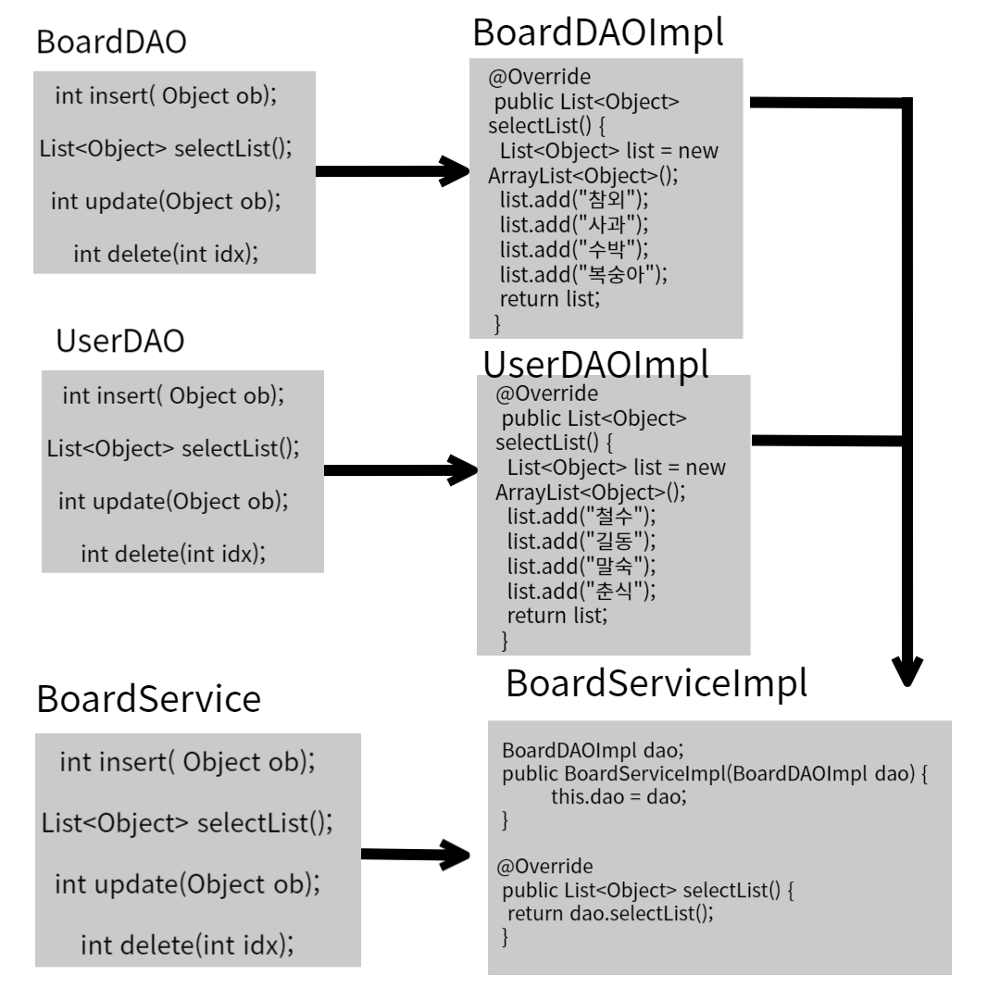

# 의존성 주입
- Dependency Injection : 각 객체 간의 의존관계를 스프링 컨테이너가 개발자가 정의한 Bean등록 정보를 바탕으로 자동으로 주입해주는 기능

## 의존성 주입의 종류
- 필드 주입(Field Injection)
- 수정자 주입(Setter Injection)
- 생성자 주입(Constructor Injection)

<br>

# Ex_날짜_DI 프로젝트 생성하기
- com.korea.test_di

## pom.xml 복사해오기, config패키지 복사해오기
- pom.xml의 내용을 복사해서 붙혀넣고 groupId와 ArtifactId수정하기
- root-context.xml,servlet-context.xml,web.xml 삭제하기

## SpringDI 흉내내기
- 사실 의존성 주입이라고 하는건 이미 자바에서 다 배운 이론이다.
- 하지만 이것을 스프링이 대신 해주기 때문에 헷갈리는것이다.

### 변경에 유리한 코드1 - 다형성,factory method
```java
class Car{};
class SportCar extends Car{};
class Truck extends Car{};
```
- 변경사항이 발생했을 때 타입과 생성자 부분을 모두 변경해줘야 한다.
```java

SportCar car = new SportCar();
↓↓↓↓↓			↓↓↓↓↓↓
Truct car = new Truck();

```
- 다형성을 이용하면 수정을 해야 하는곳이 적어진다.
```java
Car car = new SportCar();
				↓↓↓↓↓↓
Car car = new Truck();
```
- 별도의 메서드를 만들어서 객체를 생성하면 수정 포인트를 더 줄일 수 있다.
```java
Car car = getCar(); //-> 사용하는곳은 여러군데일 수 있다.
//고칠 필요가 없다.

static Car getCar(){
	return new SportCar(); //-> 기능 제공
	//return new Truck();
}
```

### 변경에 유리한 코드2 - Map과 외부파일
```java
Car car = getCar();

static Car getCar() throws Exception{

	//java.util.Properties
	//키와 값의 쌍으로 구성된 속성 목록을 관리할때 사용
	//일반적으로 구성 파일이나 속성파일에서 설정 정보를
	//읽거나 쓸 때 사용한다.

	//Map과 비슷하다 Map은 (Object, Object)를 저장하지만
	//Properties는 (String,String)을 저장한다.

	//config.txt를 읽어서 Properties에 저장
	Properties p = new Properties();

	//load()메서드가 어떤 파일에서 데이터를 읽어오기 편하게 되어있다.
	p.load(new FileReader("config.txt"));

	//클래스 객체(설계도)를 얻어서
	Class clazz = Class.forName(p.getProperty("car"));
	
	return (Car)clazz.newInstance();//객체를 생성해서 반환

}
```

#### config.txt
- 만약 스포츠카에서 트럭으로 교체하려면 
- 이 파일만 고치면 된다.
```txt
car = com.korea.di.SprotCar
↓↓↓↓↓			↓↓↓↓↓
key				value

car = com.korea.id.Truck
```

- 코드를 변경하면 테스트가 필수이지만 코드는 변경되지 않았기 때문에 테스트를 할 필요가 없어진다.
- 그래서 항상 프로그램의 변경을 최소화 할까 고민해야 한다.

### Main1 클래스파일 생성하기
```java
package com.korea.study;

import java.io.FileReader;
import java.util.Properties;

class Car{};
class SportCar extends Car{};
class Truck extends Car{};

public class Main1 {
	public static void main(String[] args)throws Exception {
		Car car = getCar();
		System.out.println("car= " + car);
	}
	
	static Car getCar()throws Exception {
		Properties p = new Properties();
		p.load(new FileReader("config.txt"));
		
		Class clazz = Class.forName(p.getProperty("car"));
		
		return (Car)(clazz.newInstance());
	}

}
```

- 프로젝트 우클릭하여 new -> File -> config.txt 파일 생성하기

```
car=com.korea.study.SportCar
```

### 코드를 조금더 유연하게 바꿔보자
- config.txt 수정하기
```
car=com.korea.study.SportCar
engine=com.korea.study.Engine
```

- getObject로 메서드 수정하기

```java
class Car{};
class SportCar extends Car{};
class Truck extends Car{};
class Engine {};

public class Main1 {
	public static void main(String[] args)throws Exception {
		Car car = (Car)getObject("car");
		System.out.println("car= " + car);
	}
	
	static Object getObject(String key)throws Exception {
		Properties p = new Properties();
		p.load(new FileReader("config.txt"));
		
		Class clazz = Class.forName(p.getProperty(key));
		
		return (Car)(clazz.newInstance());
	}

}
```
### 3. 객체 컨테이너(ApplicationContext)만들기
```java
AppContext ac = new AppContext();
Car car = (Car)ac.getBean("car");
Engine engine = (Engine)ac.getBean("Engine");
```

- AppContext의 구조
```java
class AppContext{
	Map map;

	AppContext(){
		map = new HashMap();
		map.put("car",new SportCar());
		map.put("engine", new Engine());
	}

	Object getBean(String id) {return map.get(id);}

}
```
### Main2 클래스 생성하기
- Main1에 Car클래스등 이미 선언한 클래스가 있어 오류가 난다.
```java
package com.korea.study;

import java.util.HashMap;
import java.util.Map;

class Car{};
class SportCar extends Car{};
class Truck extends Car{};
class Engine {};

class AppContext{
	Map map; //객체 저장소
	
	public AppContext() {
		map = new HashMap();
		map.put("car", new SportCar());
		map.put("engine", new Engine());
	}
	
	Object getBean(String key) {
		return map.get(key);
	}
}

public class Main2 {
	
	public static void main(String[] args)throws Exception {
		AppContext ac = new AppContext();
		
		
		Car car = (Car)ac.getBean("car");
		System.out.println("car= " + car);
		
		Engine engine = (Engine)ac.getBean("engine");
		System.out.println("engine= " + engine);
	}
}

```
- 하드코딩은 좋지 않으니 코드를 수정해주자

```java
package com.korea.study;

import java.io.FileReader;
import java.util.HashMap;
import java.util.Map;
import java.util.Properties;

class Car{};
class SportCar extends Car{};
class Truck extends Car{};
class Engine {};

class AppContext{
	Map map; //객체 저장소
	
	public AppContext() {
		
		
		try {
			Properties p = new Properties();
			p.load(new FileReader("config.txt"));
			
			//Properties에 저장된 내용을 Map에 저장
			map = new HashMap(p);
			
			//반복문으로 클래스 이름을 얻어서 객체를 생성해서 다시 map에 저장
			for(Object key : map.keySet()) {
				Class clazz = Class.forName((String)map.get(key));
				map.put(key, clazz.newInstance());
			}
		} catch (Exception e) {
			// TODO: handle exception
		}
		
	}
	
	Object getBean(String key) {
		return map.get(key);
	}
}

public class Main2 {
	
	public static void main(String[] args)throws Exception {
		AppContext ac = new AppContext();
		
		
		Car car = (Car)ac.getBean("car");
		System.out.println("car= " + car);
		
		Engine engine = (Engine)ac.getBean("engine");
		System.out.println("engine= " + engine);
	}
}

```

### 4. 객체 자동 등록하기
- @Component 어노테이션을 이용한 객체 등록하기

```java
ClassLoader classloader = AppContext.class.getClassLoader();
ClassPath classPath = ClassPath.from(classloader);

//패키지 내의 모든 클래스를 읽어서 Set에 저장
Set<ClassPath.ClassInfo> set = classPath.getTopLevelClasses("com.korea.study");

for(ClassPath.ClassInfo classInfo : set){
	Class clazz = classInfo.load();
	Component component = (Component)clazz.getAnnotation(Component.class);

	if(component != null){
		String id = StringUtils.uncapitalize(classInfo.getSimpleName());// Car ->car
		map.put(id,clazz.newInstance());
	}
}
```
- Computer 클래스 생성하기
```java
package com.korea.study;

import org.springframework.stereotype.Component;

@Component
public class Computer {
	
	int ram = 16;
	
	public int getRam() {
		return ram;
	}

}
```

- Coding 클래스 생성하기

```java
package com.korea.study;

import org.springframework.beans.factory.annotation.Autowired;
import org.springframework.stereotype.Component;

@Component
public class Coding {
	
	Computer computer;
	
	public Computer getComputer() {
		return computer;
	}
}
```

#### AppContext로 객체 찾기
```java
AppContext ac = new AppContext();
Car car = (Car)ac.getBean("car"); //by Name
Car car2 = (Car)ac.getBean(Car.class); //by Type

Object getBean(String id){
	return map.get(id);
}

Object getBean(Class clazz){
	for(Object obj : map.values()){
		if(clazz.instance(obj)){ // obj instanceof clazz
			return obj;
		}
		return null;
	}
}
```

### SpringDITest 클래스 생성하기
```java
package com.korea.study;

import org.springframework.context.ApplicationContext;
import org.springframework.context.annotation.AnnotationConfigApplicationContext;

public class SpringDITest {
	public static void main(String[] args) {
		ApplicationContext ac = new AnnotationConfigApplicationContext(Coding.class, Computer.class);
		
		Coding coding = (Coding)ac.getBean(Coding.class);
		Computer computer = (Computer)ac.getBean(Computer.class);
		
		coding.computer = computer;
		System.out.println(coding.getComputer().getRam());
		
	}

}
```

### 필드주입
- @Autowired를 이용하여 만들어진 객체를 필드에 직접 주입을 한다.
```java
package com.korea.study;

import org.springframework.beans.factory.annotation.Autowired;
import org.springframework.stereotype.Component;

@Component
public class Coding {
	
	@Autowired
	Computer computer;
	
	public Computer getComputer() {
		return computer;
	}
}
```

### setter주입
```java
package com.korea.study;

import org.springframework.beans.factory.annotation.Autowired;
import org.springframework.stereotype.Component;

@Component
public class Coding {
	
	Computer computer;
	
	public Computer getComputer() {
		return computer;
	}

	public void setComputer(Computer computer){
		this.computer = computer;
	}
}
```
### 생성자주입
```java
package com.korea.study;

import org.springframework.beans.factory.annotation.Autowired;
import org.springframework.stereotype.Component;

@Component
public class Coding {
	
	Computer computer;

	public Coding(Computer computer){
		this.computer = computer;
	}
	
	public Computer getComputer() {
		return computer;
	}
}
```


<hr>


## dao 패키지에 BoardDAO 인터페이스 만들기

```JAVA
package dao;

import java.util.List;

public interface BoardDAO {

	//Dao(Data Access Object)는 기본적으로 CRUD기능을 가지고 있다.
	//나중에 사용할 추상메서드를 준비해보자.
	//파라미터를 받을 수도 있긴 한데 뭘 받을지 모르기 때문에 모든걸 다 받을 수 있는 		
	//Object타입으로 만들자!

	int insert( Object  ob);
	
	List<Object> selectList();
	
	int update(Object ob);
	
	int delete(int idx);
}
인터페이스만 가지고는 아무것도 못한다.
인터페이스를 구현하는 자식클래스를 만들어주자.
```

## dao 패키지에 BoardDAOImpl 클래스 만들기
```JAVA
package dao;

import java.util.List;

public class BoardDAOImpl implements BoardDAO {

	//원래 DAO는 DB에 연결하여 List를 가지고 오는 작업을 하지만
	//이 예제에서는 그 부분은 생략했다.

	@Override
	public int insert(Object ob) {
		// TODO Auto-generated method stub
		return 0;
	}

	DB에서 값이 넘어왔다고 가정하고 리스트에 담아서 넘겨보기
	@Override
	public List<Object> selectList() {
		List<Object> list = new ArrayList<Object>();
		list.add("참외");
		list.add("사과");
		list.add("수박");
		list.add("복숭아");
		return list;
	}
	
	//얘가 dao 이니까 servlet이 받아서 바인딩하고 포워딩을 해서 jsp에 출력을 해줘야 된다.
	//그 사이에 service라고 하는애가 받아준다.

	@Override
	public int update(Object ob) {
		// TODO Auto-generated method stub
		return 0;
	}

	@Override
	public int delete(int idx) {
		// TODO Auto-generated method stub
		return 0;
	}

}

```

## service 패키지에 BoardService 인터페이스 만들기
```JAVA
package service;

import java.util.List;

public interface BoardService {

	List<Object> selectList();
	
}
```

## 인터페이스를 구현할 BoardServiceImpl 클래스 만들기
```JAVA
package service;

import java.util.List;

import dao.BoardDAOImpl;

public class BoardServiceImpl implements BoardService {

	BoardDAOImpl dao;
	
	public BoardServiceImpl(BoardDAOImpl dao) {
		this.dao = dao;
	}
	
	@Override
	public List<Object> selectList() {
		
		return dao.selectList();
	}

}

```



## bean 객체를 생성해보자
- config 패키지에 RootContext.java에 객체 생성하기
```JAVA
package config;

import org.springframework.context.annotation.Bean;
import org.springframework.context.annotation.Configuration;

import dao.BoardDAOImpl;
import service.BoardServiceImpl;

@Configuration
public class RootContext {

	@Bean
	public BoardDAOImpl dao() {
		return new BoardDAOImpl();
	}
	
	@Bean
	public BoardServiceImpl service(BoardDAOImpl dao) {
		return new BoardServiceImpl(dao);
	}
}

```

## BoardController 클래스 생성하기
```JAVA
//↓↓↓ 스프링으로 하여금 해당클래스가 Controller라는 것을 인식시키기 위해
//꼬리표(어노테이션 :프로그램 주석)이 "반드시" 필요하다.

@Controller    
public class BoardController {
	//root-context.xml은 Controller를 제외한 모든 객체를 만든다.
	//유일하게 컨트롤러만이 servlet-context.xml에서 만들어진다.
	BoardServiceImpl service;

	//생성자 인젝션을 위한 service객체를 파라미터로 받는 생성자
	public BoardController(BoardServiceImpl service;) {
		System.out.println("--BoardController()의 생성자--");
		this.service = service;
	}

	//셋터인젝션을 사용하기 위한 셋터메서드 생성
	public void setService(BoardServiceImpl service) {
		this.service = service;
	}
	
	생성자 주입 or setter 주입 중에 하나 사용하기	
	
}
```


## config 패키지에 ServletContext.java에 객체 만들기
```JAVA
package config;

import org.springframework.context.annotation.Bean;
import org.springframework.context.annotation.ComponentScan;
import org.springframework.context.annotation.Configuration;
import org.springframework.web.servlet.config.annotation.EnableWebMvc;
import org.springframework.web.servlet.config.annotation.ResourceHandlerRegistry;
import org.springframework.web.servlet.config.annotation.WebMvcConfigurer;
import org.springframework.web.servlet.view.InternalResourceViewResolver;
import org.springframework.web.servlet.view.JstlView;

import com.korea.test.BoardController;

import dao.BoardDAOImpl;
import service.BoardServiceImpl;

@Configuration
@EnableWebMvc
//@ComponentScan("com.korea.test") 자동탐색
public class ServletContext implements WebMvcConfigurer {

	@Override
	public void addResourceHandlers(ResourceHandlerRegistry registry) {
		registry.addResourceHandler("/resources/**").addResourceLocations("/resources/");
	}

	@Bean
	public InternalResourceViewResolver resolver() {
		InternalResourceViewResolver resolver = new InternalResourceViewResolver();
		resolver.setViewClass(JstlView.class);
		resolver.setPrefix("/WEB-INF/views/");
		resolver.setSuffix(".jsp");
		return resolver;
	}

	//ConstructorInjection
	@Bean
	public TestController testController(BoardServiceImpl service) {
		return new TestController(service);
	}

	//setterInjetcion
	@Bean
	public TestController testController(BoardServiceImpl service) {
		TestController testController = new TestController();
		testController.setService(service);
		return testController;
	}
}

```

## BoardController에서 바인딩 및 포워딩해주기
```JAVA
package com.korea.test;

import java.util.List;

import org.springframework.stereotype.Controller;
import org.springframework.web.bind.annotation.RequestMapping;

import service.BoardServiceImpl;

@Controller
public class BoardController {
	
	BoardServiceImpl service;
	
	public BoardController(BoardServiceImpl service) {
		this.service = service;
	}
	
	@RequestMapping("/board/list.do")
	public String select(Model model) {
		//서비스를 통해 dao의 selectList()메서드를 호출할 수 있다.
		List<Object> list = service.selectList();
		
		model.addAttribute("list",list);
		
		return "board_list";
	}
}

```

## board_list.jsp에서 과일목록 출력하기
```JAVA
<%@ page language="java" contentType="text/html; charset=UTF-8"
    pageEncoding="UTF-8"%>
<%@ taglib prefix="c" uri="http://java.sun.com/jsp/jstl/core" %>
<!DOCTYPE html>
<html>
<head>
<meta charset="UTF-8">
<title>Insert title here</title>
</head>
<body>
	<h1>과일목록</h1>
	
	<c:forEach var="vo" items="${list }">
		${ vo }<br>
	</c:forEach>
</body>
</html>
```

컨트롤러 한군데 에서 여러개의 매핑이 가능하기 때문에 파일의 개수를 많이 줄일 수 있다.
