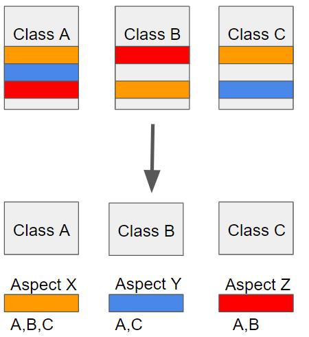
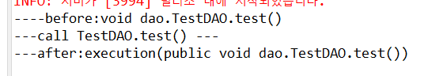
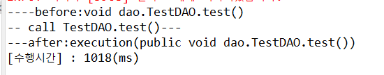
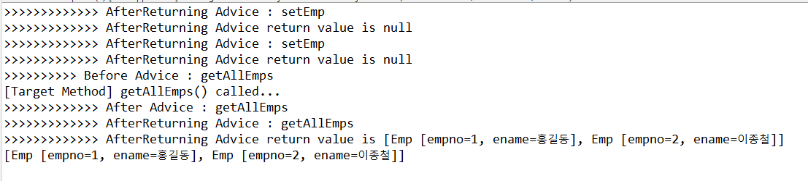

# 스프링 AOP
- Aspect-Oriented Programming(관점지향 프로그래밍)
- 공통 기능 구현과 핵심 기능 구현의 분리
- 반복되는 로직들을 모듈화 하여 필요할 때 호출해서 사용하는 방법
- 여러 객체에 공통적으로 적용할 수 있는 기능을 분리해 재사용성을 높여주는 기법


## AOP를 코딩하기 위한 개념
- 핵심 기능에 공통 기능을 삽입하며 다음과 같은 방법이 존재
  - 런타임에 프록시 객체를 생성해서 공통 기능을 삽입
- 스프링 AOP는 프록시 객체를 자동으로 생성해줌
- AOP의 공통 기능을 Aspect라 칭하며, 아래와 같은 주요 용어가 존재
  - Target
    - 적용할 로직(어떤 대상에 부가 기능을 부여할 것인가.)
  - Advice
    - 반복 로직의 구현체(언제,어떤 부가기능? Before, AfterReturning,AfterThrowing, After,Around)
  - Joinpoint
    -  Advice를 적용 가능한 지점을 의미(어디에 적용할 것인가? 메서드, 필드, 객체, 생성자 등)
  - Pointcut
    - JoinPoint의 상세한 스펙을 정의한 것. 더욱 구체적으로 Advice가 실행될 지점을 정할 수 있다.
  - Weaving
    - Advice를 핵심 로직 코드에 적용하는 것
  - Aspect
    - 반복되어 사용되는 로직 (여러 객체에 공통으로 적용되는 기능)

## 프록시 패턴
- 컴퓨터 프로그래밍 소프트웨어 디자인 패턴의 하나
- 다른 무언가와 이어지는 인터페이스 역할을 하는 클래스
- 어떤 객체에 대한 접근을 제어하는 용도로 대리인이나 대변인에 해댕하는 객체를 제공하는 패턴


## Advice의 종류
- before Advice : 대상 객체의 메서드 호출 전에 공통 기능을 실행
- After Returning Advice : 대상 객체의 매서드가 익셉션 없이 실행된 이후에 공통 기능을 실행
- After Throwing Advice: 대상 객체의 매서드를 실행하는 도중 익셉션이 발생한 경우에 공통 기능을 실행
- After Advice: 익셉션 발생 여부에 상관없이 대상 객체의 매서드 실핼 후 공통 기능을 실행
- Around Advice: 대상 객체의 매서드 실행 전, 후 또는 익셉션 발생 시점에 공통 기능을 실행

## Ex_날짜_AOP 프로젝트 생성
- pom.xml, resources의 패키지 옮기기

## resources에 advice패키지 생성후 Advice클래스 생성하기

```java
package advice;

import org.aspectj.lang.JoinPoint;
import org.aspectj.lang.annotation.After;
import org.aspectj.lang.annotation.Aspect;
import org.aspectj.lang.annotation.Before;
import org.aspectj.lang.annotation.Pointcut;

@Aspect
//@Aspect : Aspect 클래스를 선언할 때 사용하는 어노테이션
public class Advice {

	//Pointcut : JoinPoint의 상세한 스펙을 정의한 것. 더욱 구체적으로 Advice가 실행될 지점을 정할 수 있다.

	//* : 반환 타입
	//excution : 메서드 실행을 나타내는 키워드
	//dao.*DAO : dao패키지의 DAO로 끝나는 모든 클래스
	//.* : 모든 메서드
	//(..) : 메서드의 전달되는인자 ..은 어떤 개수의 인자든지 가능하다. 

	@Pointcut("execution(* dao.*DAO.*(..))")
	public void myPoint() {}

	//before Advice : 대상 객체의 메서드 호출 전에 공통 기능을 실행
	
	@Before("myPoint()") 
	public void before(JoinPoint jp) {//	//JoinPoint : pointcut이 걸린 위치의 정보를 받는 클래스
		System.out.println("----before:"+jp.getSignature());
		//getSignature() : 현재 JoinPoint에서 실행되는 메서드의 서명(Signature)정보를 반환한다.
		//서명 정보에는 메서드명, 리턴 타입, 파라미터 타입등이 포함된다.
		//.getName() : 메서드명
		//.getReturnType() : 리턴타입
		//.getParameterTypes() : 파라미터 타입들
	}
	
	@After("myPoint()") //- After Advice: Exception 발생 여부에 상관없이 대상 객체의 Method 실행 후 공통 기능을 실행
	public void after(JoinPoint jp) {
		System.out.println("---after:"+jp.toLongString());
	}
}

```
## dao패키지에 TestDAO클래스 만들기

```java
package dao;

import org.apache.ibatis.session.SqlSession;

public class TestDAO {

	SqlSession sqlSession;
	
	public void setSqlSession(SqlSession sqlSession) {
		this.sqlSession = sqlSession;
	}
	
	public void test() {
		System.out.println("-- call TestDAO.test()---");
	}
}

```
## Context_3_dao 클래스에 객체 생성하기

```java
package context;

import org.apache.ibatis.session.SqlSession;
import org.springframework.context.annotation.Bean;
import org.springframework.context.annotation.Configuration;
import org.springframework.context.annotation.EnableAspectJAutoProxy;

import advice.Advice;
import dao.TestDAO;

@Configuration
@EnableAspectJAutoProxy
//어노테이션으로, AspectJ 스타일의 선언적 어스펙트(Aspect)를 지원하도록 활성화한다.
//AspectJ는 자바용으로 개발된 강력한 어스펙트 지향 프로그래밍(AOP) 프레임워크로 널리 사용된다.
//이 어노테이션을 사용하여 AspectJ 스타일의 AOP를 활성화하면 스프링은 @Aspect 어노테이션을
//가진 클래스들을 찾아서 프록시를 생성하고, 해당 어스펙트를 적용한다.
public class Context_3_dao {

	//dao 객체의 생성
	@Bean
	public TestDAO testDAO(SqlSession sqlSession) {
		TestDAO testDAO = new TestDAO();
		testDAO.setSqlSession(sqlSession);
		return testDAO;
	}

	//Advice 클래스의 객체 생성
	@Bean
	public Advice advice() {
		return new Advice();
	}
	

}

```
## TestController 클래스 생성하기

```java
package com.korea.aop;

import org.springframework.stereotype.Controller;
import org.springframework.web.bind.annotation.RequestMapping;

import dao.TestDAO;

@Controller
public class TestController {

	TestDAO test_dao;
	
	public TestController(TestDAO test_dao) {
		this.test_dao = test_dao;
	}
	
	public static final String VIEW_PATH = "/WEB-INF/views/";

	@RequestMapping(value= {"/","test.do"})
	public String test() {
		test_dao.test();
		return VIEW_PATH+"test.jsp";
	}
}

```

## Servlet_Context에서 객체 생성하기
```java
package mvc;

import org.springframework.context.annotation.Bean;
import org.springframework.context.annotation.Configuration;
import org.springframework.web.servlet.config.annotation.EnableWebMvc;
import org.springframework.web.servlet.config.annotation.ResourceHandlerRegistry;
import org.springframework.web.servlet.config.annotation.WebMvcConfigurer;

import com.korea.aop.TestController;

import dao.TestDAO;


@Configuration
@EnableWebMvc
//@ComponentScan("com.korea.auto")
public class ServletContext1 implements WebMvcConfigurer {
	

	@Override
	public void addResourceHandlers(ResourceHandlerRegistry registry) {
		registry.addResourceHandler("/resources/**").addResourceLocations("/resources/");
	}

	
//	  @Bean 
//	  public InternalResourceViewResolver resolver() {
//	  InternalResourceViewResolver resolver = new InternalResourceViewResolver();
//	  resolver.setViewClass(JstlView.class); resolver.setPrefix("/WEB-INF/views/");
//	  resolver.setSuffix(".jsp"); return resolver; }
	
	@Bean
	public TestController testController(TestDAO testDAO) {
		return new TestController(testDAO);
	}	 
}

```

## 실행하여 콘솔 확인하기



## 페이지의 수행시간을 체크해보도록 하자
## TestDAO클래스 test()메서드에 코드 추가하기

```java
package dao;

import org.apache.ibatis.session.SqlSession;

public class TestDAO {

	SqlSession sqlSession;
	
	public void setSqlSession(SqlSession sqlSession) {
		this.sqlSession = sqlSession;
	}
	
	public void test() {
		System.out.println("-- call TestDAO.test()---");
		//test() 메서드의 수행 시간을 Advice에서 캐치할 예정인데, 
		//메서드 한개를 호출하는 경과시간은 0초에 가깝기 때문에, 
		//임의로 딜레이를 주기위해 스레드를 추가했다.
		try {
			Thread.sleep(1000);
		} catch (InterruptedException e) {
			// TODO Auto-generated catch block
			e.printStackTrace();
		}
	}
}

```

## Advice 클래스에 코드 추가하기
```java
package advice;

import org.aspectj.lang.JoinPoint;
import org.aspectj.lang.annotation.After;
import org.aspectj.lang.annotation.Aspect;
import org.aspectj.lang.annotation.Before;
import org.aspectj.lang.annotation.Pointcut;

@Aspect
public class Advice {
	
	long start;

	@Pointcut("execution(* dao.*DAO.*(..))")
	public void myPoint() {}
	
	@Before("myPoint()")
	//JoinPoint : pointcut이 걸린 위치의 정보를 받는 클래스
	public void before(JoinPoint jp) {
		
		//before()가 호출됐을때의 시간
		start = System.currentTimeMillis();

		System.out.println("----before:"+jp.getSignature());
	}
	
	@After("myPoint()")
	public void after(JoinPoint jp) {
		
		//after()가 호출됐을때의 시간
		long end = System.currentTimeMillis();
		
		System.out.println("---after:"+jp.toLongString());
		System.out.printf("[수행시간] : %d(ms)\n",end-start);
	}
}

```




# 리스트에 사람을 저장하고 출력하는 기능 만들어보기
- 핵심기능 : 리스트에 추가, 호출
- 
## emp 패키지 생성후 Emp.java 클래스만들기
```java
package xml;

import lombok.Getter;
import lombok.Setter;

@Setter
@Getter

public class Emp {
	private String empno;
	private String ename;
	
	public Emp(String empno,String ename) {
		this.empno = empno;
		this.ename = ename;
	}
	
	@Override
	public String toString() {
		// TODO Auto-generated method stub
		return "Emp [empno="+empno+", ename="+ ename + "]";
	}
}

```

## 추가와 출력 기능이 있는 EmpManager클래스 생성하기
```java
package emp;

import java.util.ArrayList;
import java.util.List;

public class EmpManager {
	
	List<Emp> emps = new ArrayList<Emp>();

	
	public List<Emp> getAllEmps() throws Exception {
		System.out.println("[Target Method] getAllEmps() called...");
		return emps;
	}

	public void setEmp(Emp e) {
		emps.add(e);	
	}

}

```

## EmpLoggingAspect클래스 만들기
```java
package emp;

import org.aspectj.lang.JoinPoint;
import org.aspectj.lang.ProceedingJoinPoint;
import org.aspectj.lang.annotation.After;
import org.aspectj.lang.annotation.AfterReturning;
import org.aspectj.lang.annotation.AfterThrowing;
import org.aspectj.lang.annotation.Around;
import org.aspectj.lang.annotation.Aspect;
import org.aspectj.lang.annotation.Before;

@Aspect
public class EmpLoggingAspect {
	
	//@Before 어노테이션을 사용하며 포인트컷 메소드가 실행되기 전에 충고가 적용된다.
         
	@Before("execution(* emp.EmpManager.get*(..))")
	public void before(JoinPoint joinPoint) {

		System.out.println(">>>>>>>>>> Before Advice : " + joinPoint.getSignature().getName());
	}
	
  	//@Around 어노테이션을 사용하며 포인트컷 메소드가 실행 되기 전, 리턴 된 후에 advice가 적용된다.
  	//advice method의 첫번째 파라미터는 ProceedingJoinPoint가 되어야 한다.
	//proceed() 메소드를 통해 타겟 클래스의 원래 메소드를 호출
	@Around("execution(* emp.EmpManager.get*(..))")
	public Object around(ProceedingJoinPoint pjp) throws Throwable{
    
		System.out.println(">>>>>>>>>> Around Advice[전] : " + pjp.getSignature().getName());
		
		Object o = pjp.proceed();
		
		System.out.println(">>>>>>>>>> Around Advice[후] : " + pjp.getSignature().getName());
		return o;
	}
	
	//@AfterReturning 어노테이션을 사용하며 pointcut method가 리턴(정상종료)된 후 advice가 적용된다.
	@AfterReturning(pointcut = "execution(* emp.EmpManager.*(..))", returning = "retVal")
	public void afterReturning(JoinPoint joinPoint, Object retVal) {
		System.out.println(">>>>>>>>>>>>> AfterReturning Advice : " + joinPoint.getSignature().getName());
		System.out.println(">>>>>>>>>>>>> AfterReturning Advice return value is " + retVal);
	}
	
  	//@After 어노테이션을 사용한다. 포인트컷 메소드가 실행된 후(정상종료 여부와 관계없이) 충고가 적용된다.
	@After("execution(* emp.EmpManager.get*(..))")
	public void after(JoinPoint joinPoint) {
		System.out.println(">>>>>>>>>>>>> After Advice : " + joinPoint.getSignature().getName());
	}
	
  //@AfterThrowing 어노테이션을 사용하며 포인트컷 메소드에서 예외가 발생할 때 충고가 적용된다.
	@AfterThrowing(pointcut = "execution(* emp.EmpManager.*(..))", throwing="ex")
	public void logAfterThrowingAllMethods(Exception ex) throws Throwable {
		System.out.println(">>>>>>>>>>>>> @AfterThrowing Advice : " + ex);
	}
	
}
```

## context패키지에 Context_5_AOP 클래스 만들기
```
package context;

import org.springframework.context.annotation.Bean;
import org.springframework.context.annotation.Configuration;
import org.springframework.context.annotation.EnableAspectJAutoProxy;

import emp.EmpLoggingAspect;
import emp.EmpManager;


@Configuration
@EnableAspectJAutoProxy
public class Context_5_AOP {
	
	@Bean
	public EmpManager empManager() {
		return new EmpManager();
	}
	
	@Bean
	public EmpLoggingAspect loggingAspect() {
		return new EmpLoggingAspect();
	}
}

```

## emp 패키지에 EmpTest클래스 만들기
```java
package xml;

import java.util.List;

import org.aspectj.apache.bcel.util.ClassPath;
import org.springframework.context.ApplicationContext;
import org.springframework.context.annotation.AnnotationConfigApplicationContext;
import org.springframework.context.support.ClassPathXmlApplicationContext;

import context.Context_5_aop;

public class EmpTest {
	public static void main(String[] args) throws Exception {
		//AnnotationConfigApplicationContext 클래스는 Spring Framework에서 제공하는 ApplicationContext 인터페이스의 구현 중 하나.
		//이 클래스는 Java Config 클래스를 사용하여 Spring 애플리케이션 컨텍스트를 설정하는 데 사용된다.

		//AnnotationConfigApplicationContext는 Spring의 ApplicationContext 인터페이스를 구현하여 애플리케이션 컨텍스트를 나타낸다.
		//Java Config 사용: 주로 Java Config(자바 기반 설정)을 사용하여 Spring Bean을 구성하는 데 사용된다.

		ApplicationContext context = new AnnotationConfigApplicationContext(Context_5_aop.class);

		//empManager라는 이름을 가진 bean을 가져와서 EmpManager타입으로 캐스팅한다.
		EmpManager manager = (EmpManager) context.getBean("empManager");
		
		manager.setEmp(new Emp("1","홍길동"));
		manager.setEmp(new Emp("2","이종철"));
		
		List<Emp> emps = manager.getAllEmps();
		System.out.println(emps);
	}
}

```

ctrl+ f11 눌러서 확인하기!




