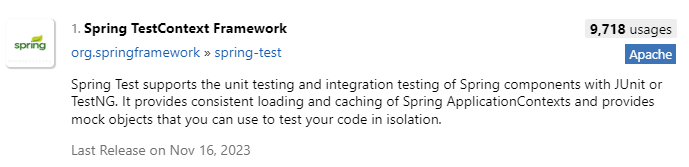
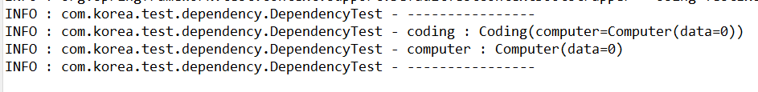
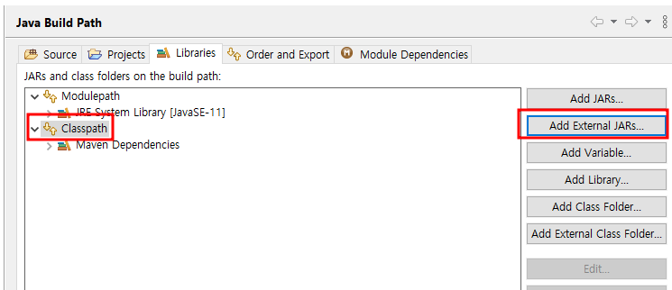
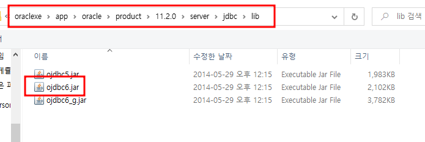
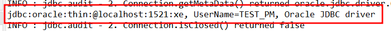

# 단위테스트
- 단위테스트는 하나의 모듈을 기준으로 독립적으로 진행되는 가장 작은 단위의 테스트다.
- 하나의 모듈이란 각 계층에서의 하나의 기능 또는 메소드로 이해할 수 있다.
- 하나의 기능이 올바르게 동작하는지를 독립적으로 테스트하는 것이다.

## 단위테스트의 필요성
- 일반적으로 테스트 코드를 작성한다고 하면 거의 단위 테스트를 의미한다.
- 통합 테스트는 실제 여러 컴포넌트들 간의 상호작용을 테스트 하기 때문에 모든 컴포넌트들이 구동된 상태에서 테스트를 하게 되므로, 캐시나 데이터베이스 등 다른 컴포넌트들과 실제 연결을 해야하고 어플리케이션을 구성하는 컴포넌트들이 많아 질수록 테스트를 위한 시간이 커진다.
- 하지만, 단위 테스트는 테스트하고자 하는 부분만 독립적으로 테스트를 하기 때문에 해당 단위를 유지 보수 또는 리팩토링 하더라도 빠르게 문제 여부를 확인 할 수 있다.

## 단위테스트의 한계
- 일반적으로 어플리케이션은 하나의 기능을 처리하기 위해 다른 객체들과 데이터를 주고 받는 복잡한 통신이 일어난다.
- 단위 테스트는 해당 기능에 대한 독립적인 테스트기 때문에 다른 객체와 데이터를 주고 받는 경우에 문제가 발생한다.
- 그래서, 이 문제를 해결하기 위해 테스트하고자 하는 기능과 연관된 모듈에서 가짜 데이터, 정해진 반환값이 필요하다.
- 즉 단위 테스트에서는, 테스트 하고자 하는 기능과 연관된 다른 모듈은 연결이 단절 되어야 비로소 독립적인 단위 테스트가 가능해 진다.

## Ex_날짜_Test 프로젝트 생성
- pom.xml, resources패키지 옮기기


## pom.xml에 spring-test 추가하기




```xml
<dependency>
    <groupId>org.springframework</groupId>
    <artifactId>spring-test</artifactId>
    <version>5.1.20.RELEASE</version>
</dependency>

<!-- Test -->
<dependency>
	<groupId>junit</groupId>
	<artifactId>junit</artifactId>
	<version>4.12</version>
	<scope>test</scope>
</dependency>   
 ```

## 의존성 주입 테스트
- dependency패키지 생성하기
### Computer 클래스 생성하기
```java
package dependency;

import org.springframework.stereotype.Component;

import lombok.Data;

@Component
@Data
public class Computer {

	int data;
}

```
### Coding클래스 생성하기
```java
package dependency;

import org.springframework.beans.factory.annotation.Autowired;
import org.springframework.stereotype.Component;

import lombok.Data;

@Component
@Data
public class Coding {
	
	@Autowired
	private final Computer computer;
}

```

### Context_3_dao 클래스에 객체 생성하기
```java
package context;

import org.springframework.context.annotation.ComponentScan;
import org.springframework.context.annotation.Configuration;


@Configuration
@ComponentScan("dependency")
public class Context_3_dao {
	
}
```

## src/text/java에 dependency 패키지 만들기
### DependencyTest클래스만들기
```java
package com.korea.test.dependency;

import org.junit.Test;
import org.junit.runner.RunWith;
import org.springframework.beans.factory.annotation.Autowired;
import org.springframework.test.context.ContextConfiguration;
import org.springframework.test.context.junit4.SpringJUnit4ClassRunner;

import context.Context_3_dao;
import dependency.Coding;
import lombok.extern.log4j.Log4j;

//JUnit 프레임워크의 테스트 실행방법을 확장할 때 사용하는 어노테이션
//톰캣 대신에 스프링에 접근할 수 있게 해준다.
@RunWith(SpringJUnit4ClassRunner.class)

//설정 파일을 읽어야 하는데, 이런 설정파일을 로드하는 어노테이션이 ContextConfiguration이다.
@ContextConfiguration(classes={Context_3_dao.class})

//println 대신에 쓸 로그 객체를 생성합니다.
@Log4j
public class DependencyTest {
	
	@Autowired
	private Coding coding;

	//Test에 사용될 메서드임을 알려주는 어노테이션
	@Test
	public void check() {
		log.info("----------------");
		log.info("coding : " + coding);
		log.info("computer : " + coding.getComputer());
		log.info("----------------");
	}
	

}

```

ctrl+ f11 누르고 JUnit으로 실행하여 결과보기



### DB를 톰캣을 통해서 보지 않고 콘솔에서 보기 위해 ojdbc를 직접 넣어주기



배포할때 ojdbc 라이브러리도 같이 배포하라는 뜻

 
 ## src/test/java의 com.korea.test패키지에 DataSourceTests 클래스 만들기
 
 ```java
 package com.korea.test;

import static org.junit.Assert.fail;

import java.sql.Connection;

import javax.sql.DataSource;

import org.junit.Test;
import org.junit.runner.RunWith;
import org.springframework.beans.factory.annotation.Autowired;
import org.springframework.test.context.ContextConfiguration;
import org.springframework.test.context.junit4.SpringJUnit4ClassRunner;

import context.Context_1_dataSource;
import lombok.extern.log4j.Log4j;


@RunWith(SpringJUnit4ClassRunner.class)


@ContextConfiguration(classes={Context_1_dataSource.class})


@Log4j
public class DataSourceTests {

	@Autowired
	private DataSource dataSource;
	
	@Test
	public void testConnection() {
		try(Connection connection = dataSource.getConnection()){
			log.info(connection);
		} catch( Exception e) {
			fail(e.getMessage());
		}
	}
}

 ```
 
 ### 실행했을 때 콘솔에 db접속과 관련된 정보가 출력된다.
 
 
 
 # 부서 테이블 조회해보기
 
 - log4jdbc-log4j2-jdbc4.1 라이브러리 추가하기
 
 ```xml
 <!-- https://mvnrepository.com/artifact/org.bgee.log4jdbc-log4j2/log4jdbc-log4j2-jdbc4.1 -->
<dependency>
    <groupId>org.bgee.log4jdbc-log4j2</groupId>
    <artifactId>log4jdbc-log4j2-jdbc4.1</artifactId>
    <version>1.16</version>
</dependency>
```

- src/main/resources에 log4jdbc.log4j2.properties 파일만들기


- log4jdbc.spylogdelegator.name=net.sf.log4jdbc.log.slf4j.Slf4jSpyLogDelegator 작성하고 저장하기

## Context_1_Datasource 클래스에 코드 수정하기
```
package context;

import javax.sql.DataSource;

import org.apache.commons.dbcp.BasicDataSource;
import org.springframework.context.annotation.Bean;
import org.springframework.context.annotation.Configuration;


@Configuration
public class Context_1_dataSource {

	@Bean
	public DataSource ds() {
		BasicDataSource ds = new BasicDataSource();
	//	ds.setDriverClassName("oracle.jdbc.OracleDriver");
	//	ds.setUrl("jdbc:oracle:thin:@localhost:1521:xe");
		ds.setDriverClassName("net.sf.log4jdbc.sql.jdbcapi.DriverSpy");
		ds.setUrl("jdbc:log4jdbc:oracle:thin:@localhost:1521:xe");
		ds.setUsername("test_pm");
		ds.setPassword("1111");
		return ds;
	}

}
```
 
 ## vo패키지에 DeptVO클래스 생성하기
 ```java
 package vo;

import lombok.Getter;
import lombok.Setter;

@Getter
@Setter
public class DeptVO {

	private int deptno;
	private String dname,loc;
}

 ```
 
 ## dao패키지에 DeptDAO클래스 생성하기
 ```java
 package dao;

import java.util.List;

import org.apache.ibatis.session.SqlSession;

import vo.DeptVO;

public class DeptDAO {

	SqlSession sqlSession;
	
	public DeptDAO(SqlSession sqlSession) {
		this.sqlSession = sqlSession;
	}
	
	public List<DeptVO> selectList(){
		List<DeptVO> list = sqlSession.selectList("dept.dept_list");
		return list;
	}
}

```

## Context_3_dao에 객체 생성하기
```java
package context;

import org.apache.ibatis.session.SqlSession;
import org.springframework.context.annotation.Bean;
import org.springframework.context.annotation.Configuration;

import dao.DeptDAO;

@Configuration
public class Context_3_dao {
	
	@Bean
	public DeptDAO deptDAO(SqlSession sqlSession) {
		return new DeptDAO(sqlSession);
	}
}

```

## dept.xml에 쿼리문 작성하기

```xml
<?xml version="1.0" encoding="UTF-8" ?>
<!DOCTYPE mapper
PUBLIC "-//mybatis.org//DTD Mapper 3.0//EN"
"http://mybatis.org/dtd/mybatis-3-mapper.dtd">
<mapper namespace="dept">

	<select id="dept_list" resultType="vo.DeptVO">
		select * from dept
	</select>
</mapper>
```

## src/test/java의 com.korea.test패키지에 DeptTest클래스 생성하기
```
package com.korea.test;

import org.junit.Test;
import org.junit.runner.RunWith;
import org.springframework.beans.factory.annotation.Autowired;
import org.springframework.test.context.ContextConfiguration;
import org.springframework.test.context.junit4.SpringJUnit4ClassRunner;

import context.Context_1_dataSource;
import context.Context_2_mybatis;
import context.Context_3_dao;
import dao.DeptDAO;
import lombok.extern.log4j.Log4j;

@RunWith(SpringJUnit4ClassRunner.class)
@ContextConfiguration(classes={Context_1_dataSource.class,Context_2_mybatis.class,Context_3_dao.class})
@Log4j
public class DeptTest {
	
	@Autowired
	private DeptDAO dept_dao;
	
	
	@Test
	public void getListTest() {
		dept_dao.selectList().forEach(log::info);
	
	}
}

```

### 실행하여 콘솔 확인하기


