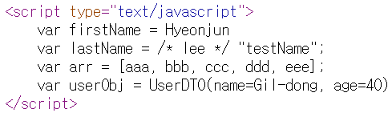
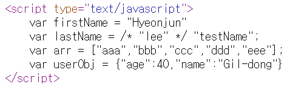

# 템플릿 엔진
- 지정된 템플릿 양식과 데이터가 합쳐져 HTML 문서를 출력하는 소프트웨어입니다.
- 웹사이트 화면을 어떤 형태로 만들지 도와주는 양식웹 템플릿 엔진은 view code(HTML)와 data logic code(DB connection)를 분리해주는 기능을 합니다.
- 템플릿 엔진은 **서버 사이드 템플릿 엔진**과 **클라이언트 사이드 템플릿 엔진**으로 나눌 수 있습니다.

## 서버 사이드 템플릿 엔진
  - 서버에서 DB혹은 API에서 가져온 데이터를 미리 정의된 템플릿에 넣어서 HTML을 그려서 클라이언트에 전달해주는 역할
  - HTMl 코드에서 고정적으로 사용되는 부분은 템플릿으로 만들어두고 동적으로 생성되는 부분만 템플릿 특정 장소에 꺼워 넣는 방식으로 동작할 수 있도록 해줍니다.

### 동작 과정
1. 클라이언트의 요청을 받는다.
2. 필요한 데이터 DB나 API에서 가져온다.
3. 미리 정의된 Template에 해당 데이터를 배치한다.
4. 서버에서 HTML(데이터가 반영된 Template)을 그린다.
5. 해당 HTML을 클라이언트에 전달한다.

- 서버에서 최종 html 결과를 만들어서 브라우저에 전달하기 때문에 주로 화면 이동이 많은 곳에서 사용됩니다.
- 대표적인 서버 사이드 템플릿 엔진으로는 Thymeleaf, JSP, Freemarker가 있습니다.

## 클라이언트 사이드 템플릿 엔진
- HTML 형태로 코드를 작성할 수 있으며 동적으로 DOM을 그리게 해주는 역할입니다.
- 데이터를 받아서 DOM 객체에 동적으로 그려주는 프로세스를 담당하고 있습니다.

### 동작 과정
1. 클라이언트에서 공통적인 프레임을 미리 Template로 만든다.
2. 서버에서 필요한 데이터를 받는다.
3. 데이터를 Template에 배치하고 DOM 객체에 동적으로 그려준다.

- URL이 바뀌어도 HTML을 다시 내려받지 않고 클라이언트에서 알아서 그리기 때문에 주로 단일 화면에서 화면이 변경되는 경우에 사용됩니다.
- 대표적인 클라이언트 사이드 템플릿 엔진으로는 Mustache, Squirrelly, Handlebars가 있습니다.

# 타임리프(Thymeleaf)
- 자바 웹개발에 이상적인 '모던'서버 사이드 자바 템플릿 엔진
- 타임리프는 컨트롤러가 전달하는 데이터를 이용해 동적으로 화면을 만들어주는 역할을 하는 view 템플릿 엔진이다.
- 스프링부트에서는 공식적으로 VIEW영역에서 JSP의 사용을 권장하지 않습니다.


- 가능하다면 JSP를 피하고 Thymeleaf와 같은 템플릿 엔진을 사용하라고 권장하고 있다.


## Thymeleaf가 제공해주는 템플릿
- Thymeleaf는 2개의 Markup Template Mode(HTML,XML)가 있고 3개의 Textual Template Mode(TEXT, Javascript, CSS)가 있고 1개의 no-op Template Mode(Raw)가 있다.
  - HTML
  - XML
  - TEXT
  - JavaScript
  - CSS
  - Raw

## 타임리프의 특징
- 서버상에서 동작하지 않아도 HTML파일의 내용을 바로 확인 가능하다.
  - JSP와 같은 경우 서버를 구동하지 않고 해당 파일을 열게되면 JSP코드와 HTML이 섞여있어서 정상적인 확인이 불가능했다.
  - 반면 타임리프는 화면 구성을 서버 가동없이 쉽게 파악할 수 있어 개발에 수정할때마다 서버 재가동이 필요없어지기 때문에 개발에 용이하다.
- 순수 HTML구조를 유지한다.

## Thymeleaf의 장점
- 코드를 변경하지 않기 때문에 디자인팀과 개발 팀간의 협업이 편해진다.
- JSP와 달리 Servlet Code로 변환되지 않기 때문에 비즈니스 로직과 분리되어 오로지 View에 집중할 수 있다.
- 서버상에서 동작하지 않아도 되기 때문에 서버 동작 없이 화면을 확인할 수 있다.
- 때문에 더미 데이터를 넣고 화면 디자인 및 테스트에 용이하다.
- 확장성이 뛰어나며, 커스터마이징이 쉽다.
- 다양한 도구와 확장 프로그램으로 구성된 에코시스템 제공

https://www.thymeleaf.org/ecosystem.html

# Ex_날짜_Thymeleaf 프로젝트 생성하기
- pom.xml, resources의 패키지 옮기기, 나머지 xml파일들 지우기

## Thymeleaf사용을 위한 라이브러리 추가하기
- 스프링 MVC에서 타임리프는 뷰 영역에 해당한다. 스프링 MVC의 구성 요소에 대해 설명할 때 뷰 영역과 관련된 구성 요소는 ViewResolver와 View였다. 타임리프는 thymeleaf-spring5 모듈을 제공하는데 이 모듈에 타임리프 연동을 위한 ViewResolver와 View 구현 클래스가 존재한다. 스프링 MVC에서 타임리프가 제공하는 ViewResolver를 사용하도록 설정하면 결과를 타임리프 템플릿을 이용해서 생성할 수 있다.

- 스프링 MVC와 타임리프를 연동하려면 먼저 타임리프의 스프링 연동 모듈을 의존에 추가해야 한다. 다음의 세 가지(thymeleaf-spring5, thymeleaf-extras-java8time, thymeleaf-layout-dialect) 의존 설정을 추가한다.

```xml
<!-- thymeleaf-spring5 스프링 MVC에서 Thymeleaf를 View로 사용하기 위한 기능을 제공 -->
<dependency>
	<groupId>org.thymeleaf</groupId>
	<artifactId>thymeleaf-spring5</artifactId>
	<version>3.0.15.RELEASE</version>
</dependency>

<!-- thymeleaf-extras-java8time 자바에서 제공하는 시간타입을 Thymeleaf에서 사용하기 위한 기능 -->
<dependency>
	<groupId>org.thymeleaf.extras</groupId>
	<artifactId>thymeleaf-extras-java8time</artifactId>
	<version>3.0.4.RELEASE</version>
</dependency>

<!-- thymeleaf-layout-dialect Thymeleaf가 페이지 레이아웃 기능을 사용하기 위한 기능 -->
<dependency>
	<groupId>nz.net.ultraq.thymeleaf</groupId>
	<artifactId>thymeleaf-layout-dialect</artifactId>
	<version>3.1.0</version>
</dependency>
```
- thymeleaf-spring5 모듈은 스프링 MVC에서 타임리프를 뷰로 사용하기 위한 기능을 제공한다. 
- thymeleaf-extras-javaStime은 LocalDateTime과 같은 자바 8의 시간 타입을 위한 추가 기능을 제공한다.
- thymeleaf-layout-dialect은 페이지 레이아웃 기능을 사용하기 위한 추가 기능을 제공합니다.
- 의존을 추가했다면 스프링 MVC가 타임리프를 사용하도록 ViewResolver를 설정한다. 이를 위한 설정 코드는 다음과 같다.

## Servlet_Context에 코드 수정하기
```java
package mvc;

import org.springframework.beans.factory.annotation.Autowired;
import org.springframework.context.ApplicationContext;
import org.springframework.context.annotation.Bean;
import org.springframework.context.annotation.Configuration;
import org.springframework.web.servlet.config.annotation.DefaultServletHandlerConfigurer;
import org.springframework.web.servlet.config.annotation.EnableWebMvc;
import org.springframework.web.servlet.config.annotation.ResourceHandlerRegistry;
import org.springframework.web.servlet.config.annotation.ViewResolverRegistry;
import org.springframework.web.servlet.config.annotation.WebMvcConfigurer;
import org.thymeleaf.extras.java8time.dialect.Java8TimeDialect;
import org.thymeleaf.spring5.SpringTemplateEngine;
import org.thymeleaf.spring5.templateresolver.SpringResourceTemplateResolver;
import org.thymeleaf.spring5.view.ThymeleafViewResolver;

import com.korea.test3.HomeController;

import nz.net.ultraq.thymeleaf.layoutdialect.LayoutDialect;


@Configuration
@EnableWebMvc
//@ComponentScan("com.korea.test3")
public class ServletContext1 implements WebMvcConfigurer {
	
	@Autowired
	ApplicationContext applicationContext;
	
	@Override
	public void configureDefaultServletHandling(DefaultServletHandlerConfigurer configurer) {
		configurer.enable();
	}

	@Override
	public void addResourceHandlers(ResourceHandlerRegistry registry) {
		registry.addResourceHandler("/resources/**").addResourceLocations("/resources/");
	}
	
	@Bean
	public SpringResourceTemplateResolver templateResolver() {
		SpringResourceTemplateResolver templateResolver = new SpringResourceTemplateResolver();
		templateResolver.setApplicationContext(applicationContext);
		//templateResolver.setPrefix("/WEB-INF/views/");
		//templateResolver.setSuffix(".html");
		templateResolver.setCacheable(false);//캐시 사용 안함(사용하면 html수정시 서버를 재기동)
		return templateResolver;
	}
	
	//타임리프의 템플릿 엔진을 선정한다. 템플릿 파일을 읽어올 때 선언한 TemplateResolver를 사용한다.
	@Bean
	public SpringTemplateEngine templateEngine() {
		SpringTemplateEngine templateEngine = new SpringTemplateEngine();
		templateEngine.setTemplateResolver(templateResolver());
		templateEngine.setEnableSpringELCompiler(true);//el표현식을 사용할것인지
		templateEngine.addDialect(new Java8TimeDialect()); //자바8의 시간타입을 지원하기 위한 Dialect 추가
		templateEngine.addDialect(new LayoutDialect()); //개선된 레이아웃 추가 기능을 위해 LayoutDialect 역시 추가
		return templateEngine;
	}

	@Bean
	public ThymeleafViewResolver thymeleafViewResolver() {
		ThymeleafViewResolver resolver = new ThymeleafViewResolver();
		resolver.setContentType("text/html");
		resolver.setCharacterEncoding("utf-8");
		resolver.setTemplateEngine(templateEngine());
		return resolver;
	}
		
	@Override
	public void configureViewResolvers(ViewResolverRegistry registry) {
		registry.viewResolver(thymeleafViewResolver());
	}

//	  @Bean 
//	  public InternalResourceViewResolver resolver() {
//	  InternalResourceViewResolver resolver = new InternalResourceViewResolver();
//	  resolver.setViewClass(JstlView.class); resolver.setPrefix("/WEB-INF/views/");
//	  resolver.setSuffix(".jsp"); return resolver; }
		 
}

```

# Thymeleaf 알아보기
- 타임리프 템플릿(*.html)은 HTML과 유사해서 편집 후 내용 확인이 쉽다.

## 1. <b>th:*</b>
- th:* 속성은 타임리프 전용 속성이며, 브라우저는 이를 무시한다.

### 설정
- **xmlns:th=""**

```html
<html lang="en" xmlns:th="http://www.thymeleaf.org">
```
- Thymeleaf의 th속성을 사용하기 위해 선언된 네임스페이스이다.
- 순수 HTML로만 이루어진 페이지인 경우 선언하지 않아도 된다.

## 2. **th:text / th:utext**
- JSP의 EL표현식인 ${}와 마찬가지로 ${}표현식을 사용해서 컨트롤러에서 전달받은 데이터에 접근할 수 있다.
- th:text는 ${...}을 해석해서 태그의 텍스트 노드
```html
<div th:text="${lastName}">Lee</div>
<div>[[${lastName}]]</div>
```

- 문자열 결합과 리터럴 치환

```html
<span th:text="'My name is' + ${lastName} + ',' + ${firstName}"></span>
<span th:text="|My name is ${lastName} ,${firstName}|"></span>

th:utext는 태그의  <, >를 &lt; &gt;로 바꾸지 않고 그대로 출력해준다.

<span th:text="${'<i>Hyeonjun,Lee</i>'}">Hyeonjun, Lee</span> 엔티티 코드로 나온다.
<span th:utext="${'<i>Hyeonjun,Lee</i>'}">Hyeonjun, Lee</span> 실제 태그로 나온다.
```

## 3. **th:if="${}"**,**th:unless="${}"**
	- JAVA의 조건문에 해당하는 속성이다. 각각 if와 else를 뜻한다.
```html
조건에 맞을 때 렌더링 한다.
<tr th:if="${list.size()}==0">
    <td> 게시물이 없습니다.</td>
</tr>

조건이 맞을 때 렌더링 하지 않는다.
<tr th:unless="${list.size()}!=0">
    <td> 게시물이 없습니다.</td>
</tr>

```
	
## 4. **th:switch**, **th:case**
	- JAVA의 switch-case문과 동일하다.
	- switch case문으로 제어할 태그를 th:block으로 설정하고 그 안에 코드를 작성한다.
	- 다음은 nuserNum이라는 변수의 값이 1이거나 2일때 동작하는 예제이다.

### th:block
- 타임리프에서 자체적으로 제공하는 블록태그이다.
- 타임리프 특성상 HTML 태그안에 속성으로 기능을 정의하여 사용하는데, 사용하기 애매한 경우에 사용한다.
```html
<th:block th:switch="${userNum}"> 
  <span th:case="1">권한1</span> 
  <span th:case="2">권한2</span> 
</th:block>

<div th:switch="${user.grade}">
    <span th:case="A">특급</span>
    <span th:case="B">고급</span>
    <span th:case="C">중급</span>
    <span th:case="*">기타</span> 어디에도 속하지 않을때
</div>
```

## 5. **th:each="변수 : ${list}"**
	- JSP의 JSTL에서 <c:foreach> 그리고 JAVA의 반복문 중 for문을 뜻한다.
	- ${list}에 받아온 것을 변수로 하나씩 가져온다는 뜻으로 변수는 이름을 마음대로 지정할 수 있다.

```html
<select multiple>
        <option th:each="opt:${list}" th:value="${opt}">[[${opt}]]</option>
</select>


<!--th:each를 쓰기 어려운 경우 th:block으로 처리-->
<th:block th:each="opt:${list}">
    <input type="checkbox" th:value="${opt}">[[${opt}]]<br>
</th:block>
<body>
  <li th:each="pageButton" : ${#numbers.sequece(paging.firstPage, paging.lastPage)}></li>
</body>
```
### status변수
- 타임리프에서 th:each를 사용하면 반복 상태를 추적할수 있는 status변수를 제공해준다.
- 이 변수는 객체이고 다양한 속서을 제공한다.
- index : 0부터 인덱스값
- count : 1부터 개수세기
- size : 요소의 개수
- current : 현재 요소
- even : 현재 반복이 짝수인지 여부(boolean)
- odd : 현재 반복이 홀수인지 여부(boolean)
- first : 현재 반복이 첫번째인지 여부(boolean)
- last : 현재 반복이 마지막인지 여부(boolean)

```html
<!-- multiple은 select를 펼쳐서 보여주는 키워드-->
<select multiple>
        <option th:each="opt,status:${list}" th:value="${opt}">
            [[${status.index}]].[[${opt}]]
        </option>
</select>

<!--status변수의 선언을 생략하면, '변수명Stat'으로 사용 가능하다. -->
<select multiple>
        <option th:each="opt:${list}" th:value="${opt}" th:selected="${optStat.first}">
            [[${optStat.index}]].[[${opt}]]
        </option>
</select>
```

#### ex04.html
```html
<!DOCTYPE html>
<html>
<head>
<meta charset="UTF-8">
<title>Insert title here</title>
</head>
<body>
<th:block th:each="opt : ${list}">
	<input type="checkbox" th:value="${opt}">[[${opt}]]</br>
</th:block>
	<select name="" id="" multiple>
		<option th:each="opt : ${list}" th:value="${opt}">[[${opt}]]</option>
	</select>
</body>
</html>
```

## 6. th:object

### controller에 코드 작성하기
```java
	@RequestMapping("/ex05")
	public String test(Model model) {
		model.addAttribute("user",new UserDTO("Gil-dong",40));
		
		return "/WEB-INF/views/ex05.html";
	}
```

### ex05.html
```html
<!DOCTYPE html>
<html>
<head>
<meta charset="UTF-8">
<title>Insert title here</title>
</head>
<body th:object="${user}">
        <h1>회원정보 출력 예제</h1>
        <div>
            이름 : <span th:text="*{name}"></span>
        </div>
        <div>
            나이 : <span th:text="*{age}"></span>
    </body>
</html>
```

## 7. **th:attr**와**th:attrappend**, **th:attrprepend**
- th:attr은 속성의 값을 설정하는데 사용

```html


<!-- 결과 -->


<!-- 대부분의 속성은 th:속성이름도 가능하다. -->

```
```html
<!-- th:attrappend : 속성을 뒤에 추가 -->
<input type="button" value="Go" calss="btn" th:attrappend="class=${''+style}"/>

<!-- 결과 -->
<input type="button" value="Go" class="btn new-style">
```

## 8. @{...}
- 타임리프에서 URL을 표현할 때 사용하는 표현식이다.
- @{/...} : 절대 경로 (root경로를 알아서 붙혀준다)
- @{...} : 상대경로

```html
<a href="boardList.html" th:href="@{/board/list}">

<!-- 결과 -->
<a href="/ch2/board/list">
```
- Query parameter와 Path variable을 포함한 URL도 쉽게 만들 수 있다.

```html
<!-- Query parameter -->
<a href="board.html" th:href="@{/board/read(bno=${bno}, type='L')}">

<a href="/ch2/board/read?bno=123&type='L'">

<!-- Path variable -->
<a href="board.html" th:href="@{/board/{bno}/read(bno=${bno})}">

<a href="/ch2/123/read">
```

### ex05.html
```html
<!DOCTYPE html>
<html>
<head>
<meta charset="UTF-8">
<title>Insert title here</title>
</head>
<body>
	<a href="board.html" th:href="@{/board/list(bno=${bno},type='L')}"></a>
</body>
</html>
```


## 9. 주석
- <!-- --> : HTML 주석. 주석 내 부분은 타임리프가 처리 안함
- <!--/*  */--> : paser-level 주석. parser가 처리할 때 무시. 에러가 있어도 OK
- <!--/*/ /*/--> : prototype-only 주석. html에서는 주석이지만 처리되면 주석이 아님

```html
	<!--  <span th:text="${list}"></span> -->
	<!--/*  <span th:text="${list}"></span> */-->
	<!--/*/  <span th:text="${list}"></span> /*/-->

<!--/*/ <th:block th:each="opt : ${list}"> /*/-->
	<input type="checkbox" th:value="${opt}">[[${opt}]]</br>
<!--/*/ </th:block> /*/-->
```

## 10. 자바스크립트 인라이닝
- [[${...}]]를 자바스크립트에 맞게 적절히 변환해주는 편리한 기능
```html
<script>
    var firstName = [[${firstName}]]
    var lastName = /*[[${lastname}]]*/ "testName"
    var arr = [[${list}]]
    var userObj = [[${user}]]
<script>

<script>
    var firstName = Hyeonjun
    var lastName = /*Lee*/ "testName"
    var arr = [aaa,bbb,ccc,ddd,eee,fff]
    var userObj = com.korea.leaf.User@6adf734d
</script>
```
- 인라인 추가

```html
<script th:inline="javascript">
    var firstName = [[${firstName}]]
    var lastName = /*[[${lastname}]]*/ "testName"
    var arr = [[${list}]]
    var userObj = [[${user}]]
<script>

<script>
    var firstName = "Hyeonjun"
    var lastName = "Lee"
    var arr = ["aaa","bbb","ccc","ddd","eee","fff"]
    var userObj = {"name":"Gil-dong","age":40}
</script>
```

### controller에 Mapping 잡아주기
```java
	@RequestMapping("/ex07")
	public String ex07(Model model) {
		model.addAttribute("firstName", "Hyeonjun");
		model.addAttribute("lastName","lee");
		model.addAttribute("list",Arrays.asList("aaa","bbb","ccc","ddd","eee"));
		model.addAttribute("user", new UserDTO("Gil-dong",40));
		return "/WEB-INF/views/ex07.html";
	}
```

### UserDTO.java 생성하기
```java
package dto;

import lombok.Data;
import lombok.Getter;
import lombok.Setter;

@Setter
@Getter
@Data
public class UserDTO {
	private final String name;
	private final int age;
	
}
```

### ex07.html
```html
<!DOCTYPE html>
<html>
<head>
<meta charset="UTF-8">
<title>Insert title here</title>
</head>
<body>
	<script type="text/javascript" th:inline="javascript">
		var firstName = [[${firstName}]]
		var lastName = /* [[${lastName}]] */ "testName";
		var arr = [[${list}]];
		var userObj = [[${user}]]
	</script>
</body>
</html>
```


- th:inline="javascript" 넣기
```html
<!DOCTYPE html>
<html>
<head>
<meta charset="UTF-8">
<title>Insert title here</title>
</head>
<body>
	<script type="text/javascript" th:inline="javascript">
		var firstName = [[${firstName}]]
		var lastName = /* [[${lastName}]] */ "testName";
		var arr = [[${list}]];
		var userObj = [[${user}]]
	</script>
</body>
</html>
```



## 11. 유틸리티 객체
- 유용한 메서드를 제공하는 객체들. 변환 & 형식화를 쉽게 해준다.
- 문자열 & 숫자 : #strings, #numbers
- 날짜 & 시간 : #dates, #calendars, #temporals
- 배열 & 컬렉션 : #arrays, #lists, #sets, #maps
- 기타
  - #urls : URI/URL의 escape/unescape처리
  - #conversions : 스프링의 변환기능 지원
  - #messages : 자바의 메세지 형식화 국제화 지원
  - #objects : null확인 기능 제공
  - #bools : boolean연산(and, or)기능 제공

---

## 12. 기본객체
- 서블릿의 기본객체(request,session,application등)에 접근하는 방법을 제공한다.

### controller에 코드 작성하기
```java
	@RequestMapping("/ex08")
	public String test(Model model, HttpServletRequest request) {
		request.setAttribute("year", 2023);
		
		HttpSession session = request.getSession();
		session.setAttribute("id", "asdf");
		
		ServletContext application = session.getServletContext();
		application.setAttribute("email", "service@korea.com");
		
		return "/WEB-INF/views/ex08.html";
	}
```

### ex08.html
```html
<!DOCTYPE html>
<html>
<head>
<meta charset="UTF-8">
<title>Insert title here</title>
</head>
<body>
	<h1 th:text="|year : ${year}|"></h1>
	<h1 th:text="|id : ${session.id}|"></h1>
	<h1 th:text="|email : ${application.email}|"></h1>

	<hr>
	<h1 th:text="${#request.getAttribute('year')}"></h1>
	<h1 th:text="${#session.getAttribute('id')}"></h1>
	<h1 th:text="${#servletContext.getAttribute('email')}"></h1>
</body>
</html>
```
<hr>

# 구 자료

## 기본 기능
- 타임리프는 크게 변수식, 페이지식, 링크 식의 세 가지 식과 선택 변수 식을 제공한다.
	- <b>변수 식: </b> ${OGNL}
	- <b>메시지 식:</b> #{코드}
	- <b>링크 식 :</b> @{링크}
	- <b>선택 변수 식 :</b> \*{OGNL}

※OGNL : 자바 언어가 지원하는 범위보다 더 단순한 식을 사용하면서 속성(자바빈즈에서 발견되는 setProperty와 getPeroperty 메소드를 통해)을 가져오고 설정하는 것을 허용하고 자바 클래스의 메소드를 실행하는 오픈 소스 표현식 언어(EL)이다. 

<br>

1. **th:with="${}"**
```html
<div th:with="userId=${number}" th:text="${usesrId}">
```
- 변수형태의 값을 재정의하는 속성이다. 즉 **th:with**를 이용하여 새로운 변수값을 생성할 수 있다.<br>

<br>
	
	
## 타임리프 식 객체
- 타임리프는 식에서 사용할 수 있는 객체를 제공한다. 이 식 객체를 이용하면 문자열 처리나 날짜 형식 변환 등의 작업을 할 수 있다. "#객체명"을 사용해서 식 객체를 사용한다. 
- 다음은 dates, 식 객체를 이용해서 Date 타입 변수 값을 형식에 맞게 출력하는 예이다.

```
<span th:text="${#dates.format(date, 'yyyy-MM-dd')}">date</span>
```
	
## Form태그
```html
예시
<body>
  <form th:action="@{/join}" th:object="${joinForm}" method="post">
    <input type="text" id="userId" th:field="*{userId}" >
    <input type="password" id="userPw" th:field="*{userPw}" >
  </form>
</body>
	
```
	
1. **th:action="@{}"**
    - \<form\>태그 사용시, 해당 경로로 요청을 보낼 때 사용한다.

2. **th:object="${}"**
    - \<form\>태그에서 데이터를 보내기 위해 Submit을 할 때 데이터가 th:object 속성을 통해 object에 지정한 객체에 값을 담아 넘긴다.
    - 이때 값을 **th:field**속성과 함께 사용하여 넘긴다.
    - Controller와 View 사이의 VO클래스 객체라고 생각하면 된다.
	
3. **th:field="*{}"**
    - **th:object**속성과 함께 **th:field**를 이용해서 HTML태그에 멤버 변수를 매핑할 수 있다.
    - **th:field**을 이용한 사용자 입력 필드는 id, name, value속성 값이 자동으로 매핑된다.
    - **th:object**와 **th:field**는 Controller에서 특정 클래스의 객체를 전달 받을 경우에만 사용 가능하다.
	

	
# Thymeleaf 실습

## ThymeController 생성하기
```java
package com.korea.test3;

import java.time.LocalDateTime;

import org.springframework.stereotype.Controller;
import org.springframework.ui.Model;
import org.springframework.web.bind.annotation.RequestMapping;

/**
 * Handles requests for the application home page.
 */
@Controller
public class ThymeController {
	
	/**
	 * Simply selects the home view to render by returning its name.
	 */
	@RequestMapping(value = "/")
	public String home(Model model) {
		model.addAttribute("data","타임리프 예제입니다.");
		
		return "/WEB-INF/views/ex01.html";
	}	
}

```
	
## ThymeController 객체 생성하기
- Servlet_Context 클래스에 객체 생성하기
```java
@Bean
public ThymeController thymeController() {
	return new ThymeController();
}
	
```
	
## views 폴더에 ex01.html 생성하기
```html
<!DOCTYPE html>
<html xmlns:th="http://www.thymeleaf.org">
<head>
    <meta charset="utf-8">
    <title>Title</title>
</head>
<body>
    <p th:text="${data}">Hello Thymeleaf!!</p>
</body>
</html>

```


# Controller에서 객체 받아서 출력하기

## MemberVO 클래스 생성하기

```java
package vo;

import java.time.LocalDateTime;

import lombok.Getter;
import lombok.Setter;

@Setter
@Getter
public class MemberVO {

	private Long memNo;
	private String memId;
	private String memNm;
	private LocalDateTime regDt;
	private LocalDateTime modDt;
}
```
	
## ThymeController 코드 추가하기

```java
@RequestMapping("/ex02")
public String ex02(Model model) {
	MemberVO vo = new MemberVO();

	vo.setMemNo(1L);
	vo.setMemId("user1");
	vo.setMemNm("이름1");
	vo.setRegDt(LocalDateTime.now());

	model.addAttribute("vo",vo);
	return "/WEB-INF/views/ex02.html";
}
```
	
## views에 ex02.html 생성하기

```html
<!DOCTYPE html>
<html xmlns:th="http://www.thymeleaf.org">
	<head>
		<meta charset="UTF-8">
		<title>Insert title here</title>
	</head>
	<body>
		<h1>회원정보 출력 예제</h1>
		<div>
			회원번호 : <span th:text="${vo.memNo}"></span>
		</div>
				<div>
			아이디 : <span th:text="${vo.memId}"></span>
		</div>
				<div>
			이름 : <span th:text="${vo.memNm}"></span>
		</div>
				<div>
			가입일시 : <span th:text="${#temporals.format(vo.regDt, 'yyyy-MM-dd HH:mm:ss')}"></span>
		</div>
		
	</body>
</html>	
```


## 반복문

## ThymeController 코드 추가하기

```java
@RequestMapping("/ex03")
	public String ex03(Model model) {
		
		List<MemberVO> list = new ArrayList<>();
		
		for (int i = 1; i <= 10; i++) {
			MemberVO vo = new MemberVO();
			vo.setMemNo(Long.valueOf(i));
			vo.setMemId("user" + i);
			vo.setMemNm("이름" + i);
			vo.setRegDt(LocalDateTime.now());
			
			memberDtoList.add(vo);
		}
		
		model.addAttribute("list", list);
		return "/WEB-INF/views/ex03.html";
	}
```

## ex03.html 작성하기
```html
<!DOCTYPE html>
<html xmlns:th="http://www.thymeleaf.org">
<head>
    <meta charset="UTF-8">
    <title>Title</title>
</head>
<body>
    <h1>회원 목록 출력 예제</h1>
    
    <table border="1">
        <thead>
            <tr>
                <th>순번</th>
                <th>회원번호</th>
                <th>아이디</th>
                <th>회원명</th>
                <th>가입일</th>
            </tr>
        </thead>
        <tbody>
            <tr th:each="vo, status : ${list}">
                <td th:text="${status.index}"></td>
                <td th:text="${vo.memNo}"></td>
                <td th:text="${vo.memId}"></td>
                <td th:text="${vo.memNm}"></td>
                <td th:text="${#temporals.format(vo.regDt, 'yyyy.MM.dd')}"></td>
            </tr>
        </tbody>
    </table>
</body>
</html>
```

## 조건문

## th:if, th:unless : 조건문
- 순번이 짝수이면 '짝수'를 출력하고, 짝수가 아니면 '홀수'를 출력하기

## ThymeController 코드 추가하기
```java	
@RequestMapping("/ex04")
public String ex04(Model model) {

  List<MemberVO> list = new ArrayList<>();

  for (int i = 1; i <= 10; i++) {
    MemberVO vo = new MemberVO();
    vo.setMemNo(Long.valueOf(i));
    vo.setMemId("user" + i);
    vo.setMemNm("이름" + i);
    vo.setRegDt(LocalDateTime.now());

    memberDtoList.add(vo);
  }

  model.addAttribute("list", list);
  return "/WEB-INF/views/ex04.html";
}
```
           
## ex04.html 작성하기
```html
<!DOCTYPE html>
<html xmlns:th="http://www.thymeleaf.org">
<head>
    <meta charset="UTF-8">
    <title>Title</title>
</head>
<body>
    <h1>회원 목록 출력 예제</h1>
    
    <table border="1">
        <thead>
            <tr>
                <th>순번</th>
                <th>회원번호</th>
                <th>아이디</th>
                <th>회원명</th>
                <th>가입일</th>
            </tr>
        </thead>
        <tbody>
            <tr th:each="vo, status : ${list}">
                <td th:if="${status.even}" th:text="짝수"></td>
                <td th:unless="${status.even}" th:text="홀수"></td>
                <td th:text="${vo.memNo}"></td>
                <td th:text="${vo.memId}"></td>
                <td th:text="${vo.memNm}"></td>
                <td th:text="${#temporals.format(vo.regDt, 'yyyy.MM.dd')}"></td>
            </tr>
        </tbody>
    </table>
</body>
</html>                                                      
```
  
## ThymeController에 코드 작성하기
```java	
@RequestMapping("/ex05")
public String ex05(Model model) {

  List<MemberVO> list = new ArrayList<>();

  for (int i = 1; i <= 10; i++) {
    MemberVO vo = new MemberVO();
    vo.setMemNo(Long.valueOf(i));
    vo.setMemId("user" + i);
    vo.setMemNm("이름" + i);
    vo.setRegDt(LocalDateTime.now());

    memberDtoList.add(vo);
  }

  model.addAttribute("list", list);
  return "/WEB-INF/views/ex05.html";
}
```

## th:switch, th:case : 선택문

## ex05.html
```html
<!DOCTYPE html>
<html xmlns:th="http://www.thymeleaf.org">
<head>
    <meta charset="UTF-8">
    <title>Title</title>
</head>
<body>
    <h1>회원 목록 출력 예제</h1>
    
    <table border="1">
        <thead>
            <tr>
                <th>순번</th>
                <th>회원번호</th>
                <th>아이디</th>
                <th>회원명</th>
                <th>가입일</th>
            </tr>
        </thead>
        <tbody>
            <tr th:each="vo, status : ${list}">
                <td th:switch="${status.even}">
                    <span th:case=true>짝수</span>
                    <span th:case=false>홀수</span>
                </td>
                <td th:text="${vo.memNo}"></td>
                <td th:text="${vo.memId}"></td>
                <td th:text="${vo.memNm}"></td>
                <td th:text="${#temporals.format(vo.regDt, 'yyyy.MM.dd')}"></td>
            </tr>
        </tbody>
    </table>
</body>
</html>
```

## th:href
- Thymeleaf에서는 링크를 처리하는 문법으로 th:href가 있습니다. 
- Absolute URL :  이동할 서버의 URL을 입력해주는 Absolute URL 방식은 http:// 또는 https:// 로 시작합니다.
- Context-relative URL : 가장 많이 사용되는 URL 형식이며 우리가 실행하는 애플리케이션의 서버 내부를 이동하는 방법이라고 생각하면 됩니다. 
- 웹 애플리케이션 루트에 상대적인 URL을 입력합니다. 상대경로는 URL의 프로토콜이나 호스트 이름을 지정하지 않습니다.

## ThymeController에 코드 작성하기
```java
	@RequestMapping("/ex06")
	public String ex06() {
		return "ex06";
	}
```

## ex06.html 파일 생성하기
```html
<!DOCTYPE html>
<html xmlns:th="http://www.thymeleaf.org">
	<head>
		<meta charset="UTF-8">
		<title>Insert title here</title>
	</head>
	<body>
		 <h1>Thymeleaf 링크처리 예제</h1>
	    <div>
	        <a th:href="@{ex02}">예제2 페이지 이동</a>
	    </div>
	    <div>
	        <a th:href="@{https://www.naver.com/}">thymeleaf 공식페이지 이동</a>
	    </div>
	</body>
</html>
```
- 링크로 넘기면서 같이 파라미터를 넘길 수 있습니다.

```html
<a th:href="@{ex07(param1 = '파라미터1', param= '파라미터2')}">Thymeleaf 파라미터 전달</a>

<a th:href="@{ex07?param1='파라미터1'&amp;param2='파라미터2'}">Thymeleaf 파라미터 전달</a>
```

## ex06.html 코드 수정하기
```html
<!DOCTYPE html>
<html xmlns:th="http://www.thymeleaf.org">
	<head>
		<meta charset="UTF-8">
		<title>Insert title here</title>
	</head>
	<body>
		 <h1>Thymeleaf 링크처리 예제</h1>
	    <div>
	        <a th:href="@{ex02}">예제2 페이지 이동</a>
	    </div>
	    <div>
	        <a th:href="@{https://www.naver.com/}">thymeleaf 공식페이지 이동</a>
	    </div>
	    <div>
	        <a th:href="@{ex07(param1 = '파라미터 데이터1', param2='파라미터 데이터2')}">ex07로 이동</a>
	    </div>
        <div>
	        <a th:href="@{ex07?param1='파라미터1'&amp;param2='파라미터2'}">ex07로이동2</a>
	    </div>
	</body>
</html>
```

## ThymeController에서 파라미터 받아주기
```java
	@RequestMapping("ex07")
	public String ex07(String param1, String param2, Model model) {
		model.addAttribute("param1", param1);
		model.addAttribute("param2", param2);
		return "/WEB-INF/views/ex07.html";
	}
```

## ex07.html 파일 생성하기
```html
<!DOCTYPE html>
<html xmlns:th="http://www.thymeleaf.org">
    <head>
        <meta charset="UTF-8">
        <title>Title</title>
    </head>
    <body>
        <h1>파라미터 전달 예제</h1>
        <div th:text="${param1}"></div>
        <div th:text="${param2}"></div>
    </body>
</html>
```

## th:object : 선택 변수식
- **th:object**, **\*{...}**,**th:field** 3개를 함께 사용하면 \<form\>을 편리하게 작성할 수 있다.
- **th:object** : 커맨드 객체를 지정한다.
    - 단, 정보를 model에 담아서 넘겨줘야 한다.
    - 등록 폼이기 때문에 데이터가 비어있는 빈 오브젝트를 만들어서 뷰에 전달한다.

※ 커맨드 객체 : request를 통해 들어온 요청 파라미터들을 setter메서드를 이용하여 객체에 정의되어있는 속성에 바인딩 되는 객체<br>보통 VO를 의미한다. 스프링에서는 HttpServletRequest와 setter를 이용하여 자동으로 바인딩을 시켜준다.

- **\*{...}** : **th:object**에서 선택한 객체에 접근한다.
    - ${객체.필드}와 같은 의미
    - **th:object=${객체명}** + **\*{필드명}**을 사용하던지, ${객체.필드}를 사용하던지 선택하면 된다.

- **th:field** : HTML 태그의 id, name, value속성을 자동으로 만들어준다.
    - input에 적용하는 속성이다.
    - id와 name은 **th:field**에서 지정한 변수의 이름과 같게 만들어진다.
        - <label>등과 함께 사용시 id가 존재하지 않으면 ide측에서 오류로 간주한다.(타임리프는 렌더링시 만들어주기 때문). 따라서 필요할 시에는 id를 직접 적어야 한다.
        - value는 **th:field**에서 지정한 변수의 값(model에 담긴 값)을 사용한다.
  
- 입력폼으로 넘어갈때 비어있는 객체를 같이 전달해줘야 한다.
## ThymeController에 코드 추가하기
```java
	@RequestMapping("/ex09")
	public String ex09(Model model) {
		model.addAttribute("vo", new MemberVO());
		return "/WEB-INF/views/ex09.html";
	}
```

## ex09.html 생성하기
```html
<!DOCTYPE html>
<html>
<head>
<meta charset="EUC-KR">
<title>Insert title here</title>
</head>
<body>
	<form th:object="${vo}" th:action="@{/result}" method="post">
		이름 : <input th:field="*{name}" placeholder="이름을 입력해주세요"><br>
		나이 : <input th:field="*{age}" placeholder="나이를 입력하세요"><br>
		<input type="submit" value="전송">
	</form>
</body>
</html>
```

## ThymeController에 코드 추가하기
```java
	@RequestMapping("/result")
	public String result(Model model) {
		MemberVO vo = new MemberVO();
		
		vo.setMemNo(Long.valueOf(1));
		vo.setMemId("user1");
		vo.setMemNm("이름1");
		vo.setRegDt(LocalDateTime.now());
		
		model.addAttribute("vo", vo);
		return "/WEB-INF/views/result.html";
	}
```

## result.html 파일 생성하기
```html
<!DOCTYPE html>
<html xmlns:th="http://www.thymeleaf.org">
        <head>
        <meta charset="UTF-8">
        <title>Title</title>
    </head>
    <body th:object="${vo}">
        <h1>회원정보 출력 예제</h1>
        <div>
            회원번호 : <span th:text="*{memNo}"></span>
        </div>
        <div>
            아이디 : <span th:text="*{memId}"></span>
        </div>
        <div>
            이름 : <span th:text="*{memNm}"></span>
        </div>
        <div>
            가입일시 : <span th:text="${#temporals.format(vo.regDt, 'yyyy-MM-dd HH:mm:ss')}"></span>
        </div>
    </body>
</html>
```

