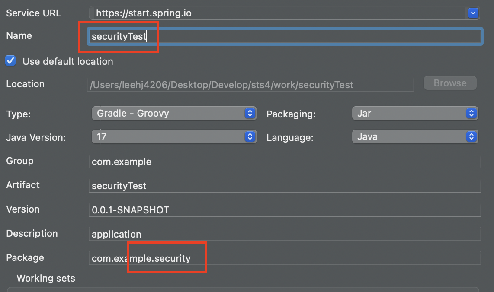
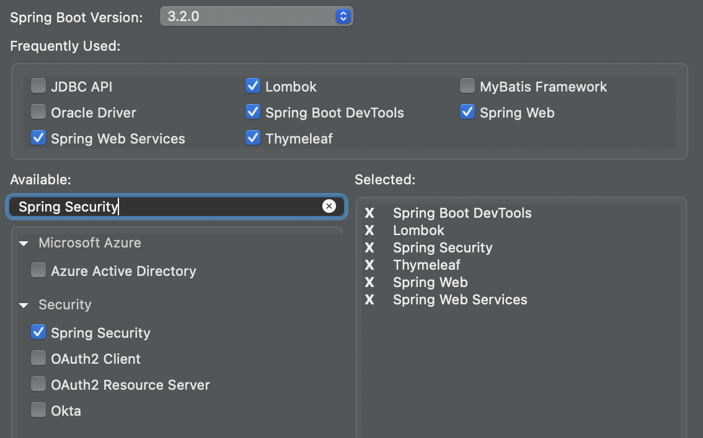
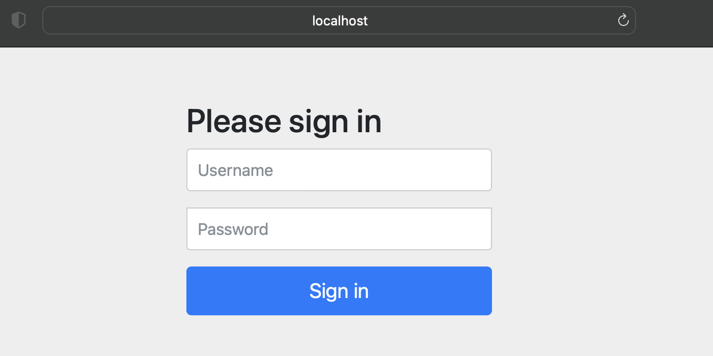
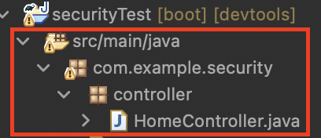
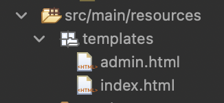

# Spring Security
- Spring Boot의 하위 프레임워크이며 Java 어플리케이션에 인증과 권한 부여를 제공하는데 중점을 둔 프레임워크이다.
- Spring에서는 사실상 Spring Security를 표준으로 하여 보안기능을 제공하며 필터기반으로 처리한다.
- 사용자의 ID와 PassWord를 입력받아 인증하고 역할 및 권한을 부여할 수 있으며
- CSRF(Cross Site Script Forgery)같은 취약점에도 대응이 가능하다.
#### CSRF
- 사용자(희생자)가 자신의 의지와는 무관하게 공격자가 의도한 행위를 웹사이트에 요청하도록 만드는 공격
- 예를 들어 페이스북에 희생자 계정으로 광고성 글을 올려버리는것

## Spring Security 주요 컴포넌트
### Filter
- 톰캣과 같은 웹 컨테이너에서 관리되는 서블릿의 기술이다.
- Client는 Application으로 요청을 전송하고, 컨테이너는 Servlet과 여러 Filter로 구성된 FilterChain을 만들어 요청 URL path 기반으로 HttpServletRequest를 처리한다.
- SpringMVC어플리케이션에서의 Servlet은 DispatcherServlet이다.


### SecurityFilterChain
- Spring의 보안 Filter를 결정하는데 사용되는 Filter이다.
- session, jwt 등 인증 방식을 사용할 때 필요한 설정을 서비스 로직 구현으로부터 분리할 수 있는 환경을 제공한다.
- SecurityFilterChain에는 여러 개의 Security Filter들이 있는데 대표적으로UsernamePasswrodAuthenticationFilter를 살펴보자

### UsernamePasswrodAuthenticationFilter
- Form Login 기반에서 Username과 Password를 확인하여 인증한다.
- 인증이 필요한 URL 요청이 들어왔을 때 인증이 되지 않았다면 로그인 페이지를 반환한다.

### SecurityContextHolder
- SecurityContextHolder : Spring Security로 인증한 사용자의 상세 정보를 저장한다.
- SecurityContext : SecurityContextHolder로 접근할 수 있으며, Authentication 객체를 갖는다.

### Authentication
- 현재 인증된 사용자를 나타내며, SecurityContext 에서 가져올 수 있다.
- principal : 사용자를 식별한다. username/password 방식으로 인증할 때 보통 UserDetails 인스턴스다.
- credentials : 주로 비밀번호 정보이다. 대부분 사용자 인증에 사용한 다음 비운다.
- authorities : 사용자에게 부여한 권한을 GrantedAuthority 로 추상화하여 사용한다.

### UserDetailService
- username/password 인증방식을 사용할 때, 사용자를 조회하고 검증한 후 UserDetails를 반환한다.
- 커스텀하여 Bean으로 등록 후 사용할 수 있다.

### UserDetails
- 검증된 UserDetails는 UsernamePasswordAuthenticationToken 타입의 Authentication 을 만들 때 사용된다.
- 이 인증 객체는 SecurityContextHolder 에 세팅된다.
- 커스텀하여 사용할 수 있다.

## Ex_날짜_SpringSecurity 프로젝트 생성하기





### 프로젝트 실행해보기
- 프로젝트 생성후 서버를 구동해서 들어가보면 우리가 만든 페이지는 없지만
- Spring Security에서 제공하는 Login페이지가 나온다.
- Spring Security는 설정하지 않으면 기본적으로 모든 페이지에 권한을 체크한다.



### application.yml 파일 생성하기
- id,password,권한을 정의해보자.
```xml
#Spring Security 설정
spring:
  security:
    user:
      name: user
      password: password
      roles:
      - USER
```

### HomeContorller 생성하기
- com.korea.security.controller 패키지 생성하고 클래스 만들기



```java
package com.example.security.controller;
import org.springframework.stereotype.Controller;
import org.springframework.web.bind.annotation.GetMapping;

@Controller
public class HomeController {

    @GetMapping("/")
    public String home() {
        return "index";
    }

    @GetMapping("/admin")
    public String admin() {
        return "admin";
    }
}
```

### templates에 html파일 생성하기


- index.html

```html
<!DOCTYPE html>
<html lang="en">
<head>
    <meta charset="UTF-8">
    <title>Spring Security Demo</title>
</head>
<body>
    <h1>Welcome to the Home Page!</h1>
    <p>You have successfully logged in.</p>
</body>
</html>
```
- admin.html

```html
<!DOCTYPE html>
<html lang="en">
<head>
    <meta charset="UTF-8">
    <title>Spring Security Demo - Admin</title>
</head>
<body>
    <h1>Welcome to the Admin Page!</h1>
    <p>You have successfully logged in as an admin.</p>
</body>
</html>
```
### Security 설정 클래스 생성
- src/main/java 패키지에 SecurityConfig.java 클래스 생성하기

```java
package com.example.security;

import org.springframework.beans.factory.annotation.Autowired;
import org.springframework.context.annotation.Bean;
import org.springframework.context.annotation.Configuration;
import org.springframework.security.config.Customizer;
import org.springframework.security.config.annotation.authentication.builders.AuthenticationManagerBuilder;
import org.springframework.security.config.annotation.web.builders.HttpSecurity;
import org.springframework.security.config.annotation.web.configuration.EnableWebSecurity;
import org.springframework.security.web.SecurityFilterChain;

@Configuration
@EnableWebSecurity
public class SecurityConfig {

    @Bean
    protected SecurityFilterChain configure(HttpSecurity http) throws Exception {
        http.csrf((csrf) -> csrf.disable())
                .authorizeHttpRequests((requests) -> requests
                        .requestMatchers("/admin").hasRole("ADMIN")
                        .anyRequest().authenticated())
                .formLogin(Customizer.withDefaults());
        		
       return http.build();
    }

    @Autowired
    public void configureGlobal(AuthenticationManagerBuilder auth) throws Exception {
        auth
            .inMemoryAuthentication()
                .withUser("user").password("{noop}password").roles("USER")
                .and()
                .withUser("admin").password("{noop}password").roles("ADMIN");
    }
}

```

### 실행하여 결과 확인하기


- 우리가 설정한 아이디와 패스워드로 로그인을 하면 index.html로 이동하게 된다

